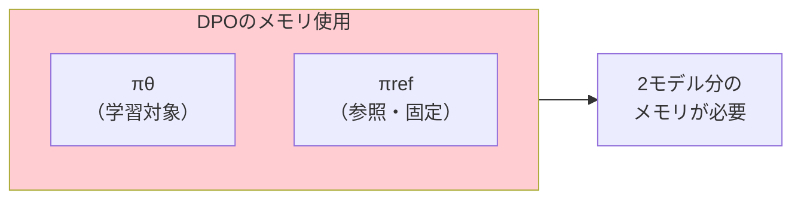
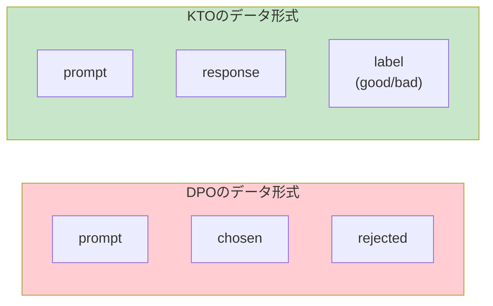
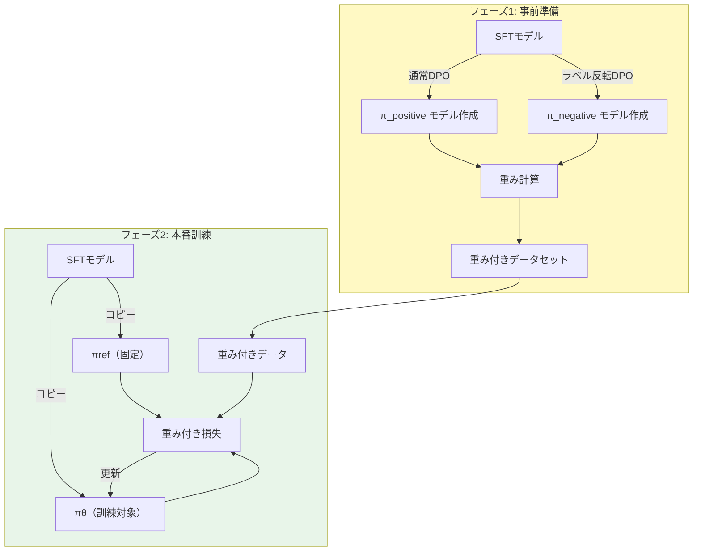
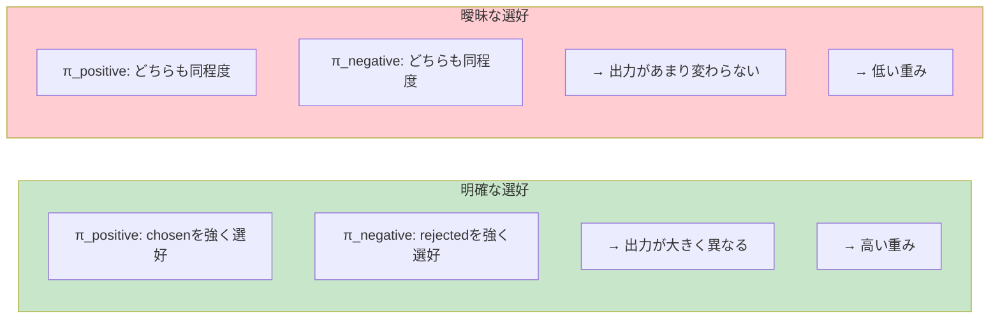

# はじめに

[前回の記事](https://qiita.com/atsushi11o7/items/b6d6bb48a2888acb961c)ではDPO（Direct Preference Optimization）の基礎を解説しました。本記事では、DPOの課題を解決するために提案された派生技術を紹介します。

前回の記事

https://qiita.com/atsushi11o7/items/b6d6bb48a2888acb961c

DPOの派生技術はたくさんありますが今回は下の3つを解説します：

| 手法 | 特徴（解決する課題） |
|------|-------------|
| **SimPO** | 計算コスト・メモリ使用量 |
| **KTO** | 選好ペアデータの作成コスト |
| **TIS-DPO** | ノイジーな選好データ |

なお、筆者が実際に実装して動かしたのはTIS-DPOのみで、他のモデルは学習が甘いので間違いが含まれている可能性があることをご理解ください。

# SimPO：参照モデルを不要にする

## DPOの計算コスト問題

DPOでは、学習対象の $\pi_\theta$ に加えて、参照モデル $\pi_{ref}$ をメモリに保持する必要があります（LoRAで解決しているように思いますが）。



7Bモデルの場合、16bit精度で約14GB × 2 = 28GB以上のVRAMが必要になります。

## SimPOのアイデア

SimPO（Simple Preference Optimization）は、**参照モデルを使わずに直接最適化**する手法です。
参照モデルを使用しないため、フルファインチューニング時にはメモリ削減の恩恵が非常に大きく、精度も通常DPOより性能が上と報告されています。

核となるアイデアは2つ：

1. **参照モデルの除去**：$\pi_{ref}$ との比較を行わない
2. **長さ正規化**：応答の長さによるバイアスを補正


## 損失関数

SimPOの損失関数は以下の通りです：

```math
\mathcal{L}_{\text{SimPO}} = -\log \sigma \left( \frac{\beta}{|y_w|} \log \pi_\theta(y_w \mid x) - \frac{\beta}{|y_l|} \log \pi_\theta(y_l \mid x) - \gamma \right)
```

| 記号 | 意味 |
|---|---|
| $x$ | プロンプト |
| $y_w$ | chosen応答（勝ち＝より良い応答） |
| $y_l$ | rejected応答（負け＝より悪い応答） |
| $\|y\|$ | 応答のトークン数 |
| $\gamma$ | マージン項（chosen/rejectedの差を確保） |

**DPOとの違い：**

```
DPO:   「参照モデルからの変化量」の差を最大化
         → log(πθ/πref) を使用

SimPO: 「生成確率」の差を最大化（長さで補正）
         → log(πθ) のみを使用、πref は登場しない
```

**イメージ：**

```
prompt: 「おすすめの映画は？」

chosen (y_w):  「ショーシャンクの空にがおすすめです」
  → log確率: -0.5（生成しやすい）
  → トークン数: 10
  → 長さ正規化後: -0.5 / 10 = -0.05

rejected (y_l): 「映画はいろいろあります」
  → log確率: -0.3（これも生成しやすい）
  → トークン数: 6
  → 長さ正規化後: -0.3 / 6 = -0.05
```

SimPOは「chosenの正規化スコア > rejectedの正規化スコア + マージンγ」となるように学習します。

**なぜ長さ正規化が必要か：**

長い応答ほど確率の掛け算が増えるため、log確率が低くなります。長さで割ることで、短い応答と長い応答を公平に比較できます。


## 実装

TRLでは `loss_type="simpo"` を指定するだけで使用できます：

```python
from trl import DPOConfig, DPOTrainer

config = DPOConfig(
    # SimPOを使用
    loss_type="simpo",
    
    # SimPO固有パラメータ
    beta=2.0,           # SimPOでは大きめの値を使用
    simpo_gamma=0.5,    # マージン項
    
    # 通常のパラメータ
    output_dir="./outputs/simpo",
    num_train_epochs=3,
    per_device_train_batch_size=1,
    learning_rate=5e-5,
)

trainer = DPOTrainer(
    model=model,
    ref_model=None,  # 参照モデル不要
    args=config,
    train_dataset=train_dataset,
    processing_class=tokenizer,
)

trainer.train()
```

:::note info
**パラメータの違い**

SimPOでは `beta` の推奨値がDPOと異なるようです：
- DPO: β = 0.1〜0.2
- SimPO: β = 2.0〜2.5

これは損失関数の構造が異なるためです。
:::

## メリット・デメリット

| メリット | デメリット |
|---------|-----------|
| メモリ使用量が約半分 | 長文生成タスクでの挙動に注意 |
| 実装がシンプル | βとγのチューニングが必要 |
| 学習が高速 | |

# KTO：ペアデータを不要にする

## 選好ペア作成の課題

DPOでは `(prompt, chosen, rejected)` の3つ組が必要です。これには以下の課題があります：

- 同じプロンプトに対して2つの応答を用意する手間
- 「どちらが良いか」の判断が曖昧なケースがある
- 既存の評価データ（good/badラベル付き）を活用しにくい

## KTOのアイデア

KTO（Kahneman-Tversky Optimization）は、**ペアではなく単一の応答**に対して学習します。



名前の由来は、行動経済学者Kahneman と Tversky の **損失回避理論**（Prospect Theory）です。人間は「得をする喜び」より「損をする苦痛」を強く感じるという理論を、損失関数に取り入れています。

## 損失関数

KTOの損失関数は、goodサンプルとbadサンプルで異なる形式を取ります：

**goodサンプルの場合：**
```math
\mathcal{L}_{\text{good}} = 1 - \sigma \left( \beta \log \frac{\pi_\theta(y \mid x)}{\pi_{\text{ref}}(y \mid x)} - z_{\text{ref}} \right)
```

**badサンプルの場合：**
```math
\mathcal{L}_{\text{bad}} = 1 - \sigma \left( z_{\text{ref}} - \beta \log \frac{\pi_\theta(y \mid x)}{\pi_{\text{ref}}(y \mid x)} \right)
```

| 記号 | 意味 |
|---|---|
| $x$ | プロンプト |
| $y$ | 応答（good または bad） |
| $\pi_\theta$ | 学習対象のモデル |
| $\pi_{\text{ref}}$ | 参照モデル（固定） |
| $z_{\text{ref}}$ | 参照点（KL項の期待値） |
| $\beta$ | 正則化の強さ |

**DPOとの違い：**

```
DPO: (prompt, chosen, rejected) のペアが必要
      → chosenとrejectedを同時に比較

KTO: (prompt, response, label) の単一データでOK
      → good/badを個別に学習
```

**損失回避理論とは：**

行動経済学の理論で、「人間は得をする喜びより、損をする苦痛を強く感じる」というものです。

```
例：
・1万円もらった喜び     → 嬉しさ 1.0
・1万円失った苦痛       → 悲しさ 2.0（約2倍強く感じる）
```

KTOはこれを損失関数に反映しています：

| ラベル | 学習の方向 | 強さ |
|--------|-----------|------|
| good | その応答の確率を**上げる** | 通常 |
| bad | その応答の確率を**下げる** | **より強く** |

**イメージ：**

```
prompt: 「Pythonでリストをソートするには？」

goodサンプル:
  response: 「sorted()関数を使います。list.sort()でも可能です」
  label: good
  → この応答の生成確率を上げる

badサンプル:
  response: 「ソートは難しいです」
  label: bad
  → この応答の生成確率を下げる（より強く）
```

**なぜペア不要で学習できるのか：**

DPOは「AとBを比べてAが良い」という相対評価が必要でした。KTOは「この応答は良い/悪い」という絶対評価で学習するため、同じプロンプトに対する2つの応答を用意する必要がありません。

## 実装

TRLでは `KTOTrainer` を使用します：

```python
from trl import KTOConfig, KTOTrainer

# データセットの形式
# {"prompt": "...", "completion": "...", "label": True}  # good
# {"prompt": "...", "completion": "...", "label": False} # bad

config = KTOConfig(
    output_dir="./outputs/kto",
    num_train_epochs=3,
    per_device_train_batch_size=1,
    learning_rate=5e-5,
    beta=0.1,
    
    # KTO固有：good/badの比率調整
    desirable_weight=1.0,    # goodサンプルの重み
    undesirable_weight=1.0,  # badサンプルの重み
)

trainer = KTOTrainer(
    model=model,
    ref_model=ref_model,  # KTOは参照モデルが必要
    args=config,
    train_dataset=train_dataset,
    processing_class=tokenizer,
)

trainer.train()
```

:::note warn
**データ形式の違いに注意**

KTOのデータセットはDPOと異なり、`completion` と `label` を使用します：

```json
{"prompt": "質問", "completion": "良い応答", "label": true}
{"prompt": "質問", "completion": "悪い応答", "label": false}
```
:::

## メリット・デメリット

| メリット | デメリット |
|---------|-----------|
| ペアデータ不要 | 参照モデルは必要 |
| 既存の評価データを活用可能 | good/badの比率調整が必要 |
| アノテーションが容易 | DPOより性能が劣る場合も |

# TIS-DPO：ノイジーなデータに対処する

## 選好データの品質問題

実際の選好データには様々なノイズが含まれます：

- **アノテーターの不一致**：人によって判断が異なる
- **曖昧な比較**：chosenとrejectedの差が小さい
- **ラベルミス**：誤ったラベル付け

通常のDPOはすべてのサンプルを同等に扱うため、ノイジーなサンプルに引きずられてしまいます。

## TIS-DPOのアイデア

TIS-DPO（Two-stage Importance Sampling DPO）は、**サンプルごとに重みを付けて**学習します。

「明確な選好があるサンプル」には高い重みを、「曖昧なサンプル」には低い重みを付けることで、ノイズの影響を軽減します。

## 処理フロー

TIS-DPOは2つのフェーズで構成されます：



### フェーズ1：補助モデル学習と重み計算

1. **π_positive の学習**：通常のDPOで学習
2. **π_negative の学習**：ラベルを反転（chosen↔rejected）したDPOで学習
3. **重みの計算**：2つのモデルの出力差から重みを算出

### フェーズ2：重み付きDPO学習

フェーズ1で計算した重みを使って、重み付きDPO学習を実行します。

## 重み計算の直感

なぜ「通常DPO」と「ラベル反転DPO」の2つを使うのでしょうか？



**明確な選好があるサンプル**では、π_positiveとπ_negativeの出力が大きく異なります。一方、**曖昧なサンプル**では、どちらに学習しても結果があまり変わりません。

この差を重みとして使うことで、「学習する価値のあるサンプル」を自動的に特定できます。

## 実装

### フェーズ1：ラベル反転データの作成

```python
import json
from pathlib import Path

def create_flipped_dataset(input_path: Path, output_path: Path) -> None:
    """ラベルを反転したデータセットを作成（chosen ↔ rejected）"""
    
    output_path.parent.mkdir(parents=True, exist_ok=True)
    
    with open(input_path, "r", encoding="utf-8") as f_in, \
         open(output_path, "w", encoding="utf-8") as f_out:
        
        for line in f_in:
            if not line.strip():
                continue
            item = json.loads(line)
            
            # chosen と rejected を入れ替え
            flipped = {
                "prompt": item["prompt"],
                "chosen": item["rejected"],   # 反転
                "rejected": item["chosen"],   # 反転
            }
            f_out.write(json.dumps(flipped, ensure_ascii=False) + "\n")
```

### フェーズ1：補助モデルの学習

π_positiveとπ_negativeの学習には、[前回記事](https://qiita.com/atsushi11o7/items/b6d6bb48a2888acb961c)で紹介したとおり、DPOの学習を行います

1. **π_positive**：元のデータセットで通常のDPO学習
2. **π_negative**：ラベル反転データセット（上記で作成）でDPO学習

### フェーズ1：重みの計算

```python
import torch
from typing import List
from tqdm import tqdm

def compute_log_probs(
    model,
    tokenizer,
    prompts: List[str],
    responses: List[str],
    max_length: int = 1024,
) -> List[float]:
    """モデルの出力確率（log prob）を計算"""
    
    model.eval()
    log_probs = []

    with torch.no_grad():
        for prompt, response in tqdm(zip(prompts, responses), desc="Computing log probs"):
            full_text = prompt + response
            prompt_ids = tokenizer.encode(prompt, add_special_tokens=False)
            full_ids = tokenizer.encode(full_text, add_special_tokens=False)

            input_ids = torch.tensor([full_ids[:max_length]]).to(model.device)
            outputs = model(input_ids)
            logits = outputs.logits

            # 応答部分のみのlog probを計算
            response_start = len(prompt_ids)
            if response_start >= len(full_ids) - 1:
                log_probs.append(0.0)
                continue

            shift_logits = logits[0, response_start:-1, :]
            shift_labels = input_ids[0, response_start + 1:]

            log_softmax = torch.nn.functional.log_softmax(shift_logits, dim=-1)
            token_log_probs = log_softmax.gather(1, shift_labels.unsqueeze(1)).squeeze(1)
            avg_log_prob = token_log_probs.mean().item()
            log_probs.append(avg_log_prob)

    return log_probs


def compute_sample_weights(
    model_positive,
    model_negative,
    tokenizer,
    dataset,
) -> List[float]:
    """π_positive と π_negative を使用してサンプルごとの重みを計算"""
    
    prompts = [item["prompt"] for item in dataset]
    chosen_responses = [item["chosen"] for item in dataset]
    rejected_responses = [item["rejected"] for item in dataset]

    # 各モデルでlog probを計算
    pos_chosen = compute_log_probs(model_positive, tokenizer, prompts, chosen_responses)
    pos_rejected = compute_log_probs(model_positive, tokenizer, prompts, rejected_responses)
    neg_chosen = compute_log_probs(model_negative, tokenizer, prompts, chosen_responses)
    neg_rejected = compute_log_probs(model_negative, tokenizer, prompts, rejected_responses)

    # 重み計算: π_positive と π_negative の差が大きいほど高い重み
    weights = []
    for i in range(len(dataset)):
        chosen_diff = abs(pos_chosen[i] - neg_chosen[i])
        rejected_diff = abs(pos_rejected[i] - neg_rejected[i])
        weight = chosen_diff + rejected_diff
        weights.append(weight)

    # 正規化（平均1になるように）
    mean_weight = sum(weights) / len(weights)
    if mean_weight > 0:
        weights = [w / mean_weight for w in weights]

    return weights
```

### フェーズ2：重み付きDPOTrainer

```python
from trl import DPOTrainer

class WeightedDPOTrainer(DPOTrainer):
    """重み付きDPOトレーナー"""

    def compute_loss(self, model, inputs, return_outputs=False, num_items_in_batch=None):
        """重み付き損失を計算"""
        
        # データセットから重みを取り出す
        weights = inputs.pop("weight", None)

        # 通常のDPO損失を計算
        loss, outputs = super().compute_loss(
            model, inputs, return_outputs=True, num_items_in_batch=num_items_in_batch
        )

        # 重みを適用
        if weights is not None:
            weights = weights.to(loss.device)
            mean_weight = weights.mean()
            loss = loss * mean_weight

        if return_outputs:
            return loss, outputs
        return loss
```

### 重み付きデータセットの形式

```json
{"prompt": "質問1", "chosen": "良い応答", "rejected": "悪い応答", "weight": 1.5}
{"prompt": "質問2", "chosen": "良い応答", "rejected": "悪い応答", "weight": 0.3}
{"prompt": "質問3", "chosen": "良い応答", "rejected": "悪い応答", "weight": 1.2}
```

この実装では、WeightedDPOTrainerが`weight` フィールドを読み取って損失に適用します。

## メリット・デメリット

| メリット | デメリット |
|---------|-----------|
| ノイジーなデータに強い | 計算コストが高い（3回の学習） |
| サンプル品質を可視化できる | 実装が複雑 |
| 他の手法と組み合わせ可能 | フェーズ1のハイパラ調整が必要 |

# まとめ

本記事では、DPOの代表的な派生技術3つを解説しました：

- **SimPO**：参照モデルを不要にし、メモリ使用量を削減
- **KTO**：ペアデータ不要で、単一応答+ラベルで学習可能
- **TIS-DPO**：重要度サンプリングでノイジーなデータに対処

実際のプロジェクトでは、データの特性や計算リソースに応じて適切な手法を選択してください。

# 参考文献

- [SimPO: Simple Preference Optimization with a Reference-Free Reward](https://arxiv.org/abs/2405.14734)
- [KTO: Model Alignment as Prospect Theoretic Optimization](https://arxiv.org/abs/2402.01306)
- [TIS-DPO: Token-level Importance Sampling for Direct Preference Optimization](https://arxiv.org/abs/2410.04350)
- [TRL Documentation](https://huggingface.co/docs/trl/)
