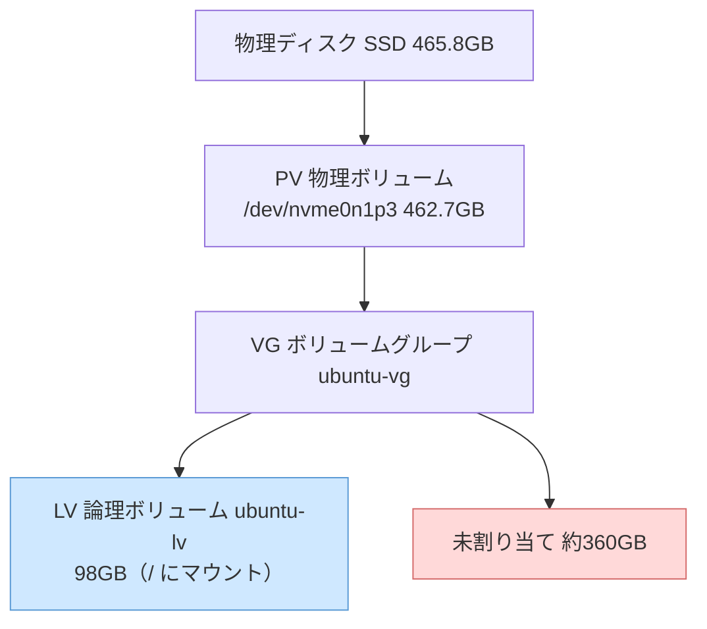
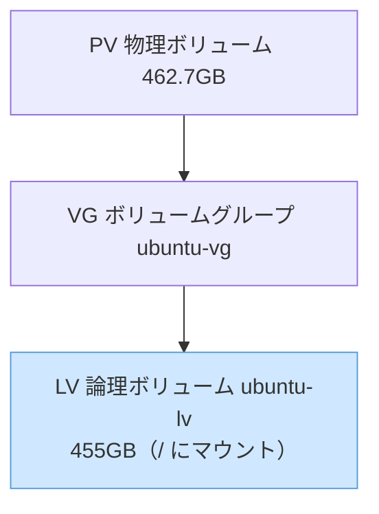

## はじめに

以前、新調して余ったゲーミングPCを使って、機械学習用の開発サーバを作りました

https://qiita.com/atsushi11o7/items/b44ac565651bdc68db1a

それ以来時々開発に使用していたのですが、最近、コンテナをいくつか立ち上げると、すぐにディスクがいっぱいになってしまうことに気づきました。

OSを入れたSSDの容量は500GBです。
特別多いわけではありませんが、コンテナを2つ起動しただけで埋まってしまうような容量でもありません。

さすがにおかしいと思って調べてみたところ、原因はディスクの容量そのものではなく、サーバのストレージの「割り当て方」にありました。

この記事では、その調査をきっかけに、LVMのボリュームの仕組みまで調べた結果を整理します。

## まず空き容量を確認する

とりあえず `df` で見てみます。
これは、ファイルシステムのディスク使用状況を表示するコマンドです。

```bash
$ df -h /
Filesystem                         Size  Used Avail Use% Mounted on
/dev/mapper/ubuntu--vg-ubuntu--lv   98G   79G   14G  85% /
```

`Size` が `98G` になっています。
500GBのSSDを積んでいるはずなのに、ファイルシステムは98GBしか認識していません。空きが足りないというより、そもそも容量が見えていないようです。

## 物理ディスクを見てみる

`lsblk` （Linuxに接続されているディスクやパーティション、LVMの構成をツリー形式で表示するコマンド）で物理ディスクの構成を確認します。

```bash
$ lsblk
NAME                      MAJ:MIN RM   SIZE RO TYPE MOUNTPOINTS
sda                         8:0    0   3.6T  0 disk 
├─sda1                      8:1    0    16M  0 part 
├─sda2                      8:2    0   1.8T  0 part 
└─sda3                      8:3    0   1.8T  0 part 
nvme0n1                   259:0    0 465.8G  0 disk 
├─nvme0n1p1               259:1    0     1G  0 part /boot/efi
├─nvme0n1p2               259:2    0     2G  0 part /boot
└─nvme0n1p3               259:3    0 462.7G  0 part 
  └─ubuntu--vg-ubuntu--lv 252:0    0    98G  0 lvm  /
```

SSD（nvme0n1）は465.8GBとして認識されており、容量不足というわけではありませんでした。
また、3.6TBのHDD（sda）も問題なく認識されています。

一方で、ルートディレクトリ（/）に割り当てられている領域は98GBしかありません。

ストレージ自体は十分あるのに、実際に使えているのは98GBだけ。
この容量のギャップがどこで生まれているのかを調べてみました。

## サーバのストレージはどう積み上がっているのか（LVM）

ルートディレクトリ（/）は物理ディスクに直接置かれているのではなく、**LVM**という仕組みの上に載っています。

LVM（Logical Volume Manager）は、物理ディスクとファイルシステムの間に入る仮想的なストレージ管理層で、容量の拡張や再配置を柔軟に行えるようにする仕組みです。
主に3つの層から成り立っています。

- **PV（物理ボリューム）**: 生のディスクやパーティション。今回の環境では `/dev/nvme0n1p3`（462.7GB）
- **VG（ボリュームグループ）**: PVを束ねた「容量のプール」。今回の環境では `ubuntu-vg`
- **LV（論理ボリューム）**: VGから切り出した区画。ここにファイルシステムを作ってマウントする。今回の環境では `ubuntu-lv`

図にするとこうなっています。



つまり、土台のPVは462.7GBあるのに、その上に切り出されたLVは98GBぶんしかなく、残りの約360GBはVGの中で未割り当てのまま余っていたわけです。
「容量が見えていない」の正体はこれでした。

> **補足**
>
> `lsblk` に表示されている `ubuntu--vg-ubuntu--lv` は、
> VG名 (`ubuntu-vg`) と LV名 (`ubuntu-lv`) を連結したデバイスマッパー名です。

## なぜデフォルトでディスクを使い切らないのか

Ubuntu Serverのインストーラの既定の挙動です。
インストール時にLVMを選ぶと、root用のLVを100GB程度だけ確保して、残りは未割り当てのままVGに残しておきます。
一見おせっかいですが、LVMの柔軟性をあとから活かせるように、わざと余白を残しているようです。

最初にディスクを全部rootへ割り当ててしまうと、VGのプールが空になり、次のようなことができなくなります。

- **スナップショットが取れる**。LVMのスナップショットは、VGの空き領域を使って作られます。バックアップを取りたいときや、リスクのある作業の前に状態を保存しておきたいときに便利です。VGに空きがないと作れません。
- **縮小はリスクが高いので、最初は小さめに作る方が安全**。LVを広げるのはオンラインで安全にできますが、縮小はデータ破損のリスクがあり、XFSのように縮小自体ができないファイルシステムもあります。最初から使い切るより、小さめに確保しておいて必要になったら広げる方が、操作の安全性という意味でも理にかなっています。

## ボリュームを分けると何が嬉しいのか

もうひとつ、空きを残しておく理由が「ボリュームを用途ごとに分けられる」ことです。
これは少しわかりにくいので、Dockerを例に整理します。

デフォルトでは、Dockerのデータ（`/var/lib/docker`）はrootと同じ1個のLVに乗っています。
OS本体もDockerも、全部この1個の区画を奪い合っている状態です。

ここで `/var/lib/docker` を別のLVに切り出すと、Docker専用の区画をrootとは別に用意できます。
利点は「容量を配る」ことではなく、溢れたときの巻き添えを防ぐことです。

- **全部1個のLVの場合**: Dockerのイメージやログが暴走して区画を100%まで埋めると、それはrootと同じ区画なので、OS本体まで書き込めなくなります。VSCode Serverや各種サービスが正常に動作できなくなり、復旧作業そのものが難しくなることがあります。
- **`/var/lib/docker` を別LVにした場合**: Dockerが暴走しても、いっぱいになるのはDocker専用の区画だけです。rootには空きが残るため、SSHやシェルからログインして原因を調査したり、不要なイメージを削除したりできます。被害をDocker領域の中に封じ込められます。

私が「コンテナを2つ立ち上げたらいっぱいになった」のは、Dockerのイメージやコンテナレイヤ、ボリュームがrootファイルシステム上に保存されていたからです。
実際に容量不足でVSCodeからサーバへ接続できなくなったこともありましたが、幸いSSHからはログインできたため、不要なDockerイメージを削除して復旧できました。

もし /var/lib/docker を別のLVに分けていれば、Docker側が容量不足になってもOS本体まで巻き込まれることはなく、より安全に運用できたはずです。

## 今回の対処：個人開発なので使い切る

ここまでが「空きを残す意味」ですが、これらが効いてくるのは、複数人・複数サービスが同居して片方の暴走で全体を落としたくない、といった本番サーバの場面です。

私の用途は個人開発で、この1台を自分が使い倒すだけです。スナップショットやボリューム分割の恩恵は薄い。
それよりも、すぐ埋まってしまう状態を解消したい。

なので今回は、余っている約360GBをすべてrootのLVに足して、SSDを使い切る方針にしました。

やることはシンプルで、未割り当ての領域をrootのLVに足してファイルシステムを広げるだけです。
拡張はデータを消さずにオンラインで行えるので、稼働させたまま実行できます。

まず、VG（ボリュームグループ）にどれくらい未使用領域が残っているかを確認します。

```bash
$ sudo vgs
  VG        #PV #LV #SN Attr   VSize    VFree   
  ubuntu-vg   1   1   0 wz--n- <462.71g <362.71g
```

`vgs` はLVMのボリュームグループの状態を表示するコマンドです。
今回注目するのは `VFree` で、これはVG内でまだLVに割り当てられていない空き容量を表します。

今回は約360GB残っているので、これをすべてrootのLVに足します。

```bash
$ sudo lvextend -r -l +100%FREE /dev/ubuntu-vg/ubuntu-lv
  Size of logical volume ubuntu-vg/ubuntu-lv changed from 100.00 GiB (25600 extents) to <462.71 GiB (118453 extents).
  Logical volume ubuntu-vg/ubuntu-lv successfully resized.
resize2fs 1.47.0 (5-Feb-2023)
Filesystem at /dev/mapper/ubuntu--vg-ubuntu--lv is mounted on /; on-line resizing required
old_desc_blocks = 13, new_desc_blocks = 58
The filesystem on /dev/mapper/ubuntu--vg-ubuntu--lv is now 121295872 (4k) blocks long.
```
`lvextend` はLVMの論理ボリューム（LV）を拡張するコマンドです。

今回指定しているオプションの意味は次の通りです。

- `-r` : LVの拡張後にファイルシステムも自動で拡張する（内部で `resize2fs` が実行される）
- `-l` : サイズをLVMの管理単位（extent）で指定する
- `+100%FREE` : VG内に残っている未割り当て領域をすべて使用する
- `/dev/ubuntu-vg/ubuntu-lv` : 拡張対象の論理ボリューム

最後にもう一度確認します。

```bash
$ df -h /
Filesystem                         Size  Used Avail Use% Mounted on
/dev/mapper/ubuntu--vg-ubuntu--lv  455G   79G  357G  19% /
```

`98G` だった `Size` が `455G` になり、空きも `14G` から `357G` に増えました。
VGの中身は、未割り当てがなくなってこうなりました。



これで、コンテナを立ち上げるたびに容量を気にする必要もなくなりました。

## まとめ

- サーバのストレージはPV → VG → LVと積み上がっていて、LVがディスクを使い切っているとは限りません。
- Ubuntu ServerをLVMでインストールすると、デフォルトではrootに100GB程度しか割り当てず、残りはVGに空けておきます。これはスナップショットやボリューム分割の余白を残すための、意図的な仕様です。
- 用途ごとにボリュームを分けると、Dockerなどが暴走しても巻き添えを局所化できます。

最初は「500GBのSSDなのにすぐに空き容量がなくなってしまうのはなぜ」という疑問から調査を始めましたが、結果としてLinuxのストレージ管理の仕組みを一通り理解できました。

同じような状況で悩んでいる方の参考になれば幸いです。
