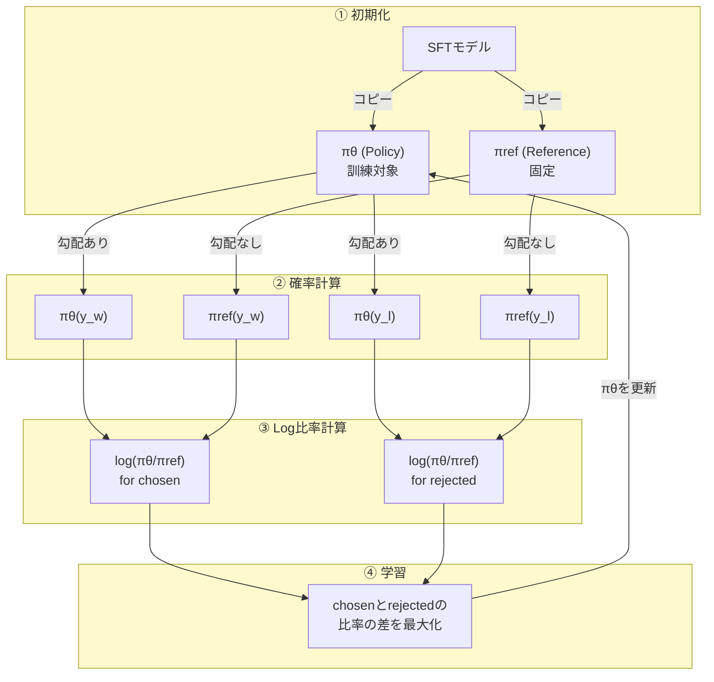

# はじめに

仕事でLLMをファインチューニングする機会があり、DPOを扱ったので解説します。

DPO（Direct Preference Optimization）は、LLMを人間の選好に合わせて調整するための学習手法です。2023年にStanford大学から発表され、そのシンプルさと安定性から急速に普及しました。

この記事では、DPOの理論的背景を数式レベルで理解し、PyTorchとTRLライブラリを使った実装までを解説します。

# 選好学習とは

## SFTとの違い

LLMのファインチューニング（SFT: Supervised Fine-Tuning）は、入力に対する「正解」を与えて模倣させる学習です。

```
入力: 「日本の首都は？」
正解: 「東京です」
```

しかし、多くのタスクでは「唯一の正解」が存在しません。

```
入力: 「おすすめの映画を教えて」
応答A: 「『ショーシャンクの空に』は希望を描いた名作です」
応答B: 「映画のジャンルは何がお好みですか？」
応答C: 「『ショーシャンクの空に』『ゴッドファーザー』『パルプ・フィクション』...（20作品列挙）」
```

どれも「間違い」ではありませんが、A・B・Cには明らかに質の差があります。SFTでは「どれがより良いか」を学習できません。

**選好学習**は、この問題を「相対評価」で解決します。

- SFT：「これが正解」（絶対評価）
- 選好学習：「AよりBの方が良い」（相対評価）

人間の評価は、絶対的なスコアをつけるより、2つを比較する方が一貫しやすいという性質があります。選好学習はこれを活用します。

**学習パイプラインの位置づけ**としては、SFTで基本的な応答能力を獲得した後、選好学習で「より良い応答」を選ぶ能力を身につける、という2段階構成が一般的です。

```
事前学習済みLLM → SFT → 選好学習（DPO等）
                   ↑         ↑
              基本能力の獲得  品質の向上
```

## RLHFとの違い

選好学習の代表的な手法として、RLHF（Reinforcement Learning from Human Feedback）があります。

RLHFは以下の2段階で学習します：

1. **報酬モデルの学習**：選好データから「良さ」をスコア化するモデルを学習
2. **強化学習（PPOなど）**：報酬モデルのスコアを最大化するようにLLMを更新


**DPOは報酬モデルを経由せず、選好データから直接LLMを最適化します。** RLHFと比較して、パイプラインがシンプルになり、計算コストも削減できるという特徴があります。

## 選好データの形式

選好学習では、以下の3つ組でデータを用意します：

| フィールド | 説明 |
|-----------|------|
| `prompt` | 入力（質問・指示） |
| `chosen` | より良い応答 |
| `rejected` | より悪い応答 |

```json
{
  "prompt": "Pythonでリストの重複を削除する方法を教えてください",
  "chosen": "set()を使う方法が最もシンプルです。\n\n```python\noriginal = [1, 2, 2, 3, 3, 3]\nunique = list(set(original))\n```\n\n順序を保持したい場合はdict.fromkeys()を使います。",
  "rejected": "リストの重複を削除するにはいくつかの方法があります。"
}
```

この例では、具体的なコード付きの回答（chosen）が、曖昧な回答（rejected）より「良い」と評価されています。

# DPOの理論

## DPOの処理フロー

まず全体像を図で示します：



ポイントは以下の通りです：

- **πθ（Policy）** と **πref（Reference）** の2つのモデルを使用
- πref は固定（勾配なし）、πθ のみ更新
- chosen と rejected の両方に対して確率比を計算し、その差を最大化

## 選好確率のモデル化（Bradley-Terry）

「AがBより良い」という選好を確率的にモデル化するために、**Bradley-Terryモデル**を使います。

各応答 $y$ に対してスコア $r(x, y)$ があるとき、応答 $y_w$ が $y_l$ より選好される確率は：

```math
P(y_w \succ y_l \mid x) = \sigma(r(x, y_w) - r(x, y_l))
```

ここで $\sigma$ はシグモイド関数 $\sigma(z) = \frac{1}{1 + e^{-z}}$ です。

直感的には：
- スコア差が大きい → 選好確率が1に近づく
- スコア差が小さい → 選好確率が0.5に近づく（どちらとも言えない）

## DPOのコアアイデア

DPOの核心は、**スコア $r(x, y)$ を明示的にモデル化せず、方策（LLM）の確率比で表現する**ことです。

KL正則化付きの最適化問題を解くと、最適方策 $\pi^*$ と報酬 $r$ の間に以下の関係が成り立ちます：

```math
r(x, y) = \beta \log \frac{\pi^*(y \mid x)}{\pi_{\text{ref}}(y \mid x)} + \beta \log Z(x)
```

ここで：
- $\pi^*$：学習後の方策（最適化対象のLLM）
- $\pi_{\text{ref}}$：参照方策（学習前のLLM、固定）
- $\beta$：KL正則化の強さを制御するパラメータ
- $Z(x)$：正規化定数（選好確率の計算時に消える）

この関係をBradley-Terryモデルに代入すると、報酬 $r$ を経由せずに選好確率を方策で表現できます。

## DPO損失関数

上記を整理すると、DPOの損失関数が導出されます：

```math
\mathcal{L}_{\text{DPO}}(\pi_\theta; \pi_{\text{ref}}) = -\mathbb{E}_{(x, y_w, y_l) \sim \mathcal{D}} \left[ \log \sigma \left( \beta \log \frac{\pi_\theta(y_w \mid x)}{\pi_{\text{ref}}(y_w \mid x)} - \beta \log \frac{\pi_\theta(y_l \mid x)}{\pi_{\text{ref}}(y_l \mid x)} \right) \right]
```

式が長いので、シグモイドの中身を分解します：

```math
\beta \left( \log \frac{\pi_\theta(y_w \mid x)}{\pi_{\text{ref}}(y_w \mid x)} - \log \frac{\pi_\theta(y_l \mid x)}{\pi_{\text{ref}}(y_l \mid x)} \right)
```

| 項 | 意味 |
|---|---|
| $\log \frac{\pi_\theta(y_w \mid x)}{\pi_{\text{ref}}(y_w \mid x)}$ | chosenの確率比（対数） |
| $\log \frac{\pi_\theta(y_l \mid x)}{\pi_{\text{ref}}(y_l \mid x)}$ | rejectedの確率比（対数） |

**直感的な理解：**

この損失を最小化すると：
- **chosenの確率比を上げる**：$\pi_\theta(y_w)$ を $\pi_{\text{ref}}(y_w)$ より高くする
- **rejectedの確率比を下げる**：$\pi_\theta(y_l)$ を $\pi_{\text{ref}}(y_l)$ より低くする

参照方策 $\pi_{\text{ref}}$ との比を取ることで、元のモデルから極端に離れることを防いでいます（暗黙のKL正則化）。

## βパラメータの役割

$\beta$ はKL正則化の強さを制御します：

| β | 挙動 |
|---|------|
| **小さい**（例：0.05） | 選好に忠実に学習。大きく変化するが、崩壊リスクも |
| **大きい**（例：0.5） | 保守的に学習。参照方策から離れにくい |


実用上は **β = 0.1〜0.2** がよく使われる？っぽいです。

# PyTorch + TRLによる実装

## 環境構築

```bash
pip install torch==2.7.1 transformers==4.48.0 datasets==3.2.0
pip install trl==0.14.0 peft==0.14.0 bitsandbytes==0.45.0
pip install accelerate==1.2.0
```
記事ではcuda12.8で動作させています。

## 選好データセットの準備

JSONL形式でデータを用意します：

```json
{"prompt": "質問1", "chosen": "良い応答1", "rejected": "悪い応答1"}
{"prompt": "質問2", "chosen": "良い応答2", "rejected": "悪い応答2"}
```

データ読み込み用の関数：

```python
import json
from pathlib import Path
from datasets import Dataset

def load_preference_dataset(data_path: str, test_size: float = 0.1):
    """選好データセットを読み込む"""
    data_path = Path(data_path)
    data = []
    
    with open(data_path, "r", encoding="utf-8") as f:
        for line in f:
            if line.strip():
                data.append(json.loads(line))
    
    dataset = Dataset.from_list(data)
    
    if test_size > 0:
        split = dataset.train_test_split(test_size=test_size, seed=42)
        return split["train"], split["test"]
    return dataset, None
```

## モデルのロード（LoRA + 量子化）

メモリ効率化のため、4bit量子化（好み）とLoRAを組み合わせます：

```python
import torch
from transformers import AutoModelForCausalLM, AutoTokenizer, BitsAndBytesConfig
from peft import LoraConfig, get_peft_model, prepare_model_for_kbit_training

def load_model_for_dpo(model_name: str):
    """DPO学習用にモデルをロード"""
    
    # 4bit量子化設定
    bnb_config = BitsAndBytesConfig(
        load_in_4bit=True,
        bnb_4bit_quant_type="nf4",
        bnb_4bit_compute_dtype=torch.bfloat16,
        bnb_4bit_use_double_quant=True,
    )
    
    # モデルロード
    model = AutoModelForCausalLM.from_pretrained(
        model_name,
        quantization_config=bnb_config,
        device_map="auto",
        trust_remote_code=True,
    )
    
    # LoRA設定
    lora_config = LoraConfig(
        r=16,
        lora_alpha=32,
        lora_dropout=0.05,
        target_modules=["xxx", "xxx", "xxx", "xxx"],  # 低ランク行列を追加する層を設定
        task_type="CAUSAL_LM",
    )
    
    model = prepare_model_for_kbit_training(model)
    model = get_peft_model(model, lora_config)
    
    # トークナイザー
    tokenizer = AutoTokenizer.from_pretrained(model_name, trust_remote_code=True)
    if tokenizer.pad_token is None:
        tokenizer.pad_token = tokenizer.eos_token
    
    return model, tokenizer
```

## DPOConfigの設定

TRLの`DPOConfig`で学習パラメータを設定します：

```python
from trl import DPOConfig

dpo_config = DPOConfig(
    output_dir="./outputs/dpo",
    
    # 学習パラメータ
    num_train_epochs=3,
    per_device_train_batch_size=1,
    gradient_accumulation_steps=4,
    learning_rate=5e-5,
    
    # DPO固有パラメータ
    beta=0.1,                    # KL正則化の強さ
    loss_type="sigmoid",         # 損失関数の種類
    max_length=2048,             # 最大トークン長
    max_prompt_length=1024,      # プロンプトの最大長
    
    # メモリ最適化
    gradient_checkpointing=True,
    bf16=True,
    
    # ロギング
    logging_steps=10,
    save_strategy="epoch",
)
```

主要パラメータの説明：

| パラメータ | 説明 | 推奨値 |
|-----------|------|--------|
| `beta` | KL正則化の強さ | 0.1〜0.2 |
| `loss_type` | 損失関数の種類（sigmoid, hinge, ipo等） | sigmoid |
| `max_length` | prompt + response の最大長 | タスク依存 |
| `gradient_checkpointing` | メモリ節約（速度とトレードオフ） | True |

## 学習の実行

すべてを組み合わせて学習を実行します：

```python
from trl import DPOTrainer

def train_dpo(
    model_name: str,
    data_path: str,
    output_dir: str = "./outputs/dpo",
):
    """DPO学習を実行"""
    
    # モデルロード
    model, tokenizer = load_model_for_dpo(model_name)
    
    # データセットロード
    train_dataset, eval_dataset = load_preference_dataset(data_path)
    print(f"Train samples: {len(train_dataset)}")
    
    # DPO設定
    dpo_config = DPOConfig(
        output_dir=output_dir,
        num_train_epochs=3,
        per_device_train_batch_size=1,
        gradient_accumulation_steps=4,
        learning_rate=5e-5,
        beta=0.1,
        max_length=2048,
        max_prompt_length=1024,
        gradient_checkpointing=True,
        bf16=True,
        logging_steps=10,
        save_strategy="epoch",
        remove_unused_columns=False,
    )
    
    # DPOTrainer初期化
    # LoRA使用時はref_model不要（TRLが自動処理）
    trainer = DPOTrainer(
        model=model,
        ref_model=None,
        args=dpo_config,
        train_dataset=train_dataset,
        eval_dataset=eval_dataset,
        processing_class=tokenizer,
    )
    
    # 学習実行
    trainer.train()
    
    # 保存
    trainer.save_model(output_dir)
    tokenizer.save_pretrained(output_dir)
    
    print(f"Training completed! Model saved to {output_dir}")


if __name__ == "__main__":
    train_dpo(
        model_name="xxx",
        data_path="data_path.jsonl",
    )
```

:::note info
**LoRA使用時のポイント：**

`ref_model=None` としている理由ですが、LoRAを使う場合、TRLは内部で「LoRAアダプターを無効化した状態」を参照方策として使用します。つまり、ベースモデルが自動的に $\pi_{\text{ref}}$ となります。

本来であればメモリに $\pi_{\text{θ}}$ と $\pi_{\text{ref}}$ の2つのモデルをのせなくてはいけないところ、LoRAを活用することで、実質的にモデル1つをメモリにのせるだけで済むのです。
:::

# まとめ

DPOは、選好データからLLMを直接最適化するシンプルかつ強力な手法です。

**ポイント：**
- SFTの後に適用し、「より良い応答」を選ぶ能力を獲得
- 報酬モデル不要で、RLHFより実装・学習が容易
- 損失関数はchosenの確率を上げ、rejectedを下げる方向に働く
- βパラメータで正則化の強さを調整

DPOをベースとした発展手法（IPO、TIS-DPO、ConfPOなど）も多数提案されており、データの品質やタスクに応じた選択が可能です。

機会があれば、そちらも解説してみようと思います。

# 参考文献

- [Rafailov, R., et al. (2023). "Direct Preference Optimization: Your Language Model is Secretly a Reward Model." NeurIPS 2023.](https://arxiv.org/abs/2305.18290)
- [TRL Documentation](https://huggingface.co/docs/trl/)
- [PEFT Documentation](https://huggingface.co/docs/peft/)
