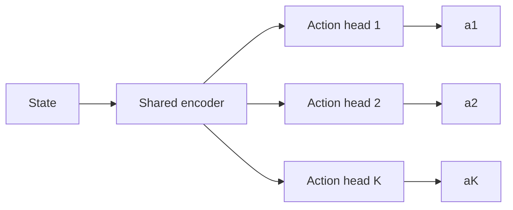
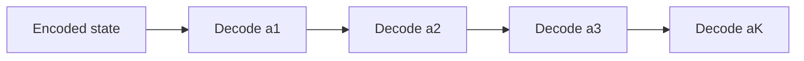
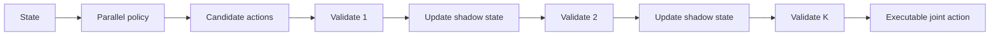
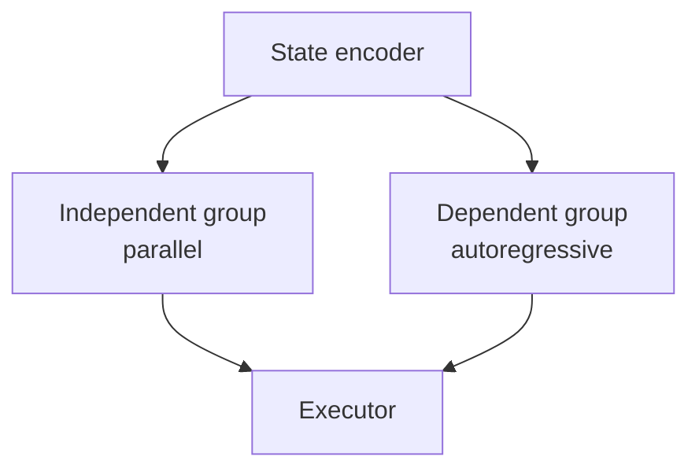
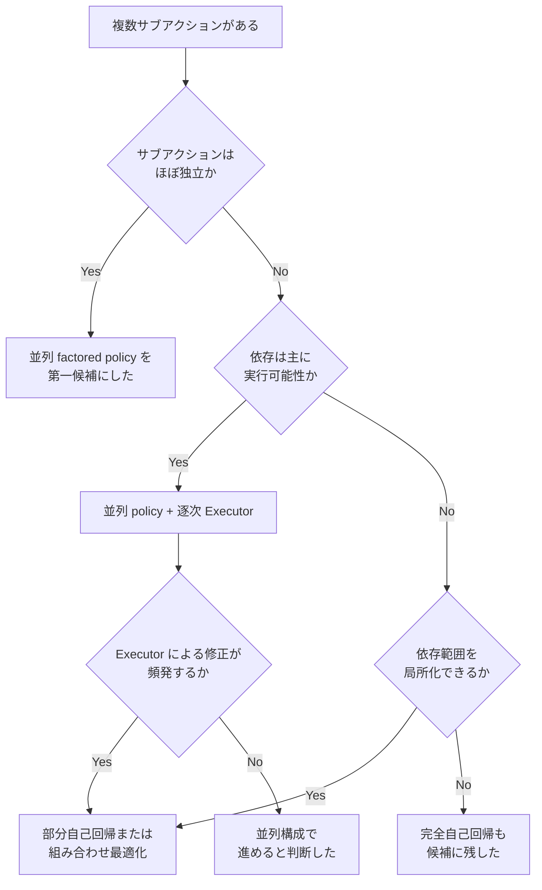
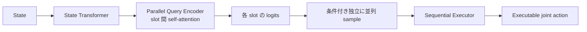

## はじめに

最近、Kaggle の2人対戦型農業シミュレーションコンペ「Kaggriculture」に参加しました。

https://www.kaggle.com/competitions/kaggriculture

このコンペでは、1回の意思決定で複数のキャラクターへの指示や、複数の取引注文をまとめて出力します。

このコンペを攻略するにあたり、さまざまな施策を行いましたが、その中でも苦労したのが方策ネットワークの設計です。強化学習の知見がまだ少なく、行動の表現方法で考えることが多くありました。

例えば、すべての行動の組み合わせを列挙すると行動空間が巨大になります。行動を複数の出力へ分解すれば計算しやすくなりますが、今度は出力同士の依存関係を表現できません。前の出力を条件にして一つずつ生成すれば依存関係を扱えますが、大量の rollout を必要とする強化学習では推論速度が問題になります。

コンペ中は、この表現力と計算量の間でかなり悩みました。本記事では、その過程で検討した施策と調べた内容をもとに、複数のサブアクションからなる離散行動空間の設計方法を整理したいと思います。

本文で扱うのは農業ゲーム固有の話ではありません。複数ロボットへの指示、設備へのタスク割り当て、共通予算を使う注文、ゲーム内の複数ユニット操作などに共通する問題として考えます。

## 複合離散行動空間とは

一度の環境ステップで出力する行動が、複数のサブアクションから構成されているとします。

$$
a=(a_1,a_2,\ldots,a_K)
$$

たとえば、10台のロボットへそれぞれ指示を出すなら、各 $a_i$ は1台のロボットに対する指示です。共通予算から複数の商品を注文するなら、各 $a_i$ は1件の注文に対応します。

各サブアクションに100通りの選択肢がある場合、10個のサブアクションからなる行動の組み合わせは $100^{10}$ 通りです。一般には、全体の行動数は次のようになります。

$$
|\mathcal A|=\prod_{i=1}^{K}|\mathcal A_i|
$$

この全組み合わせに対して、1つずつ logit や Q 値を出力するのは現実的ではありません。サブアクション数が増えるたび、行動空間が掛け算で膨らむためです。

そこで、行動を複数の head へ分解することが考えられます。それぞれの head が1つのサブアクションを担当すれば、必要な出力数は積ではなく和になります。

$$
\sum_{i=1}^{K}|\mathcal A_i|
$$

この分解は計算コスト上とても有効です。しかし、行動空間を分解できることと、意思決定を独立に行えることは同じではありません。

## 行動を分解すると何が失われるのか

複数 head を持つ単純な方策は、次のように書けます。

$$
\pi(a\mid s)=\prod_{i=1}^{K}\pi_i(a_i\mid s)
$$

すべての head は同じ状態 $s$ を参照しますが、ほかの head が何を選んだかは参照しません。

この構成には大きな利点があります。状態 Encoder を1回だけ実行でき、複数 head の計算も GPU 上でまとめて処理できます。log probability も各 head の値を足せば求められるため、PPO のような方策勾配法へ組み込みやすい構成です。

一方、この分解は、状態 $s$ が与えられれば各サブアクションを独立に選べるという仮定を置いています。本来は、次のように先行する選択を条件にすべき問題もあります。

$$
\pi_i(a_i\mid s,a_1,\ldots,a_{i-1})
$$

たとえば、2つの head が同じ対象を選んだ場合を考えます。それぞれの選択は単独では正しくても、対象を二重に利用できないなら、組み合わせとしては実行不能です。共通予算を使う複数注文でも、各注文は単独で予算内なのに、合計すると予算を超えることがあります。

共有 Encoder は、全 head へ同じ状況を伝えられます。しかし、各 head が実際にサンプルした結果までは伝えられません。共有表現が豊かであることと、サンプリング後の競合を解消できることは別の問題です。

## サブアクション間の依存を分類する

サブアクション間の依存をすべて同じ方法で扱う必要はありません。どの設計が必要かを判断するには、依存の性質を分けて考えると整理しやすくなります。

### 共有情報による依存

1つ目は、複数のサブアクションが同じ情報を参照することで生じる依存です。

複数の設備へタスクを割り当てる際、すべての設備が同じ需要予測や全体目標を参照するとします。この場合、共有 Encoder が状況を十分に表現できれば、各 head は並列のままでも妥当な判断ができる可能性があります。

ここでは、head 同士が互いの出力を知る必要はありません。必要なのは、共通の文脈を持つことです。

### 実行可能性の依存

2つ目は、先行する選択によって後続サブアクションの合法集合が変わる依存です。

$$
\mathcal A_i=\mathcal A_i(s,a_{<i})
$$

代表例は、共通予算、排他的な資源、残り容量です。先に処理した注文が予算を消費すれば、次の注文で使える予算は減ります。ある作業へ人員を割り当てれば、同じ人員を別の作業へ同時に割り当てることはできません。

この種の依存は、環境ステップの開始時点だけを見た静的な action mask では完全に処理できません。後続の合法集合を知るには、先行する選択を仮の状態へ反映する必要があるからです。

### 戦略的な依存

3つ目は、各サブアクションが単独では合法でも、組み合わせによって価値が変わる依存です。

複数のロボットを同じ場所へ集めることで相乗効果が生まれる場合や、2台に異なる役割を割り当てる必要がある場合が該当します。複数の注文が市場価格へ影響するなら、どの注文も合法であっても、組み合わせによって最終的な利益が変わります。

これは合法性だけの問題ではありません。実行器が競合を除去しても、価値の高い組み合わせを選べるとは限りません。方策自体が、ほかのサブアクションとの関係を考慮する必要があります。

3種類の依存と、各設計の大まかな対応は次のようになります。

| 依存の種類 | 共有 Encoder | 逐次 Executor | 自己回帰 |
|---|---:|---:|---:|
| 共有情報による依存 | 対応可能 | 原則不要 | 不要な場合が多い |
| 実行可能性の依存 | 不十分 | Executor の制約範囲で対応可能 | 動的 mask を使えば対応可能 |
| 戦略的な依存 | 不十分な場合がある | 原則不十分 | 対応可能 |

## 代表的な設計方式

ここからは、複合離散行動を扱う設計方法を比較します。

### 全組み合わせを単一行動として扱う

最も直接的なのは、複合行動全体を1つの categorical な行動として扱う方法です。すべての組み合わせに個別の logit を与えれば、サブアクション間の依存を分解によって失うことはありません。

小規模な問題では、実装も確率計算も単純です。しかし、出力数が $\prod_i|\mathcal A_i|$ で増えるため、少し規模が大きくなるだけで利用できなくなります。実行可能な組み合わせが全体のごく一部しかない場合は、大半の出力が無駄になる点も問題です。

### 独立 head で並列出力する

各サブアクションを独立した head から出力する方法は、最も計算効率に優れます。Encoder の出力をまとめて各 head へ渡し、1回の forward で複合行動を生成できます。

サブアクション同士がほぼ独立している場合や、共有状態を見るだけで十分な場合には、これが素直な選択です。また、rollout を大量に生成したい場合は、推論の並列性そのものが大きな価値を持ちます。

代わりに、サンプリング結果同士の競合は表現できません。各 head が同じ対象を選ぶ、合計予算を超える、全体として役割分担に失敗するといった問題が起こり得ます。

### 自己回帰的に逐次生成する

自己回帰方策では、前に選んだサブアクションを条件として、次のサブアクションを生成します。

$$
\pi(a\mid s) = \prod_{i=1}^{K}\pi_i(a_i\mid s,a_{<i})
$$

この構成なら、選択済みの対象を後続の候補から除外できます。残り予算や容量を更新しながら生成することもできます。さらに、合法性だけでなく、先行する選択を前提とした役割分担なども学習できます。

ただし、生成は逐次処理になります。状態 Encoder の計算結果を再利用しても、$a_2$ は $a_1$ を待ち、$a_3$ は $a_2$ を待たなければなりません。GPU は大きなテンソルを並列処理するのが得意ですが、この依存関係は逐次的な同期点を作ります。

学習も少し複雑になります。教師あり学習では、正解の prefix を次の入力に使う teacher forcing が一般的ですが、推論時にはモデル自身の出力が prefix になります。その差から exposure bias が生じます。また、PPO では rollout 時に選んだ行動列を保存し、更新時に同じ prefix を条件として新しい方策の log probability を再計算する必要があります。

### 並列生成して Executor で逐次解決する

別の構成として、方策はサブアクション候補を並列に生成し、実行可能性の判定だけを逐次的な Executor へ任せる方法があります。

方策が生成した候補を $\tilde a_i$ とします。

$$
\tilde a_i\sim\pi_i(\cdot\mid s)
$$

Executor は環境状態の軽量なコピー、ここでは shadow state と呼ぶものを持ちます。候補を先頭から検証し、実行可能なら shadow state へ反映します。実行不能なら、no-op などの fallback へ置き換えます。

$$
a_i=
\begin{cases}
\tilde a_i & \tilde a_i\in\mathcal A_i(s_i)\\
\operatorname{fallback}(s_i) & \text{otherwise}
\end{cases}
$$

$$
s_{i+1}=T(s_i,a_i)
$$

逐次化されるのは、ニューラルネットワーク全体ではなく、合法性判定と簡単な状態更新だけです。Executor の処理が小さければ、並列方策に近い推論速度を保ちながら、共通予算や排他的資源に関する競合を解消できます。

ただし、この方式を自己回帰方策の中間的な確率モデルと考えるのは正確ではありません。方策分布そのものは、依然として各サブアクションを独立に生成しています。Executor は悪い組み合わせを良い組み合わせへ変えるのではなく、実行不能な組み合わせを決められた規則で処理するだけです。

したがって、これは「表現力を少し落とした自己回帰方策」ではなく、方策による候補生成と、制約充足の責務を分離した設計と捉える方が適切です。

## 推論速度と表現力のトレードオフ

並列方策と自己回帰方策の違いを「1回か $K$ 回か」だけで比較すると、実態を捉え損ねます。状態 Encoder をキャッシュする自己回帰 Decoder なら、重い Encoder を毎回実行する必要はありません。それでも、各出力が前の出力を待つという逐次依存は残ります。

状態 Encoder、1つの Decoder、Executor による1件の検証コストを、それぞれ $C_E,C_D,C_X$ とします。

| 方式 | 概念上の計算コスト | 並列性 |
|---|---:|---:|
| 並列 head | $C_E+KC_D$ | 高い |
| 自己回帰 | $C_E+KC_D$ | 低い |
| 並列＋Executor | $C_E+KC_D+KC_X$ | NN 部分は高い |

並列 head では、$K$ 個の Decoder 相当の計算を大きなテンソルとして一括実行できます。一方、自己回帰方式では、演算量が同程度でも $K$ 回の依存した処理になります。小さな Decoder を何度も呼び出すと、GPU の利用率、カーネル起動、同期のオーバーヘッドも無視できません。

並列方策と Executor の組み合わせでは、$C_X$ が $C_D$ や $C_E$ より十分小さければ、完全な自己回帰より軽くできます。制約判定が単純な整数演算や配列更新で書ける問題ほど、この利点は大きくなります。

### 速さは推論回数だけでは決まらない

もっとも、最速の方策が強化学習全体でも最も効率的とは限りません。並列方策が高速でも、無効な組み合わせを大量に生成し、環境内で多くの行動が捨てられるなら、得られる学習信号の質は下がります。

シミュレータ型の強化学習では、次のような粗い診断指標で考えると実態に近づきます。無効な slot がすべて無駄になると仮定した場合の近似であり、厳密な評価指標ではありません（invalid rate が slot 単位なら、1つの slot が無効でも環境遷移全体が無価値になるわけではなく、無効行動自体からも学習信号を得られる場合があります）。

$$
\text{useful transitions/sec} = \text{transitions/sec} \times (1-\text{invalid rate})
$$

実際には、有効であるだけでなく、どれだけ情報量のある経験を得られるかも重要です。概念的には、次のように考えられます。

$$
\text{learning throughput} = \text{transitions/sec} \times \text{validity} \times \text{information quality}
$$

`information quality` を直接測るのは難しいため、実験では次の指標を並べて確認します。

- inference latency
- 1秒あたりの環境遷移数
- PPO の1 update にかかる時間
- 無効候補率
- Executor による修正率
- peak memory
- 一定時間後の平均報酬

最終的に知りたいのは、1回の forward が何ミリ秒かだけではありません。一定の wall-clock 時間で、どこまで方策を改善できるかです。

## 方策が選んだ行動と、環境が実行した行動

Executor を導入すると、もう1つ重要な問題が生まれます。方策が選んだ行動と、環境で実際に実行された行動が一致しない可能性です。

Actor が候補 $\tilde a$ を生成し、Executor が実行行動 $a$ へ変換するとします。

$$
a=E(s,\tilde a)
$$

異なる候補が同じ実行行動へ変換される場合、実行行動 $a$ の確率は、対応するすべての候補の確率を足したものです。

$$
P_\theta(a\mid s) = \sum_{\tilde a:E(s,\tilde a)=a} \pi_\theta(\tilde a\mid s)
$$

たとえば、複数種類の無効候補がすべて no-op へ変換されるなら、no-op の実行確率は、明示的な no-op だけの確率ではありません。

ここで、環境が実行した no-op を「Actor が明示的に no-op をサンプルした」とみなして PPO を更新すると、確率比の意味が変わります。old policy と new policy で比較すべき対象は、実際にサンプルした候補なのか、Executor 後の行動なのかを明確にする必要があります。

候補 intent $\tilde a$ を、方策がサンプルした行動として扱い、その log probability で方策勾配を計算すること自体は妥当です。Executor による変換が many-to-one であっても、必ず実行行動の周辺確率 $P_\theta(a\mid s)$ を計算しなければならないわけではありません。問題になるのは、Executor 後の実行行動を、Actor が直接サンプルしたかのように扱って、その log probability を使う場合です。

この不一致を扱う方法を調べると、主に次の選択肢がありました。

1. 候補 intent を方策の行動として保存し、その log probability で更新する
2. 実行行動そのものを方策の行動として扱いたい場合は、Executor によって誘導される周辺分布を計算する
3. action mask や自己回帰化によって、intent と実行行動のずれを減らす
4. 変換されたサブアクションを policy loss から除外する

どの方法が適切かは、Executor の役割によって変わります。今回は、候補 intent を方策がサンプルした行動として保存し、その log probability で更新する方法を選びました。4は、まれな異常ケースを安全に処理するだけなら実用的かもしれませんが、除外した候補が得た報酬・損失から学べなくなるため、勾配にバイアスを入れる近似として使う、という前提を持っておく必要があります。また、変換が頻繁に起こる場合は、Actor が定義する行動空間と環境が実行する行動空間のずれが大きい、と私は捉えました。

Executor による修正率は、単なるデバッグ指標ではありません。独立方策の仮定が環境にどれだけ合っているかを示す診断値として使えます。

## 教師あり学習でも意味が変わる

候補と実行行動の違いは、強化学習だけの問題ではありません。行動ログから模倣学習を行う場合にも注意が必要です。

次の2つを考えます。

- 教師が明示的に no-op を選んだ
- 教師の候補が無効だったため、実行器が no-op へ変換した

環境から見れば、どちらも実行結果は no-op です。しかし、教師の意図は異なります。

後者まで no-op の正解ラベルとして学習すると、モデルは「何もしないことが望ましかった」と解釈します。この変換が特定の局面で多ければ、モデルはその局面と no-op の相関を学び、推論時にも no-op を積極的に選ぶ可能性があります。

今回は、この2つを同じ教師として扱ったことで、no-op を過剰に選ぶ方策を学習させてしまいました。そこで、データセット上で次の3種類を区別しました。

- **explicit fallback**：教師が明示的に選んだ fallback。通常の教師として扱う
- **valid action**：そのまま実行された有効行動。通常の教師として扱う
- **invalid-to-fallback**：無効候補が fallback へ変換されたもの。その箇所の policy loss から除外する

該当するサブアクションを policy loss から除外しても、同じ状態に含まれるほかの有効な教師や value target まで捨てる必要はありません。今回は、信用できない slot だけを policy loss から除外し、同じ状態に含まれるほかの教師と value target は残しました。

この問題は no-op に限りません。範囲外の値を clip する処理、代替行動への repair、上限超過時の数量調整など、Actor の出力を後処理するすべての仕組みに共通します。

## 完全並列と完全自己回帰の間

実際の問題では、すべてを並列にするか、すべてを自己回帰にするかの二択で考える必要はありません。依存のある範囲を特定できれば、そこだけ計算を重くする設計が可能です。

### 依存の強い部分だけ自己回帰化する

たとえば、複数の行動グループのうち、共通予算を消費する注文だけを自己回帰化し、互いにほぼ独立したユニット指示は並列のままにできます。

ほかにも、行動種は並列に決めて引数だけを条件付きで生成する、グループ間は並列でグループ内だけ逐次化する、といった分け方があります。

依存の局所性をモデル構造へ反映できれば、完全自己回帰より少ない逐次ステップで、必要な表現力を得られます。

### 並列 score と組み合わせ最適化を組み合わせる

制約構造が明確な場合は、組み合わせの決定をニューラルネットワークだけに任せない方法もあります。

ネットワークは各候補の score を並列に出力し、その後で制約を満たす組み合わせをアルゴリズムによって選びます。問題構造に応じて、次のような方法を利用できます。

- bipartite matching
- knapsack
- greedy allocation
- beam search
- integer programming

たとえば、複数エージェントと複数タスクの一対一割り当てなら、各組み合わせの score をネットワークが出し、最終的な割り当てを matching で求められます。この方法では、ネットワーク推論を並列に保ちながら、排他制約を厳密に満たせます。

一方、最適化器が最大化する score と、環境で本当に得たい長期的な価値が一致している必要があります。また、solver の計算量や、方策勾配をどのように定義するかも考える必要があります。

### 複数候補を生成して再ランキングする

単一の候補集合だけを使わず、複数の候補を並列に生成し、軽量な評価器や短いシミュレーションで再ランキングする方法もあります。

完全な自己回帰ほど生成を逐次化せず、単一の独立サンプルより良い組み合わせを探せる可能性があります。ただし、候補数に比例して評価コストが増えるため、推論時間に厳しい制約がある場合は注意が必要です。

## 今回、設計をどう整理したか

今回の設計を検討する際、私はサブアクション間の依存がどこから生じているかを、次のように整理しました。これは一般的な正解を示す決定木ではなく、設計候補を絞るために使った判断の流れです。

サブアクションがほぼ独立なら、並列 factored policy が第一候補です。依存の中心が予算や排他制約などの実行可能性であれば、軽量な Executor で十分かもしれません。合法な行動同士の組み合わせが価値を大きく左右するなら、部分自己回帰、組み合わせ最適化、あるいは完全自己回帰を検討します。

比較をまとめると、次のようになります。

| 設計 | 推論速度 | 戦略的依存 | 実行可能性 | 学習実装 |
|---|---:|---:|---:|---:|
| Joint categorical | 小規模なら速い | 高い | 語彙・mask の設計次第 | 単純 |
| 並列 factored | 最速 | 低い | 個別 mask だけでは競合が残る | 単純 |
| 並列＋逐次 Executor | 速い | 低い | Executor の制約範囲で保証 | 対応関係に注意 |
| 部分自己回帰 | 中程度 | 中〜高 | 動的 mask を使えば保証可能 | やや複雑 |
| 完全自己回帰 | 遅い | 高い | 動的 mask を使えば保証可能 | 複雑 |
| 並列 score＋最適化 | 問題依存 | 制約内で高い | solver の制約定義に従う | Solver 統合が必要 |

この表の「並列＋逐次 Executor」が戦略的依存を低いとしている点は重要です。実行結果は先行行動に依存しますが、Actor の候補分布自体が先行するサンプルを条件としているわけではありません。また、「実行可能性」の列は、自己回帰や joint categorical であること自体が合法性を保証するわけではなく、動的 mask や語彙設計を適用して初めて保証される、という点に注意してください。

また、設計後も次の値を継続的に測ると、構造が問題に合っているか判断しやすくなります。

- Executor による修正率
- 無効候補率
- サブアクションの位置ごとの修正率
- 特定の候補同士が競合する頻度
- 自己回帰化した場合の wall-clock 性能
- 一定学習時間後の報酬

独立方策を採用した時点で設計判断が終わるわけではありません。実際にどの依存がボトルネックになっているかを計測し、必要な範囲だけ構造を変える方が、全面的な作り直しを避けやすくなります。

## 私が採用した設計

今回参加した農業シミュレーションコンペでは、最終的に並列方策と逐次 Executor を組み合わせました。

状態 Encoder（State Transformer）を一度だけ実行し、unit 25 slot と market 10 slot のクエリ表現をまとめて Parallel Query Encoder に通します。各 slot は、ここで slot 間の self-attention を経たクエリ表現を参照できますが、実際にサンプルされたほかの slot の行動までは参照しません。各 slot を完全に独立した head へ直接分岐させるのではなく、計画用の表現だけを共有しつつ、行動は条件付き独立に並列サンプリングする、という構成です。確率分布としては、変わらず

$$
\pi(a\mid s)=\prod_i\pi_i(a_i\mid s)
$$

と因数分解されています。

その後、Executor が候補を順番に検証し、実行可能な行動列へ変換します。市場注文については、完全な shadow state を slot ごとに更新しながら逐次解決しました。一方、unit 行動については State 全体を逐次再現せず、競合に関係する共有 shed の変化と、一括で消費される種の需要（PLANT）だけを解決しました。依存が発生する共有資源へ処理を限定することで、Executor を軽量に保っています。

完全な自己回帰方式も検討しました。しかし、強化学習で大量の rollout を生成する必要があり、推論と更新速度への影響を無視できませんでした。そのため、戦略的な依存を完全に表現することよりも、ネットワーク推論の並列性を維持しながら、実行可能性を保証することを優先しました。

もちろん、この選択がすべての環境で最適とは限りません。Executor は競合を解決できますが、候補同士の戦略的な協調を学習するわけではありません。Executor による修正が頻発する部分や、組み合わせの価値が重要な部分については、部分的な自己回帰化や組み合わせ最適化へ切り替える余地が残りました。

## まとめ

複合離散行動空間を分解すると、組み合わせ爆発を避けられます。その代わり、分解したサブアクションを条件付き独立として扱うことになります。

設計を考える際は、サブアクション間の依存を少なくとも次の3つに分けると整理しやすくなります。

1. 共有情報を参照することで扱える依存
2. 先行する選択によって合法集合が変わる実行可能性の依存
3. 合法な組み合わせ同士の価値が変わる戦略的な依存

実行可能性の依存は、並列方策と軽量な逐次 Executor の組み合わせで扱える場合があります。一方、戦略的な依存まで表現したいなら、自己回帰方策や組み合わせ最適化が有力な選択肢になります。

自己回帰方策は表現力を高めますが、rollout 生成だけでなく、PPO 更新時の再評価も逐次化します。シミュレータ型の強化学習では、1回の推論品質だけでなく、単位時間あたりに生成できる有効な経験と、一定時間後に得られる性能で比較することが重要です。

この記事はあくまで私が調べた範囲に基づく理解であり、誤りや異なる見解がある可能性を記しておきます。

