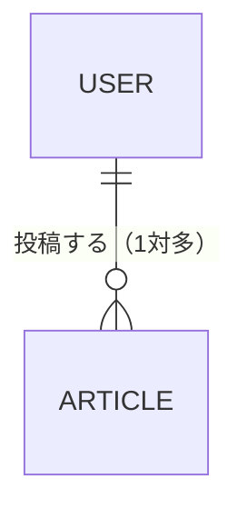
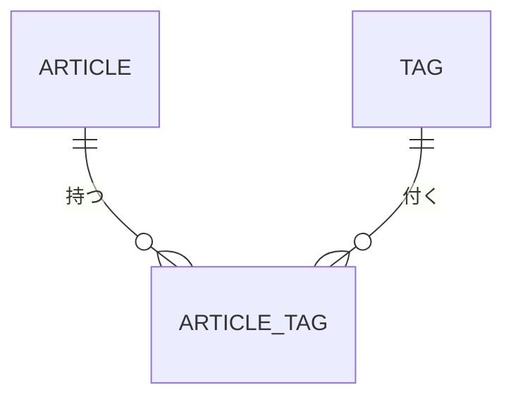
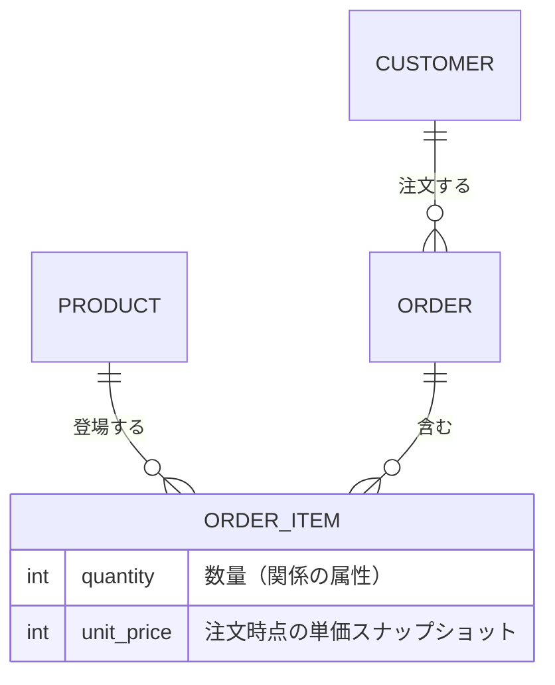
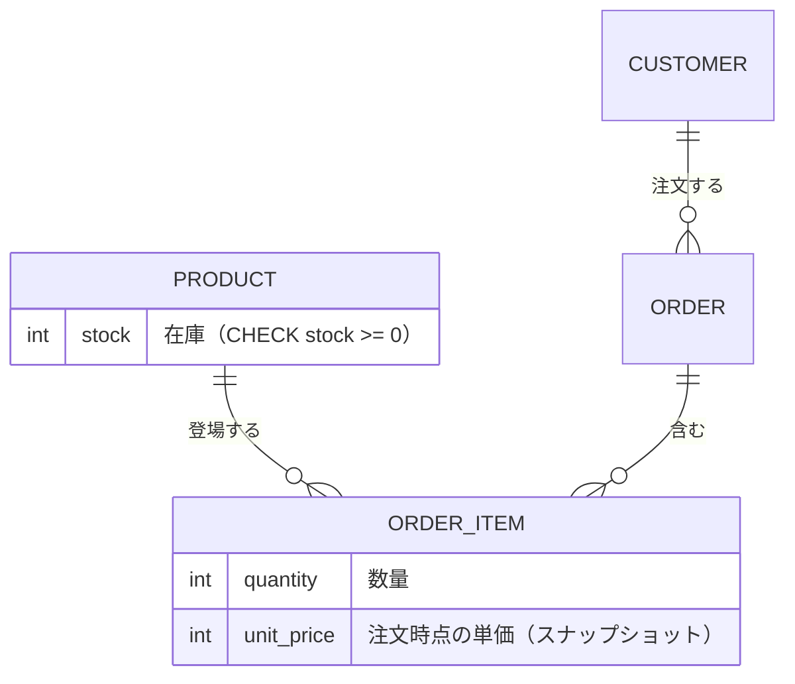
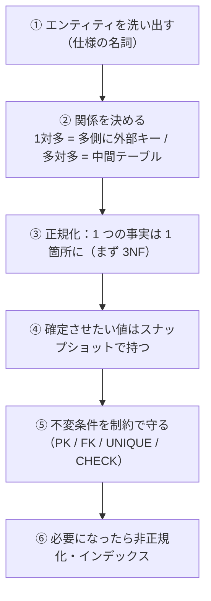

## はじめに

これまで、データ分析やデータセット作成で SQL を使うことはあっても、データベースそのものを設計・運用する機会はほとんどありませんでした。

私は RAG システムの構築でベクトル DB を使っていますが、メタデータなどを通常のデータベースで持つ場面もあります。
個人開発で使っていた DB も、正直あまりしっかり考えずに作っていました。

そこでこの機会に、DB 設計の考え方を一度まとめておくことにしました。
この記事はその学習ノートです。

設計の判断の型と、正規化などの基礎を整理していきます。

## DB 設計は何を決める作業か

DB 設計は、ざっくり言えば「仕様を、どんなテーブルを持つかに翻訳する」作業です。
具体的に決めるのは、主に次の 4 つです。

- **エンティティ**：登場するモノ(ユーザー・記事・注文など)。多くはテーブルになります。
- **関係**：エンティティ同士のつながり(1 対多・多対多)。外部キーや中間テーブルで表します。
- **不変条件**：常に成り立っていてほしいルール(在庫は負にならない、同じ人が同じ URL を重複保存しない、など)。
- **制約**：その不変条件を DB 側で守る仕掛け(主キー・外部キー・UNIQUE・CHECK)。

この 4 つが素直に決まっていると、多くの機能は自然に実装できます。
逆にここが歪むと、その上に載る処理や画面が全部歪みますし、DB 設計は後から直すコストが非常に高いです。

そこでこの記事では、まずエンティティと関係の見つけ方を押さえ、次に正規化について整理し、制約で不変条件を守り、最後に設計例で「このデータならこう設計する」という流れで整理したいと思います。

## エンティティと関係を見つける

最初にやるのは、仕様の中から「登場するモノ(エンティティ)」と「そのつながり(関係)」を洗い出すことです。
コツはシンプルで、仕様の文章に出てくる名詞がエンティティの候補、動詞がそれへの操作になります。

たとえば「ユーザーが記事を投稿し、記事にタグを付ける」なら、名詞のユーザー・記事・タグがエンティティ候補です。
エンティティが見えたら、次はそれらの関係(何対何か)を決めます。

### 1 対多 / 多対多

関係の基本は、1 対多と多対多の 2 つです。

**1 対多** は、片方の 1 件が、もう片方の複数件に対応する関係です。
たとえばユーザー 1 人が記事を複数持ちます(記事は 1 人のユーザーに属する)。
このときは、「多」側(記事)に「1」側(ユーザー)への外部キーを持たせます。



**多対多** は、両側が互いに複数に対応する関係です。
たとえば記事は複数のタグを持ち、タグは複数の記事に付きます。
この場合は、両者をつなぐ中間テーブルを 1 つ挟みます。



多対多を中間テーブルにする理由は、「片側にまとめて持たせる」とうまくいかないからです。
記事テーブルに `tags` 列を作って `"python,db,sql"` のように詰め込むと、タグで記事を検索するのが難しく(部分一致頼みになる)、タグ名の変更や集計もやりにくくなります。
中間テーブルにしておけば、検索も整合性も素直に扱えます。

### 属性を持つ中間テーブル

多対多の中間テーブルは、ただ 2 つをつなぐだけとは限りません。中間テーブル自身が属性を持つことがあります。

分かりやすいのが注文と商品です。
1 回の注文には複数の商品が含まれ、1 つの商品は複数の注文に登場します(多対多)。
ここで「その注文で、その商品を何個・いくらで買ったか」という情報は、注文にも商品にも属さず、**両者の関係に属します**。
これを載せるのが注文明細(OrderItem)で、数量・単価という関係の属性を持つ中間テーブルです。



ここで 1 つ設計判断があります。
明細の単価を、商品テーブルの価格を都度参照するか、注文した時点の価格をコピーして持つか、です。
注文は「その時いくらだったか」を確定させたいので、単価は注文時点の値をコピーして持ちます(スナップショット)。
こうしておけば、あとで商品の価格を変えても、過去の注文金額は変わりません。
このスナップショットの考え方は、あとの「あえて正規化しない」で改めて扱います。

## 正規化 - 更新異常を防ぐ

正規化は、重複をなくして「更新異常」を防ぐための手続きです。
核にあるのは「**1 つの事実は 1 箇所にだけ持つ**」という考え方です。

少し用語を先取りすると、ある列の値が決まると別の列の値が 1 つに決まる関係を、関数従属と呼びます。
正規化は、この関数従属を手がかりに、事実を正しい置き場所へ移していく作業です。

同じ事実を複数の場所に重複して持つと、次のような異常が起きます。

- **更新異常**：ある事実を直すとき、すべての重複を漏れなく直さないと食い違いが生まれる。
- **挿入異常**：入れたいデータが、無関係な情報が揃わないと入れられない。
- **削除異常**：ある行を消すと、一緒に持っていた別の事実まで消えてしまう。

正規化は、これを第 1 → 第 2 → 第 3 と段階的に直していきます。
ここでは、全部を 1 つのテーブルに詰め込んだ状態から始めて、順に分解します。

### 第 1 正規化（繰り返し・複数値をなくす）

第 1 正規化は、1 つのセルに複数の値を詰め込むのをやめる段階です。「1 セル 1 値」にします。

たとえば、1 注文を 1 行で持ち、買った商品を 1 つのセルに詰め込んだテーブルを考えます。

| order_id | customer | products |
|---|---|---|
| 1 | 田中 | りんご×2, みかん×1 |
| 2 | 佐藤 | りんご×3 |

これだと、「りんごを買った注文」を探すのに `products LIKE '%りんご%'` のような部分一致に頼るしかなく、数量の集計も大変です。
商品ごとに 1 行へ分割すると、こうなります。

| order_id | customer | product | quantity |
|---|---|---|---|
| 1 | 田中 | りんご | 2 |
| 1 | 田中 | みかん | 1 |
| 2 | 佐藤 | りんご | 3 |

これで 1 セル 1 値になり、商品での検索も数量の集計も素直に書けます。
このテーブルの主キーは `(order_id, product)` の組です。
ただし `customer`(田中)が重複して現れており、これは次の段階で解消します。

### 第 2 正規化（部分関数従属をなくす）

第 2 正規化は、複合主キーの一部だけで決まる列を、別テーブルに追い出す段階です。

さっきの 1NF のテーブルをもう一度見ます。主キーは `(order_id, product)` でした。

| order_id | customer | product | quantity |
|---|---|---|---|
| 1 | 田中 | りんご | 2 |
| 1 | 田中 | みかん | 1 |
| 2 | 佐藤 | りんご | 3 |

ここで `customer`(誰の注文か)は、主キーのうち `order_id` だけで決まります(`product` には関係ありません)。
これが部分関数従属(複合主キーの一部だけで値が決まること)で、`customer` が注文ごとに重複します。
実害として、注文 1 の顧客名を直すには、その注文に含まれるすべての明細行を直す必要があります(更新異常)。直し漏れがあると、同じ注文なのに顧客名が食い違います。また、注文 1 の明細をすべて削除すると、注文自体の顧客情報まで失われます(削除異常)。

`order_id` だけで決まるものは注文テーブルへ、`(order_id, product)` で決まるものだけを明細に残します。

**orders**

| order_id | customer |
|---|---|
| 1 | 田中 |
| 2 | 佐藤 |

**order_items**

| order_id | product | quantity |
|---|---|---|
| 1 | りんご | 2 |
| 1 | みかん | 1 |
| 2 | りんご | 3 |

同じ理屈で、商品に名前や標準価格があるなら、それらは `product` だけで決まるので、商品テーブルに分けます。

### 第 3 正規化（推移的関数従属をなくす）

第 3 正規化は、主キー以外の列に依存する列を追い出す段階です。

別の例が分かりやすいので、ユーザーのテーブルで見ます。

| user_id | name | zip | city |
|---|---|---|---|
| 1 | 田中 | 100-0001 | 千代田区 |
| 2 | 佐藤 | 100-0001 | 千代田区 |

主キーは `user_id` です。
ここで `city` は、`user_id` から直接ではなく、`zip`(郵便番号)を経由して決まります(`user_id → zip → city`)。
これが推移的関数従属(主キー以外の列を経由して値が決まること)です。同じ `zip` の `city` が重複し、地名の変更や誤りが複数行に散らばります。

(ここでは正規化を説明するため、1 つの郵便番号から 1 つの市区町村が決まる単純な仕様を仮定します。実際の住所では、郵便番号と市区町村が常に 1 対 1 とは限りません。)

`zip → city` を別テーブルに切り出します。

**users**

| user_id | name | zip |
|---|---|---|
| 1 | 田中 | 100-0001 |
| 2 | 佐藤 | 100-0001 |

**zips**

| zip | city |
|---|---|
| 100-0001 | 千代田区 |

ここまで来ると、それぞれの事実が 1 箇所にだけ存在する状態になります。
正規化には、第 3 正規化の先にもボイス・コッド正規形(BCNF)や第 4・第 5 正規化といった段階があります。
ただし実務では、まず第 3 正規化まで整えれば十分なことが多く、そこから必要に応じて崩す(非正規化する)、というのが基本線です。

## あえて正規化しない - 非正規化とスナップショット

正規化は基本ですが、いつでも正しいわけではありません。
正規化された設計は、1 つの事実を 1 箇所に持つぶん、読むときに結合(JOIN)が増えますし、確定させたい値まで後から変わってしまうことがあります。

判断の軸はシンプルで、「**その重複は、元が変わったとき一緒に変わるべきか**」です。

- 一緒に変わるべきなら、参照で持つ(正規化)。たとえば商品の「現在の価格」は、商品テーブルを参照して常に最新を見せます。
- その時点で確定させたいなら、コピーで持つ(スナップショット / 非正規化)。たとえば注文明細の単価は、注文した時点の価格をコピーして持ち、あとで商品価格が変わっても不変にします。

もう一つよくあるのが、集計結果をあらかじめ列に持つ非正規化です。
たとえば記事の「いいね数」を毎回数え直すのが重いなら、`like_count` を記事テーブルに持たせて読みを速くします。
ただしこれは、いいねの追加・取り消しのたびに `like_count` も更新する二重管理になり、ずれるリスクを抱えます。読みの速さと引き換えのトレードオフです。

大事なのは、非正規化は「**意図してやる**」ものだ、ということです。
なんとなく重複してしまうのと、トレードオフを理解したうえで崩すのは、まったくの別物です。

## 制約で不変条件を守る

「在庫は負にならない」「同じユーザーが同じ URL を重複保存しない」といった不変条件は、アプリのコードで頑張って守ることもできます。
ですが、DB 側の制約として書いておくと、どの経路から書き込んでも壊れた状態になりません。最後の砦になります。

主な制約は 4 つです。

- **主キー(PRIMARY KEY)**：行を一意に識別する。標準的には重複と NULL を許さない(ただし sqlite3 の通常テーブルには一部例外があるため、複合主キーの列などには `NOT NULL` も明示しておく)。
- **外部キー(FOREIGN KEY)**：存在しない親を参照させない(存在しない `user_id` の記事を作れない)。
- **UNIQUE**：業務上の一意。たとえば「`(user_id, url)` の組は重複しない」。
- **CHECK**：値の条件。たとえば `stock >= 0`、`price >= 0`。

sqlite3 でテーブルを作ると、こう書けます。

```sql
-- sqlite3 では外部キーの検査を明示的に有効化する
PRAGMA foreign_keys = ON;

CREATE TABLE users (
    id    INTEGER PRIMARY KEY,
    email TEXT NOT NULL UNIQUE                        -- メールは重複させない
);

CREATE TABLE bookmarks (
    id      INTEGER PRIMARY KEY,
    user_id INTEGER NOT NULL REFERENCES users(id),    -- 存在するユーザーだけ
    url     TEXT NOT NULL,
    UNIQUE (user_id, url)                             -- 同じ人が同じ URL を重複保存しない
);

CREATE TABLE products (
    id    INTEGER PRIMARY KEY,
    name  TEXT NOT NULL,
    stock INTEGER NOT NULL CHECK (stock >= 0)         -- 在庫は負にできない
);
```

こうしておくと、制約に反する書き込みは DB がはじきます。

```sql
INSERT INTO products(id, name, stock) VALUES (1, 'りんご', -1);
-- Error: CHECK constraint failed: stock >= 0
```

`bookmarks` に同じ `(user_id, url)` を 2 回入れれば UNIQUE 違反、存在しない `user_id` を入れれば外部キー違反で、それぞれ弾かれます。

一点だけ注意があります。
sqlite3 は互換性のため、既定では外部キーの検査が無効です。
`PRAGMA foreign_keys = ON;` を接続ごとに実行しないと外部キー制約が効かないので、忘れないようにします。

## インデックスと設計

設計の話に索引(インデックス)も少し絡めておきます。
索引は本の索引と同じで、目的の行に速くたどり着くための仕組みです。
索引がないと、条件に合う行を探すのにテーブル全体を走査します(全走査、O(n))。索引を張れば、その列については絞り込みが効きます。

代わりにコストもあります。
書き込みのたびに索引も更新するので書きは少し遅くなり、容量も増えます。
だから「全部の列に張る」のではなく、よく検索・結合・一意判定に使う列に絞って張ります。

設計の段階でできるのは、「このデータは、どんな条件でよく引かれるか」を意識してキーを決めておくことです。
たとえば「ユーザーの記事を新しい順に一覧する」がよくあるなら、`(user_id, created_at)` で引けるように考えておく、といった具合です。

sqlite3 なら、`EXPLAIN QUERY PLAN` で、クエリが全走査(SCAN)なのか、索引を使った検索(SEARCH ... USING INDEX)なのかを確認できます。

```sql
EXPLAIN QUERY PLAN SELECT * FROM articles WHERE user_id = 1;
-- 索引なし:            SCAN articles
-- user_id に索引を張ると: SEARCH articles USING INDEX ...
```

ただし、最初から索引を作り込む必要はありません。
まず正しく設計し、実際に遅い箇所が分かってから索引を足す、で十分なことが多いです。

## 設計例

ここまでの考え方を整理して、実際の設計を考えてみます。

### タグ付け（多対多）

記事にタグを付けたい。1 つの記事は複数のタグを持ち、1 つのタグは複数の記事に付く、典型的な多対多です。

`tags = "python,db"` と配列で持ちたくなりますが、前に見たとおり検索・整合性で破綻します。
タグ自体を `tags` テーブルに一意で持ち、記事とタグをつなぐ中間テーブル `article_tags` を挟みます。


```sql
CREATE TABLE tags (
    id   INTEGER PRIMARY KEY,
    name TEXT NOT NULL UNIQUE          -- タグ名は重複させない
);

CREATE TABLE article_tags (
    article_id INTEGER NOT NULL REFERENCES articles(id),
    tag_id     INTEGER NOT NULL REFERENCES tags(id),
    PRIMARY KEY (article_id, tag_id)   -- 同じ記事に同じタグを二重に付けない
);
```

中間テーブルの主キーを `(article_id, tag_id)` にすると、「同じ記事に同じタグを 2 回付ける」も自然に防げます。

### 注文と明細（属性を持つ中間 + スナップショット）

次は注文です。顧客が複数の商品をまとめて注文し、あとで合計を出したい。
これは、属性を持つ中間テーブル・スナップショット・制約が一度に効くケースです。



- 顧客・注文・商品・注文明細のエンティティ。注文明細は数量・単価を持つ中間テーブル。
- 単価は注文時点のスナップショット(あとで商品価格が変わっても、過去の注文金額は不変)。
- 注文合計は明細から導出する(`SUM(quantity * unit_price)`)。重複して持たない。
- 在庫は `CHECK (stock >= 0)` で負の在庫を防ぐ(並行の売り越しを防ぐには、在庫の減算と検査を同じトランザクションで行う)。

注文明細を DDL にすると、これらが 1 つのテーブルに表れます。

```sql
CREATE TABLE order_items (
    order_id   INTEGER NOT NULL REFERENCES orders(id),
    product_id INTEGER NOT NULL REFERENCES products(id),
    quantity   INTEGER NOT NULL CHECK (quantity > 0),
    unit_price INTEGER NOT NULL CHECK (unit_price >= 0),  -- 注文時点の単価（スナップショット）
    PRIMARY KEY (order_id, product_id)    -- 同じ注文に同じ商品を二重に載せない
);
```

エンティティと関係を素直に起こし、確定させたい値だけスナップショットで持ち、守りたい条件を制約に落とす。前半で見た考え方が、そのまま設計になります。

## まとめ

最後に、DB 設計の流れを 1 枚にまとめます。



大きな流れは、**エンティティと関係を見つけ → 正規化で 1 つの事実を 1 箇所にし → 確定値はスナップショットで持ち → 不変条件は制約で守る**、です。


## おわりに

DB 設計の基礎を、エンティティと関係の見つけ方から、正規化・非正規化・制約・インデックス、そして設計例まで整理しました。
「このデータはどう持つべきか」を最初に考えておくと、あとの実装がずっと楽になります。

(内容は Udemy の講座「参考書の著者直伝！『データベーススペシャリスト』試験対策講義」をもとに整理し、設計例のユースケースは Claude Code に生成してもらいました。)
