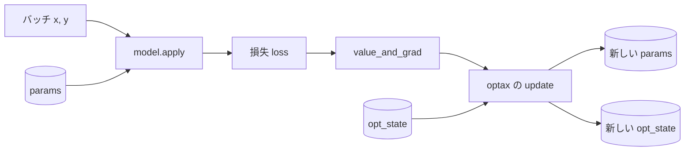
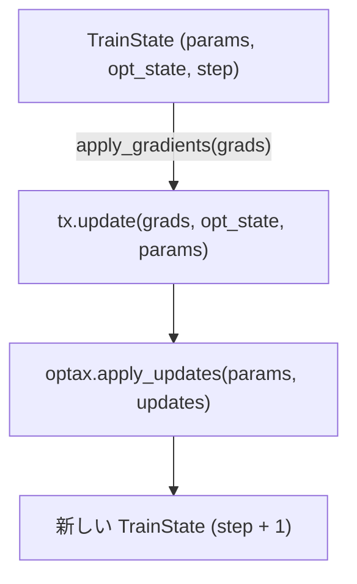
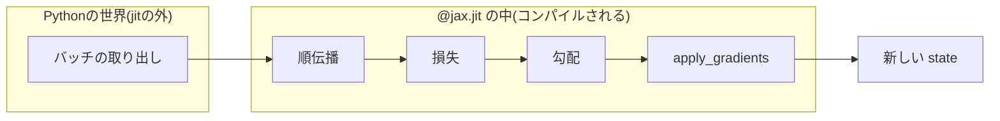
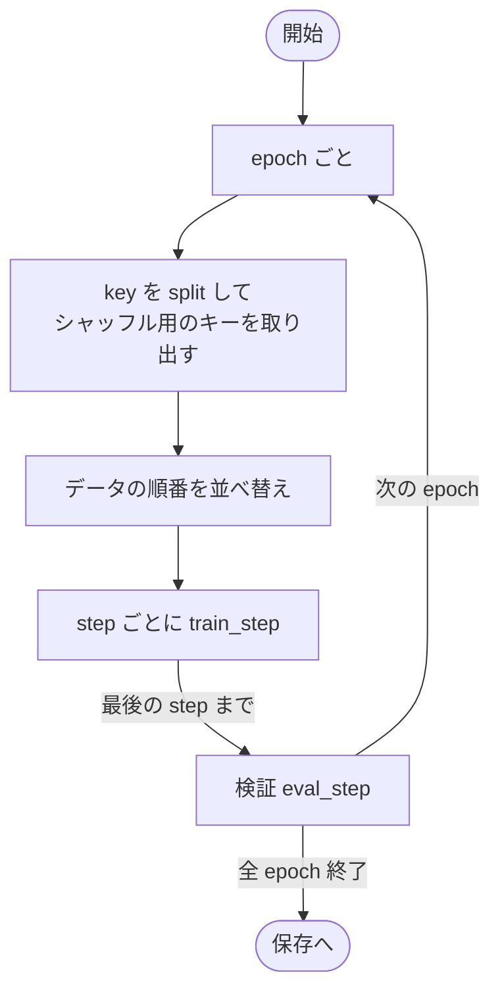
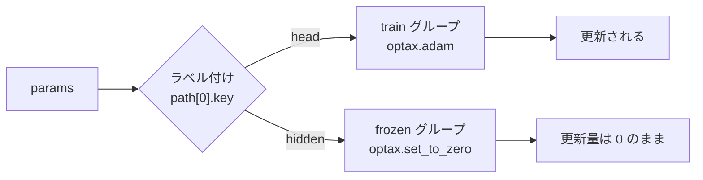
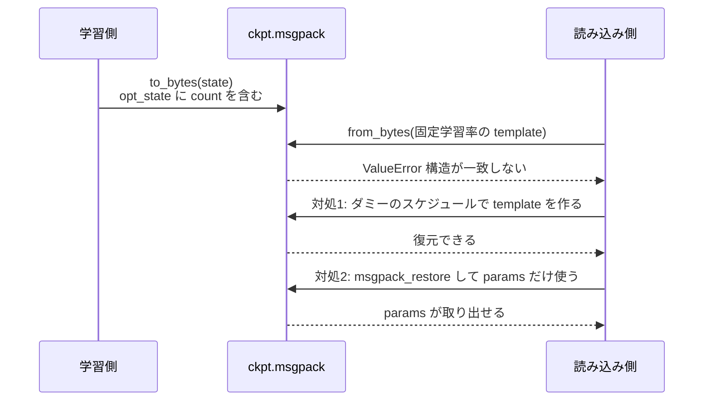

## はじめに

前回までに、JAX の基本と、Flax でのモデル作成・PyTorch との重み変換について書きました。

https://qiita.com/atsushi11o7/items/0bf94ff412c035aaa22d

https://qiita.com/atsushi11o7/items/52c41cbfad40fee67992

Flax でモデルを作るところまでは前回の記事で書きました、それを学習させて重みを保存するところまで行ったので、その過程で学習したことについて記します。この記事では、MNIST を題材に、学習ループを書き、一部のパラメータを凍結し、checkpoint を保存・復元するところまでを通しで書きます。途中で実際に踏んだエラーも載せます。

動作確認した環境は、jax 0.11.1、flax 0.12.9、optax 0.2.8 です。

## 学習ループの全体像

PyTorch では `loss.backward()` と `optimizer.step()` を呼ぶと、モデルと optimizer が内部状態を持ったまま更新されます。JAX は関数型なので、状態を明示的に受け取り、新しい状態を返す関数として書きます。



更新のたびに、`params` と `opt_state` が新しいものに置き換わります。この2つと `step` を1つにまとめて持ち回るのが、次に出てくる `TrainState` です。

## TrainState

`flax.training.train_state.TrainState` は、`params`・`opt_state`・`step` と、`apply_fn`（モデルの `apply`）・`tx`（optimizer）をまとめたデータクラスです。

```python
import flax.linen as nn
import jax
import jax.numpy as jnp
import numpy as np
import optax
from flax.training import train_state


class MLP(nn.Module):
    @nn.compact
    def __call__(self, x):
        x = x.reshape((x.shape[0], -1))
        x = nn.relu(nn.Dense(128, name="hidden")(x))
        return nn.Dense(10, name="head")(x)


def create_state(model, key, tx):
    params = model.init(key, jnp.zeros((1, 28, 28, 1)))["params"]
    return train_state.TrainState.create(apply_fn=model.apply, params=params, tx=tx)
```

`state.apply_gradients(grads=grads)` を呼ぶと、次のことをまとめてやってくれます。



新しい `TrainState` が返るだけで、元の `state` は書き換わらない点に注意です。

## optax で optimizer を組む

optax は、勾配の変換を部品として組み合わせて使います。今回は「勾配のクリップ → Adam」を `chain` でつなぎ、学習率には cosine decay のスケジュールを渡します。

```python
batch_size = 128
steps_per_epoch = 60000 // batch_size
epochs = 3

schedule = optax.cosine_decay_schedule(1e-3, steps_per_epoch * epochs, alpha=0.1)
tx = optax.chain(optax.clip_by_global_norm(1.0), optax.adam(schedule))

model = MLP()
state = create_state(model, jax.random.key(0), tx)
```

`alpha=0.1` は、最終的な学習率が初期値の10%になる、という意味です。`optax.adam` に固定値ではなく関数（schedule）を渡すと、内部で `step` を数えて学習率を変えてくれます。この設定は、後の checkpoint の復元で問題になります。

## 1 step の更新関数

```python
@jax.jit
def train_step(state, images, labels):
    def loss_fn(params):
        logits = state.apply_fn({"params": params}, images)
        loss = optax.softmax_cross_entropy_with_integer_labels(logits, labels).mean()
        return loss, logits

    (loss, logits), grads = jax.value_and_grad(loss_fn, has_aux=True)(state.params)
    accuracy = (logits.argmax(-1) == labels).mean()
    return state.apply_gradients(grads=grads), loss, accuracy
```

`jax.value_and_grad` で、損失と勾配を同時に求めます。損失以外の値（ここでは `logits`）も返したいときは `has_aux=True` にします。また、`@jax.jit` でこの関数全体がコンパイルされます。



### jit に関数を渡すと怒られる

評価用の関数を書くとき、`apply_fn` をそのまま引数に渡してしまうと、次のエラーになります。

```python
@jax.jit
def eval_step(params, apply_fn, images, labels):   # NG
    ...
```

```text
TypeError: Cannot interpret value of type <class 'method'> as an abstract array;
it does not have a dtype attribute
```

`jit` の引数は「配列の PyTree」でなければならず、関数は配列ではないので受け取れません。対処は2つあります。

- `static_argnums` で「コンパイル時に固定する値」として扱う（関数が変わるたびに再コンパイルされます）
- `TrainState` ごと渡す。`apply_fn` は `TrainState` の中で「PyTree の葉ではない値」として扱われるので、そのまま通ります

```python
@jax.jit
def eval_step(state, images, labels):
    logits = state.apply_fn({"params": state.params}, images)
    return (logits.argmax(-1) == labels).sum()
```

### shape が変わると再コンパイルされる

`jit` は、引数の shape と dtype ごとにコンパイルします。最後のバッチだけ端数が出ると、そこで再コンパイルが走って遅くなります。学習ループでは、端数のバッチは捨てる（`drop_last`）のが簡単です。

## 学習ループを回す

データは MNIST を使います。

```python
from torchvision import datasets


def load_mnist():
    def to_arrays(dataset):
        x = dataset.data.numpy().astype(np.float32)[..., None] / 255.0
        y = dataset.targets.numpy().astype(np.int32)
        return x, y

    train = datasets.MNIST("data", train=True, download=True)
    test = datasets.MNIST("data", train=False, download=True)
    return to_arrays(train), to_arrays(test)


(train_x, train_y), (val_x, val_y) = load_mnist()
```

エポックごとにシャッフルしてから、バッチを1つずつ `train_step` に渡します。

```python
key = jax.random.key(1)
for epoch in range(epochs):
    key, shuffle_key = jax.random.split(key)
    order = np.asarray(jax.random.permutation(shuffle_key, len(train_x)))
    for i in range(steps_per_epoch):
        idx = order[i * batch_size : (i + 1) * batch_size]
        state, loss, acc = train_step(state, train_x[idx], train_y[idx])

    correct = eval_step(state, val_x, val_y)
    print(f"epoch={epoch + 1} step={int(state.step)} "
          f"loss={float(loss):.3f} val_acc={float(correct) / len(val_x):.3f}")
```



### ベースラインと比べる

検証の精度は、単体で見ても良いのか悪いのか分かりません。最頻クラスを常に答える場合の精度（ベースライン）と比べる習慣をつけておくと、「ほぼ学習できていない」状態に早く気づけます。

```python
baseline = np.bincount(val_y).max() / len(val_y)
print(f"最頻クラスのベースライン: {baseline:.3f}")
```

## 一部のパラメータだけ学習する

事前学習した部分を固定して、出力層だけ学習したい場合があります。optax の `multi_transform` を使うと、パラメータのグループごとに別の optimizer を割り当てられます。

```python
params = model.init(jax.random.key(2), jnp.zeros((1, 28, 28, 1)))["params"]

labels = jax.tree_util.tree_map_with_path(
    lambda path, _: "train" if path[0].key == "head" else "frozen", params
)
tx_freeze = optax.multi_transform(
    {"train": optax.adam(1e-2), "frozen": optax.set_to_zero()}, labels
)
state = train_state.TrainState.create(apply_fn=model.apply, params=params, tx=tx_freeze)
```



`set_to_zero` は、更新量を常に0にする変換です。勾配自体は計算されますが、パラメータには反映されません。

### 凍結できているかをテストで確かめる

「凍結したつもり」で学習が進んでいなかった、というのは避けたいところです。1 step 更新して、更新前後を比べるテストを1つ書いておくと安心できます。

```python
new_state, _, _ = train_step(state, train_x[:128], train_y[:128])

hidden_same = jnp.array_equal(state.params["hidden"]["kernel"],
                              new_state.params["hidden"]["kernel"])
head_changed = not jnp.array_equal(state.params["head"]["kernel"],
                                   new_state.params["head"]["kernel"])
assert hidden_same and head_changed
```

## checkpoint の保存と復元

### flax.serialization で保存する

`serialization.to_bytes` でバイト列にして、ファイルに書き出せます。

```python
from pathlib import Path
from flax import serialization

Path("ckpt.msgpack").write_bytes(serialization.to_bytes(state))
```

復元は、同じ構造の `TrainState` を用意して、そこへ値を流し込みます。

```python
template = create_state(model, jax.random.key(3), tx)   # 保存時と同じ tx
state = serialization.from_bytes(template, Path("ckpt.msgpack").read_bytes())
```

### 学習率スケジュールの有無で復元に失敗する

「optax で optimizer を組む」の節で、`optax.adam` にスケジュールを渡しました。このとき `opt_state` には、`step` を数えるための `count` が含まれます。この `opt_state` を、固定の学習率で作った `TrainState` へ復元しようとすると失敗します。

```python
tx_const = optax.chain(optax.clip_by_global_norm(1.0), optax.adam(1e-3))
template = create_state(model, jax.random.key(3), tx_const)
serialization.from_bytes(template, data)
```

```text
ValueError: The field names of the state dict and the named tuple do not match,
got {'count'} and set() at path ./opt_state/1/1
```

推論のためだけに読み込みたいときや、別の optimizer で再開したいときに起こりやすいエラーです。対処は2つあります。

**対処1: ダミーのスケジュールで、保存時と同じ構造の template を作る**

スケジュールの中身は復元で上書きされるので、構造だけ合っていれば問題ありません。

```python
dummy = optax.chain(
    optax.clip_by_global_norm(1.0),
    optax.adam(optax.cosine_decay_schedule(1.0, 1)),
)
template = create_state(model, jax.random.key(3), dummy)
state = serialization.from_bytes(template, data)
```

**対処2: `params` だけ取り出す**

optimizer の状態が不要なら、バイト列を辞書として読んで、`params` だけ使います。template を作らないので、optimizer の構造に依存しません。

```python
raw = serialization.msgpack_restore(data)
params = raw["params"]
```



### orbax を使う場合

`flax.serialization` は手軽ですが、ファイルの管理（世代・非同期保存など）は自分で書く必要があります。そのあたりまで含めて任せたい場合は、標準的なライブラリの `orbax-checkpoint` を使います。

```python
import orbax.checkpoint as ocp

checkpointer = ocp.StandardCheckpointer()
checkpointer.save("/abs/path/params", state.params)
checkpointer.wait_until_finished()

restored = checkpointer.restore("/abs/path/params", state.params)
```

保存先は、絶対パスで指定するのが無難です（相対パスでの動作は試していません）。

今回の目的は、学習した重みを保存して、前回の重み変換で PyTorch へ渡すことでした。その場合は、`params` だけを `flax.serialization` で保存する形で十分でした。

## GPU メモリ不足と NaN のデバッグ

### GPU メモリ不足（OOM）

JAX は、既定で GPU メモリの大半を最初に確保します。他のプロセスと同じ GPU を使うときは、環境変数で調整します。

```bash
XLA_PYTHON_CLIENT_PREALLOCATE=false      # 必要になったぶんだけ確保する
XLA_PYTHON_CLIENT_MEM_FRACTION=0.5       # 使ってよい割合を制限する
```

もう1つ、評価で全データを一度に順伝播すると OOM になることがあります。学習は小さなバッチで回しているのに、評価だけ全件を渡してしまうケースです。`jax.lax.map` で分割して評価します。

```python
@jax.jit
def predict_all(params, x):
    chunk = 256
    chunks = x.reshape((len(x) // chunk, chunk) + x.shape[1:])
    logits = jax.lax.map(lambda c: model.apply({"params": params}, c), chunks)
    return logits.reshape((len(x), -1))
```

この例は、`len(x)` が `chunk` で割り切れる場合のものです。割り切れない場合は、端数を別に処理するか、パディングしてください。

分割しても予測は変わらないはずですが、GPU の行列積はバッチの形が変わると、ごくわずかに丸めが変わります。一括計算と比べるときは、`allclose` の許容誤差を `1e-5` ではなく `1e-3` くらいにしておきます。手元の確認では、最大で `1.7e-4` ずれました（`argmax` は全件一致でした）。

### NaN の発生源を特定する

```python
jax.config.update("jax_debug_nans", True)
```

有効にすると、NaN を生成した演算の時点でエラーになります。`jit` の中の値を確認したいときは、`print` ではなく `jax.debug.print` を使います。

```python
jax.debug.print("loss={loss}", loss=loss)
```

## おわりに

JAX の学習ループは、`params` と `opt_state` を持ち回る関数として書きます。`TrainState` がそれをまとめてくれて、optax は `chain` で部品をつなぎ、一部だけ学習したいときは `multi_transform` を使います。

`jit` の引数は配列の PyTree なので、関数を渡したいときは `TrainState` ごと渡します。checkpoint の復元には保存時と同じ構造の template が必要で、学習率スケジュールの有無でも構造が変わるので注意が必要です。評価はベースラインと比べ、全件を一度に流さず分割して行います。

保存した `params` は、[前回の記事](https://qiita.com/atsushi11o7/items/52c41cbfad40fee67992)の重み変換で PyTorch へ渡せます。

