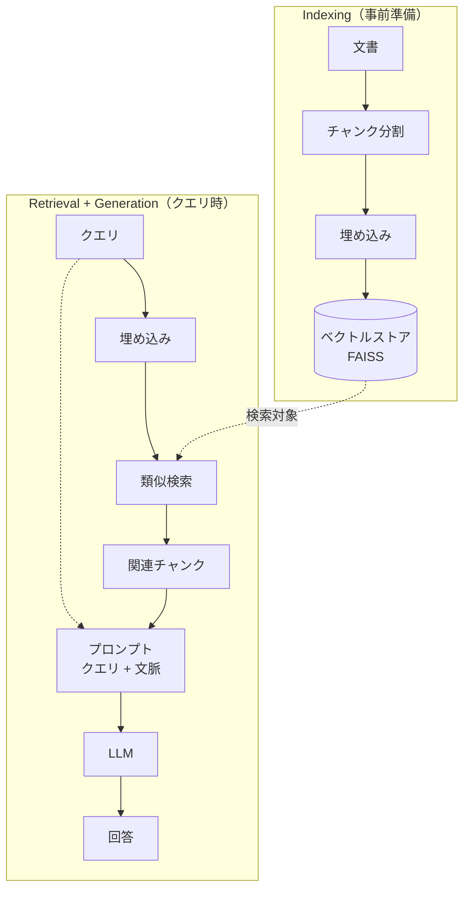
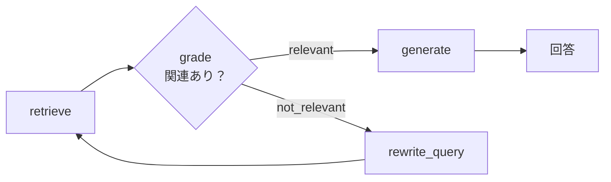

## はじめに

私は現在、RAG（Retrieval-Augmented Generation）の発展的な手法を習得するために、勉強や実装を進めているのですが、その過程で、これまで使ってきた基礎的な RAG 技術を、一度きちんと整理し直しておきたいと考えました。

そこで、2026 年 6 月現在のできるだけ新しい LangChain モジュールを使い、RAG の基礎的な処理フローを一通り実行できるリポジトリを作ってみました。
この記事はその整理の簡単なまとめです。

https://github.com/atsushi11o7/rag-sandbox


## RAG とは

RAG（Retrieval-Augmented Generation）は、外部の知識を検索し、その結果を文脈として LLM に渡してから回答を生成する手法です。

LLM は学習した時点の知識しか持たず、最新の情報や手元の文書については答えられません。
知らないことをもっともらしく答えてしまう、いわゆるハルシネーションも起きます。
検索した文書を根拠として与えることで、こうした問題を抑え、回答の正確性や最新性を高められます。

大きくは「検索（Retrieval）」と「生成（Generation）」の組み合わせです。

## 実行環境（devcontainer + uv / Ollama）

実行環境は CUDA 12.6 + Python 3.12 の devcontainer で、パッケージ管理は uv（`uv.lock` で固定）を使っています。

Dockerfile や divcontainer の設定はリポジトリにあるので、そちらを参照してください。

<details><summary>pyproject.toml（依存一覧）</summary>

```toml
[project]
name = "rag-sandbox"
version = "0.1.0"
description = "RAG技術を試すサンドボックス"
readme = "README.md"
requires-python = ">=3.12,<3.13"
dependencies = [
    "numpy>=1.26",
    "pandas>=2.2",
    "scipy>=1.12",
    "scikit-learn>=1.5",
    "transformers>=4.44",
    "sentence-transformers>=3.0",
    "FlagEmbedding>=1.2",
    "fugashi>=1.3",
    "unidic-lite>=1.0.8",
    "rank-bm25>=0.2.2",
    "faiss-cpu>=1.8",
    "ollama>=0.3",
    "langgraph>=1.0",
    "langchain>=1.0",
    "langchain-core>=1.0",
    "matplotlib>=3.8",
    "seaborn>=0.13",
    "plotly>=5.18",
    "jupyterlab>=4.0",
    "ipykernel>=6.29",
    "ipywidgets>=8.1",
    "tqdm>=4.66",
    "joblib>=1.3",
    "torch>=2.7",
    "langchain-huggingface>=1.2.2",
    "langchain-text-splitters>=1.1.2",
    "langchain-community>=0.4.2",
    "langchain-ollama>=1.1.0",
    "langchain-classic>=1.0.8",
]

[tool.uv.sources]
torch = [
    { index = "pytorch-cu126" },
]

[[tool.uv.index]]
name = "pytorch-cu126"
url = "https://download.pytorch.org/whl/cu126"
explicit = true
```

</details>

そのまま貼り付けているので、実際には使っていないモジュールも含まれています。
結果的に使用している LangChain 関連モジュールのバージョンは、次の「LangChain エコシステムの整理」で触れます。

### LLM はローカルの Ollama で

生成・HyDE・Corrective RAG では LLM を呼び出します。
本来は OpenAI などの API を使うところですが、お金をかけたくなかったので、ローカルに Ollama サーバーを立てて API ライクに使うようにしました（モデルは `qwen2.5:7b`を使用しています）。
Ollama は devcontainer の外で起動し、Docker Compose でサービス化して、コンテナ内から `OLLAMA_HOST` 経由で呼び出します。

```python
from langchain_ollama import ChatOllama

host = os.environ.get("OLLAMA_HOST")
llm = ChatOllama(model="qwen2.5:7b", base_url=host) if host else ChatOllama(model="qwen2.5:7b")
```

## LangChain エコシステムの整理

私が以前 LangChain を使っていたのは 0.0.x の頃でした。
当時と比べると、現在の 1.x 系は用途ごとにパッケージが細分化されていて、どれを import すればよいか少しややこしくなっています。
そこで、最初に整理しておきます（たとえば `ParentDocumentRetriever` は本体ではなく `langchain-classic` に移っています）。

今回（2026 年 6 月時点）使った LangChain 関連パッケージとバージョンは次のとおりです。

| パッケージ | バージョン | 役割 |
|---|---|---|
| `langchain-core` | 1.4.8 | 抽象基底クラス（`BaseRetriever` / `Document` / `Embeddings`） |
| `langchain` | 1.3.10 | 高レベル API（`ContextualCompressionRetriever` など） |
| `langchain-community` | 0.4.2 | サードパーティ統合（`FAISS` / `LongContextReorder`） |
| `langchain-text-splitters` | 1.1.2 | テキスト分割（`RecursiveCharacterTextSplitter`） |
| `langchain-ollama` | 1.1.0 | Ollama 連携（`ChatOllama`） |
| `langchain-classic` | 1.0.8 | 旧 API の互換（`ParentDocumentRetriever`） |
| `langgraph` | 1.2.6 | 状態グラフ（Corrective RAG に使用） |

埋め込み・検索まわりで使っている主なライブラリは次のとおりです。

| ライブラリ | 役割 |
|---|---|
| `sentence-transformers` | Dense 埋め込み（`SentenceTransformer` / ruri-v3）と Cross-Encoder リランカー（`CrossEncoder` / ruri-reranker-large） |
| `faiss-cpu` | ベクトルインデックスと近似最近傍探索 |
| `fugashi` + `unidic-lite` | 日本語の形態素解析（BM25 のトークナイザー） |
| `rank-bm25` | BM25 スコアリング |

### 実装の共通パターン（BaseRetriever / Document）

この記事に出てくる検索器（Dense / BM25 / ハイブリッド / Reranker / HyDE など）は、すべて LangChain の `BaseRetriever` を継承して作っています。
実装するのは `_get_relevant_documents(self, query, *, run_manager)` メソッドで、呼び出し側は公開 API の `.invoke(query)` を使います（内部で `_get_relevant_documents` が呼ばれます）。
このおかげで、どの検索手法も同じ `invoke()` で扱え、Reranker や HyDE のように「別の検索器をラップする」形でも自由に組み合わせられます。

検索でやり取りする単位は LangChain の `Document` で、本文（`page_content`）とメタデータ（`metadata`）を持ちます。
`metadata` に `doc_id` やタグを入れておくことで、後段のフィルタや評価で使えます。

また `BaseRetriever` は Pydantic モデルなので、形態素解析器や埋め込み / Reranker モデルのような重いオブジェクトは `PrivateAttr` として持ち、`model_validator(mode="after")` でインスタンス化後に一度だけ構築します（BM25・Reranker・HyDE などで繰り返し出てきます）。

## コーパスの準備（Qiita 公開 API）

検索対象のコーパスには、自分の Qiita 記事を使いました。
Qiita の公開 API（`/users/{user}/items`）から各記事を取得し、本文を `data/corpus/<記事ID>.md`、メタデータ（タイトル・日付・タグなど）を同名の `.json` として保存します。

```python
# scripts/fetch_qiita.py（抜粋）
for item in fetch_items(USERNAME, TOKEN):
    doc_id = item["id"]
    (OUT_DIR / f"{doc_id}.md").write_text(item["rendered_body"], encoding="utf-8")
    meta = {
        "title": item["title"],
        "created_at": item["created_at"],
        "tags": [tag["name"] for tag in item.get("tags", [])],
        "likes_count": item.get("likes_count", 0),
        "url": item.get("url", ""),
    }
    (OUT_DIR / f"{doc_id}.json").write_text(
        json.dumps(meta, ensure_ascii=False), encoding="utf-8"
    )
```

本文（`.md`）とメタデータ（`.json`）をペアで持つのがポイントです。
読み込み時にサイドカー JSON を `Document.metadata` に載せておくと、あとでタグや日付でフィルタできます（後述の「メタデータフィルタリング」で使います）。

```python
# src/rag/corpus.py（抜粋）
def load_md_corpus(corpus_dir: str) -> list[Document]:
    docs = []
    for p in sorted(Path(corpus_dir).glob("*.md")):
        meta: dict = {"doc_id": p.stem}
        sidecar = p.with_suffix(".json")
        if sidecar.exists():
            meta.update(json.loads(sidecar.read_text(encoding="utf-8")))
        docs.append(Document(page_content=p.read_text(encoding="utf-8"), metadata=meta))
    return docs
```

## RAG の基本パイプライン

RAG は大きく、コーパスを事前に検索可能にする「Indexing」と、クエリを受けて検索し回答する「Retrieval + Generation」に分かれます。



これ以降の各節は、このパイプラインのどこかを担う技術の話です。
チャンク分割や埋め込みは Indexing、BM25・ハイブリッド検索・リランキングは Retrieval、コンテキストの並び順は Generation に対応します。

## チャンク分割

LLM のコンテキスト長や検索精度の都合で、文書は適切な粒度に分割します。
小さすぎると文脈が失われ、大きすぎるとノイズが増えます。

実装には LangChain の `RecursiveCharacterTextSplitter` を使いました。
これは、渡した区切り文字のリストを優先順位の高い順に試すスプリッターです。
まず先頭の区切り（段落区切りの `\n\n`）で分け、それでも `chunk_size` を超えるチャンクは、次の区切り（`\n` → `。` → `、` → …）で再帰的に分け直します。
こうして「できるだけ大きな意味のまとまり（段落 → 行 → 文）を保ちつつ、`chunk_size` に収める」のが狙いです。
リスト末尾の `""` は、どの区切りでも収まらないときに文字単位で強制分割するためのフォールバックです。

デフォルトの区切り（`\n\n` → `\n` → スペース）は、単語がスペースで区切られない日本語ではうまく機能しません。
そこで、句点（`。`）・読点（`、`）を含む区切りリストを明示しています。

```python
# src/rag/chunking.py
from langchain_text_splitters import RecursiveCharacterTextSplitter

_DEFAULT_SEPARATORS = ["\n\n", "\n", "。", "、", " ", ""]

def split_documents(docs, chunk_size=500, chunk_overlap=100):
    splitter = RecursiveCharacterTextSplitter(
        chunk_size=chunk_size,
        chunk_overlap=chunk_overlap,
        separators=_DEFAULT_SEPARATORS,
    )
    chunks = []
    for doc in docs:
        doc_chunks = splitter.split_documents([doc])
        for i, chunk in enumerate(doc_chunks):
            chunk.metadata["chunk_id"] = f"{chunk.metadata['doc_id']}#{i}"
        chunks.extend(doc_chunks)
    return chunks
```

`chunk_id` を `"doc_id#連番"` の形で振っておくと、後で評価するときに「どの記事のどのチャンクか」を追跡できます。
`chunk_overlap` は、隣り合うチャンクで文脈が途切れないようにするための重複分です。

なお今回試したのは再帰分割の 1 種類だけで、固定長や意味ベースの分割との比較まではしていません。

## 埋め込みとベクトル検索（Dense・FAISS）

Dense Retrieval は、テキストを意味ベクトルに変換し、クエリとの類似度で文書をランキングする手法です。
このベクトル化を担うのが埋め込みモデルです。

### 埋め込みモデル（ruri-v3）

日本語向けの埋め込みモデルとして `cl-nagoya/ruri-v3-310m` を使いました。
ruri-v3 は、クエリと文書でプレフィックス（`検索クエリ: ` / `検索文書: `）を使い分けると精度が上がるよう学習されています。
LangChain の `HuggingFaceEmbeddings` はこのプレフィックス切り替えに対応していないため、`Embeddings` を継承した薄いラッパーを書きました。

```python
# src/rag/embeddings.py
from langchain_core.embeddings import Embeddings
from sentence_transformers import SentenceTransformer

class PrefixedEmbeddings(Embeddings):
    def __init__(self, model_name="cl-nagoya/ruri-v3-310m",
                 query_prefix="検索クエリ: ", doc_prefix="検索文書: "):
        self._model = SentenceTransformer(model_name)
        self._query_prefix = query_prefix
        self._doc_prefix = doc_prefix

    def embed_documents(self, texts):
        vecs = self._model.encode([self._doc_prefix + t for t in texts],
                                  normalize_embeddings=True, convert_to_numpy=True)
        return vecs.astype("float32").tolist()

    def embed_query(self, text):
        vec = self._model.encode(self._query_prefix + text,
                                 normalize_embeddings=True, convert_to_numpy=True)
        return vec.astype("float32").tolist()
```

`normalize_embeddings=True` でベクトルを L2 正規化すると、FAISS の L2 距離が cosine 類似度と等価になります。

### FAISS でインデックスを作る

ベクトルストアには FAISS を使いました。

```python
# src/rag/store.py
from langchain_community.vectorstores import FAISS

def build_faiss(docs, embeddings, save_dir):
    store = FAISS.from_documents(docs, embeddings)
    store.save_local(save_dir)
    return store

def load_faiss(save_dir, embeddings):
    return FAISS.load_local(save_dir, embeddings,
                            allow_dangerous_deserialization=True)
```

`load_local` の `allow_dangerous_deserialization=True` は LangChain のセキュリティ仕様で必須です（自分で作ったインデックスなので有効化しています）。

検索は、FAISS ストアを Retriever 化して使います。

```python
# src/rag/retrievers/dense.py
def build_dense_retriever(store, top_k=10):
    return store.as_retriever(search_kwargs={"k": top_k})
```

```python
# 使い方
emb = PrefixedEmbeddings()
chunks = split_documents(load_md_corpus("data/corpus"))
store = build_faiss(chunks, emb, "data/index/faiss")
retriever = build_dense_retriever(store, top_k=5)
results = retriever.invoke("RAG の精度を上げるには？")
```

## キーワード検索（BM25 + 形態素解析）

BM25 は、TF-IDF を発展させた語彙ベースのキーワード検索です。
Dense 検索が意味の近さで文書を拾うのに対し、BM25 は語の一致でスコアリングします。
そのため「uv」「FAISS」「ruri-v3」のような固有名詞・専門用語・略語に強いのが特徴です。

日本語はスペースで単語が区切られないため、`fugashi`（MeCab ラッパー）+ `unidic-lite` で形態素解析してトークン化してから `rank-bm25` に渡します。

```python
# src/rag/retrievers/bm25.py（抜粋）
from fugashi import Tagger
from rank_bm25 import BM25Okapi
from langchain_core.retrievers import BaseRetriever
from pydantic import PrivateAttr, model_validator

class JapaneseBM25Retriever(BaseRetriever):
    docs: list[Document]
    k: int = 10
    _tagger: Tagger = PrivateAttr()
    _bm25: BM25Okapi = PrivateAttr()

    @model_validator(mode="after")
    def _build_index(self):
        self._tagger = Tagger()
        tokenized = [self._tokenize(d.page_content) for d in self.docs]
        self._bm25 = BM25Okapi(tokenized)
        return self

    def _tokenize(self, text):
        return [w.surface for w in self._tagger(text)]  # 表層形でトークン化

    def _get_relevant_documents(self, query, *, run_manager):
        scores = self._bm25.get_scores(self._tokenize(query))
        ranked = sorted(
            [(d, float(s)) for d, s in zip(self.docs, scores) if s > 0],
            key=lambda x: x[1], reverse=True,
        )
        return [d for d, _ in ranked[: self.k]]
```

`Tagger` や `BM25Okapi` は、前述の `PrivateAttr` + `model_validator(mode="after")` パターンで初期化しています。

## ハイブリッド検索（RRF）

ハイブリッド検索は、Dense 検索（意味）と BM25（語彙）の結果を組み合わせる手法です。
2 つはスコアのスケールが違うので、順位ベースで統合する **RRF（Reciprocal Rank Fusion）** を使いました。
RRF は、各検索結果の「順位の逆数」を足し合わせてスコアにします。

```text
RRF スコア = Σ 1 / (k + rank)   （k=60、rank は 1 始まり）
```

`k=60` は順位差をならすための定数で、RRF の標準値としてよく使われます。

```python
# src/rag/retrievers/hybrid.py（抜粋）
class HybridRetriever(BaseRetriever):
    retrievers: list[BaseRetriever]
    k: int = 60          # RRF の平滑化定数
    candidate_k: int = 50
    top_k: int = 10

    def _get_relevant_documents(self, query, *, run_manager):
        rrf_scores: dict[str, float] = {}
        doc_map: dict[str, Document] = {}
        for retriever in self.retrievers:
            results = retriever.invoke(query)
            for rank, doc in enumerate(results[: self.candidate_k]):
                key = doc.metadata.get("chunk_id") or doc.metadata.get("doc_id")
                rrf_scores[key] = rrf_scores.get(key, 0.0) + 1.0 / (self.k + rank + 1)
                doc_map[key] = doc
        ranked = sorted(rrf_scores.items(), key=lambda x: x[1], reverse=True)
        return [doc_map[key] for key, _ in ranked[: self.top_k]]
```

```python
# 使い方
dense = build_dense_retriever(store, top_k=50)
bm25 = JapaneseBM25Retriever.from_documents(chunks, k=50)
hybrid = HybridRetriever(retrievers=[dense, bm25], candidate_k=50, top_k=10)
results = hybrid.invoke("uv の利点は？")
```

各検索で多めに候補（50 件）を取り、RRF で統合してから上位を返す構成にしています。

## リランキング（Cross-Encoder / 日本語 Reranker）

リランキングは、一次検索で取った候補を、より精度の高いモデルでスコア付けし直す手法です。

埋め込み（Bi-Encoder）はクエリと文書を別々にベクトル化して内積を取りますが、Cross-Encoder はクエリと文書をまとめて入力し、関連度スコアを 1 つ出力します。
計算コストは高いぶん精度が高いので、一次検索で候補を絞ったあとの並べ替えに向いています。

```text
Bi-Encoder:    embed(query) · embed(doc)     → 大量の文書に高速
Cross-Encoder: score(query, doc) を直接推定   → 候補の絞り込みに使う
```

日本語向けの Reranker として `cl-nagoya/ruri-reranker-large` を使いました。

```python
# src/rag/rerank.py（抜粋）
from sentence_transformers import CrossEncoder
from langchain_core.documents.compressor import BaseDocumentCompressor

class CrossEncoderReranker(BaseDocumentCompressor):
    model_name: str = "cl-nagoya/ruri-reranker-large"
    top_n: int = 5
    _model: CrossEncoder = PrivateAttr()

    @model_validator(mode="after")
    def _init_model(self):
        self._model = CrossEncoder(self.model_name)
        return self

    def compress_documents(self, documents, query, callbacks=None):
        pairs = [(query, d.page_content) for d in documents]
        scores = self._model.predict(pairs)
        ranked = sorted(zip(documents, scores), key=lambda x: x[1], reverse=True)
        return [d for d, _ in ranked[: self.top_n]]
```

`BaseDocumentCompressor` を継承しておくと、LangChain の `ContextualCompressionRetriever` に組み込めます。
これを利用して、ハイブリッド検索の上に Reranker を重ねられます。

```python
# 使い方（hybrid → rerank）
retriever = RerankedRetriever(
    base_retriever=hybrid,
    reranker=CrossEncoderReranker(top_n=5),
)
```

## メタデータフィルタリング

コーパス読み込み時にサイドカー JSON から付けたタグや日付（`Document.metadata`）を使うと、検索対象を絞り込めます。
「特定のタグの記事だけ」「最近の記事だけ」といった絞り込みです。

FAISS 単体はメタデータでのフィルタが弱いため、検索した候補を後から絞る**事後フィルタ**として実装しました。

```python
# src/rag/retrievers/filtered.py
class TagFilteredRetriever(BaseRetriever):
    base_retriever: BaseRetriever
    tags: list[str]     # OR 条件：いずれかのタグを含む文書を残す

    def _get_relevant_documents(self, query, *, run_manager):
        tag_set = set(self.tags)
        candidates = self.base_retriever.invoke(query)
        return [d for d in candidates if tag_set & set(d.metadata.get("tags", []))]
```

事後フィルタなので、**挟む位置**が重要です。
`Hybrid（50 件）→ Tag filter → Rerank（5 件）` の順にすると、タグ一致した文書の中から Reranker が上位を選びます。
逆に Rerank の後にフィルタを置くと、上位 5 件にタグ一致が無ければ結果が空になってしまいます。

```python
filtered = TagFilteredRetriever(base_retriever=hybrid, tags=["Python", "uv"])
retriever = RerankedRetriever(base_retriever=filtered, reranker=CrossEncoderReranker(top_n=5))
```

候補を多めに取ってから絞るのが前提です。

## クエリ変換（HyDE・マルチクエリ・分解）

ユーザーが入力したクエリが、そのまま検索に最適とは限りません。
クエリ側を変換・拡張してから検索する手法をいくつか試しました。

### HyDE（Hypothetical Document Embeddings）

HyDE は、クエリに対する「仮の回答」を LLM に生成させ、その仮回答文で検索する手法です。

```text
通常: クエリ ──embed──→ 検索 → 文書
HyDE: クエリ → LLM → 仮回答文 ──embed──→ 検索 → 文書
```

仮回答文は実際の文書と「同じような文章」になりやすいため、クエリそのものより文書に近いベクトルになる、という発想です。

```python
# src/rag/retrievers/hyde.py（抜粋）
_PROMPT = ChatPromptTemplate.from_messages([
    ("system", "必ず日本語のみで答えてください。"),
    ("user", "次の質問に答える日本語の文章を簡潔に書いてください。\n質問: {query}"),
])

class HydeRetriever(BaseRetriever):
    base_retriever: BaseRetriever
    include_original: bool = False  # True で元クエリ検索とも RRF 統合
    _chain: Runnable = PrivateAttr()  # _PROMPT | ChatOllama | StrOutputParser

    def _get_relevant_documents(self, query, *, run_manager):
        hypothesis = self._chain.invoke({"query": query})   # 仮回答を生成
        hyde_results = self.base_retriever.invoke(hypothesis)
        if not self.include_original:
            return hyde_results
        raw_results = self.base_retriever.invoke(query)
        return _rrf_merge([raw_results, hyde_results])[: self.top_k]
```

`include_original=True` にすると、仮回答で固有名詞が薄まるのを補うため、元クエリの検索結果とも RRF で統合します。

### マルチクエリ（言い換え・分解）

クエリを LLM で複数に増やし、それぞれで検索して RRF で統合する手法です。

```python
# src/rag/retrievers/multi_query.py（概略）
class ParaphraseRetriever(BaseRetriever):
    """言い換えを N 個生成 → 各クエリで検索 → RRF 統合"""
    base_retriever: BaseRetriever
    n_paraphrases: int = 3

class DecomposeRetriever(BaseRetriever):
    """複雑なクエリをサブクエリに分解 → 各クエリで検索 → RRF 統合"""
    base_retriever: BaseRetriever
    n_subqueries: int = 3
```

言い換え（Paraphrase）は表現のゆれを、分解（Decompose）は複数トピックを含む質問をカバーしやすくします。
統合はハイブリッド検索と同じく RRF です。

## 親子チャンク（Parent-Child）

親子チャンクは、「小さいチャンクで検索し、大きいチャンクを文脈として返す」手法です（small-to-big）。

```text
検索（子チャンク 200字）→ ヒット → 対応する親チャンク（1000字）を文脈として返す
```

小さい子チャンクは意味が凝縮されていて検索精度が高く、LLM には文脈の多い親チャンクを渡せる、という両取りを狙います。

実装には `langchain-classic` の **`ParentDocumentRetriever`** を使いました（LangChain 1.x 本体には含まれず classic に残っています）。
これは初期化時に空のベクトルストア（`vectorstore`）と保管庫（`docstore`）を受け取り、`add_documents(docs)` を呼ぶと内部で文書を親 → 子に 2 段分割しながら、

- **子チャンク**を埋め込んで `vectorstore` に追加し、検索に使う
- **親チャンク**を id をキーに `docstore` へ入れておく

という形で中身を自分で管理します。検索時は子チャンクをベクトル検索し、ヒットした子が属する親を `docstore` から引いて返します。

`docstore` には `InMemoryStore`（メモリ上の Key-Value ストア）を使いました。
親チャンクをメモリに置くだけのシンプルな実装で、永続化はしません（サンドボックスなので毎回作り直す前提。本番なら永続ストアに差し替えます）。

```python
# src/rag/retrievers/parent_child.py（抜粋）
import faiss
from langchain_classic.retrievers import ParentDocumentRetriever
from langchain_core.stores import InMemoryStore
from langchain_community.docstore.in_memory import InMemoryDocstore

def build_parent_child_retriever(docs, parent_size=1000, child_size=200, child_k=50):
    parent_splitter = RecursiveCharacterTextSplitter(chunk_size=parent_size, chunk_overlap=0)
    child_splitter = RecursiveCharacterTextSplitter(chunk_size=child_size, chunk_overlap=0)
    # 空の FAISS（次元数を直接指定して作る）
    emb = PrefixedEmbeddings()
    dim = len(emb.embed_query("dimension check"))
    vectorstore = FAISS(embedding_function=emb, index=faiss.IndexFlatL2(dim),
                        docstore=InMemoryDocstore(), index_to_docstore_id={})
    retriever = ParentDocumentRetriever(
        vectorstore=vectorstore,          # 子チャンクの検索用（空で渡す）
        docstore=InMemoryStore(),         # 親チャンクの保管用
        parent_splitter=parent_splitter,
        child_splitter=child_splitter,
        search_kwargs={"k": child_k},
    )
    retriever.add_documents(docs)
    return retriever
```

普通の Dense Retriever なら `FAISS.from_documents(chunks, emb)` で直接作れますが、`ParentDocumentRetriever` には「空の入れ物」を渡す必要があります。
`FAISS.from_texts([""], emb)` は次元数を推定するために 1 件の文書が要るので、`faiss.IndexFlatL2(dim)` で次元数を直接指定し、本当に空のインデックスを作っています。

なお、コード中の `InMemoryStore` は親チャンク用の保管庫、`InMemoryDocstore` は FAISS が子チャンクの実体を持つための内部ストアです。

`ParentDocumentRetriever` も `BaseRetriever` なので、Reranker と組み合わせられます。

```python
base = build_parent_child_retriever(docs, child_k=50)
retriever = RerankedRetriever(base_retriever=base, reranker=CrossEncoderReranker(top_n=5))
```

## 検索結果の調整（MMR）

通常の Dense 検索は「クエリに最も近い文書」を上位に並べるため、似た内容の文書ばかりが返ることがあります。
MMR（Maximal Marginal Relevance）は、関連度と多様性のバランスを取りながら文書を選ぶ手法です。

`fetch_k` 件の候補から、関連度と「すでに選んだ文書との重複の少なさ」を見て `top_k` 件を選びます。
`lambda_mult` は `1.0` で関連度重視、`0.0` で多様性重視です。
FAISS の `as_retriever` に `search_type="mmr"` を指定するだけで使えます。

```python
# src/rag/retrievers/dense.py
def build_dense_retriever(store, top_k=10, mmr=False, lambda_mult=0.5, fetch_k=50):
    if mmr:
        return store.as_retriever(
            search_type="mmr",
            search_kwargs={"k": top_k, "fetch_k": fetch_k, "lambda_mult": lambda_mult},
        )
    return store.as_retriever(search_kwargs={"k": top_k})
```

`fetch_k=50` 件の候補から、多様性を考慮して `top_k` 件を選ぶ形です。

## 生成（Generation）

検索した文書をプロンプトに入れて LLM に回答させるのが生成です。
`RAGGenerator`（`generation.py`）がこれを担います。ポイントは次のとおりです。

- **文脈の整形と出典付け**：各文書に `[1] source: 記事タイトル` のように番号と出典を付けてから渡します（回答に出典番号を含めやすくなります）。
- **ハルシネーション抑制**：システムプロンプトに「与えられた文書に根拠がなければ推測せず、分からないと答えてください」を入れています。
- **lost-in-the-middle 対策**：`LongContextReorder` で重要な文書を先頭・末尾に寄せます（下で説明します）。

```python
# src/rag/generation.py（抜粋）
_PROMPT = ChatPromptTemplate.from_messages([
    ("system", "必ず日本語のみで答えてください。"
               "与えられた文書に根拠がない内容は推測せず、分からないと答えてください。"),
    ("user", "以下の文書を参考に、質問に答えてください。\n\n文書:\n{context}\n\n質問: {query}"),
])

def _format_doc(doc, i):
    source = doc.metadata.get("title") or doc.metadata.get("doc_id", f"doc-{i}")
    return f"[{i}] source: {source}\n{doc.page_content}"

class RAGGenerator(BaseModel):
    model: str = "qwen2.5:7b"
    reorder: bool = False
    _chain: Runnable = PrivateAttr()           # _PROMPT | ChatOllama | StrOutputParser
    _reorderer: LongContextReorder | None = PrivateAttr(default=None)

    def generate(self, query, docs):
        ordered = self._reorderer.transform_documents(docs) if self._reorderer else docs
        context = "\n---\n".join(_format_doc(d, i) for i, d in enumerate(ordered, 1))
        return self._chain.invoke({"context": context, "query": query})
```

実装は **LCEL（LangChain Expression Language）** で書いています。
LCEL は `prompt | llm | parser` のように `|` でコンポーネントをつなぎ、1 つの `Runnable`（`invoke` で実行できるパイプライン）にする記法です。
ここでは「プロンプト → `ChatOllama` → 文字列パーサ」をつないでいます。

ちなみに、システムプロンプトに「必ず日本語のみで答えてください」と入れているのは、`qwen2.5:7b` が中国製モデルだからか、日本語で聞いてもたまに中国語で返ってきたからです。仕方なく日本語を明示しています（それでもたまに中国語で返ってきましたが……）。

### lost-in-the-middle 対策（LongContextReorder）

LLM は、長いコンテキストの**中間にある情報を見落としやすい**ことが知られています。
これは [Lost in the Middle: How Language Models Use Long Contexts](https://arxiv.org/abs/2307.03172)（Liu et al., 2023）で報告された現象で、関連情報が先頭や末尾にあるときは性能が高く、中間にあると大きく低下する、というものです。
LangChain にはこれに対応する `LongContextReorder` が用意されているので、`reorder=True` のときはこれで重要な文書を先頭と末尾に寄せて渡しています。
並べ替えは LCEL チェーンの中ではなく、チェーンに渡す前の Python 側で行っています（チェーンは整形済みの `context` 文字列を受け取るだけです）。

## 能動的な検索（Agentic RAG / Corrective RAG）

ここまでは「1 回検索して生成する」静的なパイプラインでした。
**能動的（Agentic）な RAG** は、LLM が検索プロセス自体を制御します。その代表例として **Corrective RAG（CRAG）** を実装しました（CRAG は Agentic / Adaptive RAG の一種です）。

CRAG は、取得した文書を LLM が「関連あるか」自己評価し、不十分なら**クエリを書き換えて再検索する**ループを持ちます。



これを LangGraph の状態機械（`StateGraph`）として実装しました。

```python
# src/rag/graph/corrective_rag.py（抜粋）
class RAGState(TypedDict):
    original_query: str   # ユーザーの元の質問（生成に使う。書き換えない）
    search_query: str     # 実際の検索クエリ（rewrite_query で更新）
    documents: list[Document]
    grade: str            # "relevant" | "not_relevant"
    retries: int

def build_corrective_rag(retriever, generator, max_retries=2):
    def retrieve(state):
        return {"documents": retriever.invoke(state["search_query"])}

    def grade_documents(state):
        # 文書を1件ずつ judge し、関連ありだけ残す
        relevant = []
        for doc in state["documents"]:
            verdict = grade_chain.invoke({"query": state["search_query"],
                                          "context": doc.page_content}).strip().lower()
            if verdict.startswith("relevant"):
                relevant.append(doc)
        return {"documents": relevant, "grade": "relevant" if relevant else "not_relevant"}

    def generate(state):
        # 回答は書き換え後ではなく「元の質問」に対して生成する
        return {"answer": generator.generate(state["original_query"], state["documents"])}

    def rewrite_query(state):
        new_q = rewrite_chain.invoke({"query": state["search_query"]}).strip()
        return {"search_query": new_q, "retries": state.get("retries", 0) + 1}
    ...
```

実装上のポイントが 3 つあります。

- **`original_query` と `search_query` を分ける**：検索クエリは書き換えても、最終的な回答は「ユーザーが最初に入力した質問」に対して生成します。
- **文書は 1 件ずつ判定する**：まとめて判定すると、無関係な文書が混ざっていても通ってしまうためです。
- **グレーディングにドメインを明示する**：プロンプトに「IT・プログラミングの文脈」と書かないと、「uv」を紫外線と解釈するなどの誤判定が起きました。

### Self-RAG

Self-RAG も、能動的な RAG の一手法です。
生成の過程でモデル自身が「そもそも検索が必要か」「取得した文書は関連するか」「生成が文書に基づいているか」を、reflection token と呼ばれる特別なトークンを使って自己評価します。
これにより、検索が不要なクエリには検索せずに答えたり、根拠の薄い生成を抑えたりできます。

## 評価の基礎

<!-- メモ:
- ※今回はラベル（qrels）を作っていないので実測結果は載せず、「こういう指標・方法がある」の紹介に留める
- 検索の指標：Recall@k / MRR@k / nDCG@k（metrics.py に実装あり、binary relevance）。正解ラベル qrels.jsonl（query と positive_doc_ids）が要る、と説明
- 生成の評価：Faithfulness（根拠との整合）/ Answer Relevance。RAGAS 等で LLM-as-Judge できる（今回は未実施、次のステップ）
- コード：metrics.py の 3 関数を「こう書ける」程度に短く
-->

## おわりに

<!-- メモ:
- Dense → BM25 → ハイブリッド → リランク → クエリ変換 → 親子チャンク → 能動的検索（CRAG）と積み上げ、各手法がパイプラインのどこを担い何を改善するかが整理できた
- 発展（Contextual Retrieval・GraphRAG・Self-RAG の精緻化・セマンティックキャッシュ・評価ラベル作成による実測）は別記事で
- 実装リポジトリ（rag-sandbox）へのリンクを追記
-->
