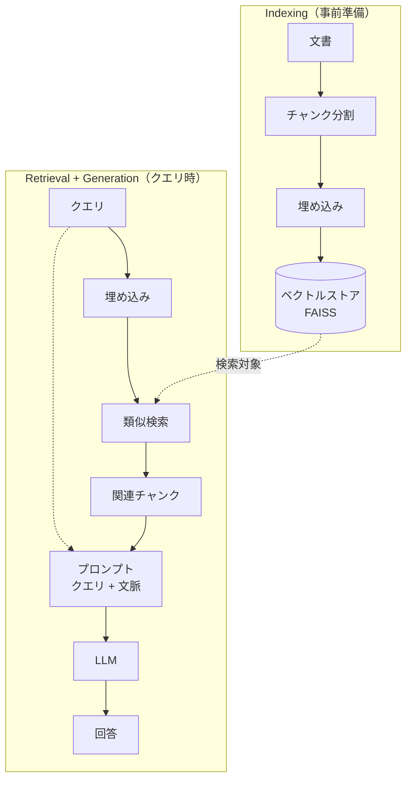

## はじめに

私は現在、RAG（Retrieval-Augmented Generation）の発展的な手法を習得するために、勉強や実装を進めているのですが、その過程で、これまで使ってきた基礎的な RAG 技術を、一度きちんと整理し直しておきたいと考えました。

そこで、2026 年 6 月現在のできるだけ新しい LangChain モジュールを使い、RAG の基礎的な処理フローを一通り実行できるリポジトリを作ってみました。
この記事はその整理のまとめです。

https://github.com/atsushi11o7/rag-sandbox


## RAG とは

RAG（Retrieval-Augmented Generation）は、外部の知識を検索し、その結果を文脈として LLM に渡してから回答を生成する手法です。

LLM は学習した時点の知識しか持たず、最新の情報や手元の文書については答えられません。
知らないことをもっともらしく答えてしまう、いわゆるハルシネーションも起きます。
検索した文書を根拠として与えることで、こうした問題を抑え、回答の正確性や最新性を高められます。

大きくは「検索（Retrieval）」と「生成（Generation）」の組み合わせです。

## 実行環境（devcontainer + uv / Ollama）

実行環境は CUDA 12.6 + Python 3.12 の devcontainer で、パッケージ管理は uv（`uv.lock` で固定）を使っています。

Dockerfile や divcontainer の設定はリポジトリにあるので、そちらを参照してください。

<details><summary>pyproject.toml（依存一覧）</summary>

```toml
[project]
name = "rag-sandbox"
version = "0.1.0"
description = "RAG技術を試すサンドボックス"
readme = "README.md"
requires-python = ">=3.12,<3.13"
dependencies = [
    "numpy>=1.26",
    "pandas>=2.2",
    "scipy>=1.12",
    "scikit-learn>=1.5",
    "transformers>=4.44",
    "sentence-transformers>=3.0",
    "FlagEmbedding>=1.2",
    "fugashi>=1.3",
    "unidic-lite>=1.0.8",
    "rank-bm25>=0.2.2",
    "faiss-cpu>=1.8",
    "ollama>=0.3",
    "langgraph>=1.0",
    "langchain>=1.0",
    "langchain-core>=1.0",
    "matplotlib>=3.8",
    "seaborn>=0.13",
    "plotly>=5.18",
    "jupyterlab>=4.0",
    "ipykernel>=6.29",
    "ipywidgets>=8.1",
    "tqdm>=4.66",
    "joblib>=1.3",
    "torch>=2.7",
    "langchain-huggingface>=1.2.2",
    "langchain-text-splitters>=1.1.2",
    "langchain-community>=0.4.2",
    "langchain-ollama>=1.1.0",
    "langchain-classic>=1.0.8",
]

[tool.uv.sources]
torch = [
    { index = "pytorch-cu126" },
]

[[tool.uv.index]]
name = "pytorch-cu126"
url = "https://download.pytorch.org/whl/cu126"
explicit = true
```

</details>

そのまま貼り付けているので、実際には使っていないモジュールも含まれています。
結果的に使用している LangChain 関連モジュールのバージョンは、次の「LangChain エコシステムの整理」で触れます。

### LLM はローカルの Ollama で

生成・HyDE・Corrective RAG では LLM を呼び出します。
本来は OpenAI などの API を使うところですが、お金をかけたくなかったので、ローカルに Ollama サーバーを立てて API ライクに使うようにしました（モデルは `qwen2.5:7b`を使用しています）。
Ollama は devcontainer の外で起動し、Docker Compose でサービス化して、コンテナ内から `OLLAMA_HOST` 経由で呼び出します。

```python
from langchain_ollama import ChatOllama

host = os.environ.get("OLLAMA_HOST")
llm = ChatOllama(model="qwen2.5:7b", base_url=host) if host else ChatOllama(model="qwen2.5:7b")
```

## LangChain エコシステムの整理

私が以前 LangChain を使っていたのは 0.0.x の頃でした。
当時と比べると、現在の 1.x 系は用途ごとにパッケージが細分化されていて、どれを import すればよいか少しややこしくなっています。
そこで、最初に整理しておきます（たとえば `ParentDocumentRetriever` は本体ではなく `langchain-classic` に移っています）。

今回（2026 年 6 月時点）使った LangChain 関連パッケージとバージョンは次のとおりです。

| パッケージ | バージョン | 役割 |
|---|---|---|
| `langchain-core` | 1.4.8 | 抽象基底クラス（`BaseRetriever` / `Document` / `Embeddings`） |
| `langchain` | 1.3.10 | 高レベル API（`ContextualCompressionRetriever` など） |
| `langchain-community` | 0.4.2 | サードパーティ統合（`FAISS` / `LongContextReorder`） |
| `langchain-text-splitters` | 1.1.2 | テキスト分割（`RecursiveCharacterTextSplitter`） |
| `langchain-ollama` | 1.1.0 | Ollama 連携（`ChatOllama`） |
| `langchain-classic` | 1.0.8 | 旧 API の互換（`ParentDocumentRetriever`） |
| `langgraph` | 1.2.6 | 状態グラフ（Corrective RAG に使用） |

埋め込み・検索まわりで使っている主なライブラリは次のとおりです。

| ライブラリ | 役割 |
|---|---|
| `sentence-transformers` | Dense 埋め込み（`SentenceTransformer` / ruri-v3）と Cross-Encoder リランカー（`CrossEncoder` / ruri-reranker-large） |
| `faiss-cpu` | ベクトルインデックスと近似最近傍探索 |
| `fugashi` + `unidic-lite` | 日本語の形態素解析（BM25 のトークナイザー） |
| `rank-bm25` | BM25 スコアリング |

## コーパスの準備（Qiita 公開 API）

検索対象のコーパスには、自分の Qiita 記事を使いました。
Qiita の公開 API（`/users/{user}/items`）から各記事を取得し、本文を `data/corpus/<記事ID>.md`、メタデータ（タイトル・日付・タグなど）を同名の `.json` として保存します。

```python
# scripts/fetch_qiita.py（抜粋）
for item in fetch_items(USERNAME, TOKEN):
    doc_id = item["id"]
    (OUT_DIR / f"{doc_id}.md").write_text(item["rendered_body"], encoding="utf-8")
    meta = {
        "title": item["title"],
        "created_at": item["created_at"],
        "tags": [tag["name"] for tag in item.get("tags", [])],
        "likes_count": item.get("likes_count", 0),
        "url": item.get("url", ""),
    }
    (OUT_DIR / f"{doc_id}.json").write_text(
        json.dumps(meta, ensure_ascii=False), encoding="utf-8"
    )
```

本文（`.md`）とメタデータ（`.json`）をペアで持つのがポイントです。
読み込み時にサイドカー JSON を `Document.metadata` に載せておくと、あとでタグや日付でフィルタできます（後述の「メタデータフィルタリング」で使います）。

```python
# src/rag/corpus.py（抜粋）
def load_md_corpus(corpus_dir: str) -> list[Document]:
    docs = []
    for p in sorted(Path(corpus_dir).glob("*.md")):
        meta: dict = {"doc_id": p.stem}
        sidecar = p.with_suffix(".json")
        if sidecar.exists():
            meta.update(json.loads(sidecar.read_text(encoding="utf-8")))
        docs.append(Document(page_content=p.read_text(encoding="utf-8"), metadata=meta))
    return docs
```

## RAG の基本パイプライン

RAG は大きく、コーパスを事前に検索可能にする「Indexing」と、クエリを受けて検索し回答する「Retrieval + Generation」に分かれます。



これ以降の各節は、このパイプラインのどこかを担う技術の話です。
チャンク分割や埋め込みは Indexing、BM25・ハイブリッド検索・リランキングは Retrieval、コンテキストの並び順は Generation に対応します。

## チャンク分割

<!-- メモ:
- なぜ分割するか（コンテキスト長・検索粒度）、小さすぎ=文脈不足 / 大きすぎ=ノイズ
- 実装：RecursiveCharacterTextSplitter。日本語向け separators ["\n\n","\n","。","、"," ",""] を明示（英語デフォルトだと日本語が切れない）。chunk_id="doc_id#i" を付与（評価で追跡）
- コード：src/rag/chunking.py split_documents
- 正直に：戦略は再帰分割 1 種（固定長/意味分割の比較はしていない）
-->

## 埋め込みとベクトル検索（Dense・FAISS）

<!-- メモ:
- Dense = 意味ベクトル化して類似度ランキング。モデル cl-nagoya/ruri-v3-310m（日本語特化、クエリ/文書でプレフィックス切替）
- HuggingFaceEmbeddings はプレフィックス切替非対応 → Embeddings 継承の薄いラッパー PrefixedEmbeddings。normalize_embeddings=True で FAISS の L2 ≒ cosine
- FAISS：build_faiss / load_faiss（allow_dangerous_deserialization）。build_dense_retriever
- コード：embeddings.py（embed_query/embed_documents のプレフィックス）/ store.py / dense.py
-->

## キーワード検索（BM25 + 形態素解析）

<!-- メモ:
- Dense の弱点（固有名詞・専門用語・略語＝uv / FAISS / ruri-v3 など）を語彙一致で補完
- BM25（TF-IDF の発展）。日本語は分かち書きが必要 → fugashi（MeCab）+ unidic-lite でトークン化 → rank-bm25 の BM25Okapi
- 実装：JapaneseBM25Retriever。重いオブジェクト（Tagger / BM25Okapi）は PrivateAttr + model_validator(mode="after") で初期化
- コード：bm25.py の _tokenize / _get_relevant_documents
-->

## ハイブリッド検索（RRF）

<!-- メモ:
- Dense（意味）+ BM25（語彙）を統合。RRF（Reciprocal Rank Fusion）= Σ 1/(k+rank)、k=60（標準値）。スケールの違う 2 手法を順位ベースで統合
- 実装：HybridRetriever（candidate_k=50 で多めに取得 → RRF → top_k）。chunk_id/doc_id で名寄せ
- コード：hybrid.py _get_relevant_documents（RRF 本体）
-->

## リランキング（Cross-Encoder / 日本語 Reranker）

<!-- メモ:
- 一次検索で多めに取得 → Cross-Encoder で精密に再採点。Bi-Encoder（embed 同士の内積、高速）vs Cross-Encoder（クエリ+文書を同時入力しスコア、高精度・低速）
- モデル：cl-nagoya/ruri-reranker-large。BaseDocumentCompressor 継承 → ContextualCompressionRetriever でラップ（RerankedRetriever）
- コード：rerank.py CrossEncoderReranker.compress_documents / reranked.py。hybrid → rerank の組み合わせ例
-->

## メタデータフィルタリング

<!-- メモ:
- サイドカー JSON のタグ/日付を Document.metadata に載せ、検索後にフィルタ（FAISS 単体はフィルタが弱いので事後フィルタ）
- 実装：TagFilteredRetriever（タグ OR 条件）。順番が重要：Hybrid(50) → Tag filter → Rerank(5)。Rerank の後に置くと上位 5 件にタグ一致が無いと空になる
- 注：サイドカー無し（タグ無し）文書は除外される副作用。事後フィルタなので候補を多めに取るのが前提
- コード：filtered.py
-->

## クエリ変換（HyDE・マルチクエリ・分解）

<!-- メモ:
- 素のクエリが検索に最適とは限らない → クエリ側を変換して再現率を上げる
- HyDE：LLM に仮回答を生成させ、その文で検索（仮回答と実文書が近いベクトルになる）。include_original=True で元クエリ結果と RRF 統合（固有名詞が薄まる対策）
- マルチクエリ：ParaphraseRetriever（言い換え N 個）/ DecomposeRetriever（サブクエリ分解）→ RRF 統合
- コード：hyde.py _get_relevant_documents / multi_query.py
-->

## 親子チャンク（Parent-Child）

<!-- メモ:
- 検索は小さい子チャンク（精度）、文脈として返すのは親の大きいチャンク（情報量）= small-to-big
- 実装：langchain-classic の ParentDocumentRetriever + InMemoryStore。空の faiss.IndexFlatL2 を直接作る（FAISS.from_texts のダミー文書がノイズになるのを回避）。child_k で子の取得件数
- BaseRetriever なので Reranker などのラッパーと組み合わせ可
- コード：parent_child.py build_parent_child_retriever
-->

## 検索結果の調整（MMR・コンテキスト並び順）

<!-- メモ:
- MMR（Maximal Marginal Relevance）：関連度と多様性のバランス（似た文書ばかりを防ぐ）。FAISS as_retriever(search_type="mmr", lambda_mult, fetch_k)。0.0=多様性 / 1.0=関連性。dense.py の mmr オプションとして実装
- Lost-in-the-Middle：長文脈の中間は無視されやすい → 重要文書を先頭/末尾へ。LangChain LongContextReorder を生成前に適用（generation.py の reorder フラグ）。LCEL チェーンの外で並べ替える点に注意
- コード：dense.py（mmr）/ generation.py（LongContextReorder ＋ 出典番号付与 _format_doc）
-->

## 能動的な検索（Agentic RAG / Corrective RAG）

<!-- メモ:
- ここまでは「1 回検索 → 生成」の静的パイプライン。能動的（Agentic）な RAG は LLM が検索プロセスを制御する。その代表として Corrective RAG（CRAG）を実装した（CRAG は Agentic / Adaptive RAG の一種）
- CRAG の流れ：retrieve → grade（文書ごとに LLM-as-Judge で relevant か判定）→ relevant なら generate / not_relevant なら rewrite_query して再検索（max_retries 超過で打ち切り）。LangGraph の StateGraph で実装
- ポイント：original_query と search_query を分離（クエリを書き換えても回答は元質問に対して生成）。文書は 1 件ずつ判定（全件まとめだと無関係が混ざる）。グレーディングにドメイン（IT/プログラミング）を明示しないと誤判定（"uv" を紫外線と解釈など）
- Self-RAG は「違いを一言だけ」：検索要否の判断（Adaptive Retrieval）と生成の忠実性チェックが追加される点。深掘りは別記事
- コード：graph/corrective_rag.py build_corrective_rag（retrieve / grade_documents / generate / rewrite_query ノード）
-->

## 評価の基礎

<!-- メモ:
- ※今回はラベル（qrels）を作っていないので実測結果は載せず、「こういう指標・方法がある」の紹介に留める
- 検索の指標：Recall@k / MRR@k / nDCG@k（metrics.py に実装あり、binary relevance）。正解ラベル qrels.jsonl（query と positive_doc_ids）が要る、と説明
- 生成の評価：Faithfulness（根拠との整合）/ Answer Relevance。RAGAS 等で LLM-as-Judge できる（今回は未実施、次のステップ）
- コード：metrics.py の 3 関数を「こう書ける」程度に短く
-->

## おわりに

<!-- メモ:
- Dense → BM25 → ハイブリッド → リランク → クエリ変換 → 親子チャンク → 能動的検索（CRAG）と積み上げ、各手法がパイプラインのどこを担い何を改善するかが整理できた
- 発展（Contextual Retrieval・GraphRAG・Self-RAG の精緻化・セマンティックキャッシュ・評価ラベル作成による実測）は別記事で
- 実装リポジトリ（rag-sandbox）へのリンクを追記
-->
