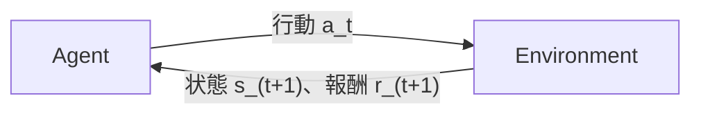
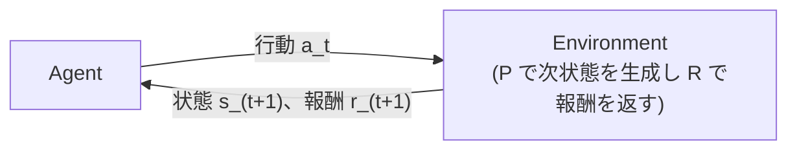

## はじめに

普段は機械学習まわりの仕事をしていますが、強化学習だけはずっと「用語はなんとなく知っている」レベルで止まっていました。教師あり学習や生成 AI まわりは業務で触る機会が多かった一方で、強化学習はちゃんと手を動かして勉強したことがありませんでした。

そこで強化学習で使用するメジャーなライブラリである Gymnasium と合わせて、基礎から整理してみようと思います。
今回は「強化学習の全体像 → Gymnasium の使い方 → バンディット問題 → マルコフ決定過程（MDP）→ ベルマン方程式 → 動的計画法 → モンテカルロ法 → TD 学習 → DQN」という一連の流れを、実際に手を動かしながら整理します。

なお、本記事の理論構成は主に『ゼロから作る Deep Learning ❹ 強化学習編』を参考にしつつ、Gymnasium の API や POMDP、実装上の注意点を追加して整理しています。

## 1. 強化学習の全体像

### 1.1 Agent と Environment のループ

強化学習は、突き詰めると次のループの繰り返しです。



Agent（エージェント）が時刻 $t$ の状態 $s_t$ を見て行動 $a_t$ を選びます。Environment（環境）はその行動を受け取り、次の状態 $s_{t+1}$ と報酬 $r_{t+1}$ を返します。これを $t=0,1,2,\dots$ と、エピソードが終了するまで離散的な時刻ごとに繰り返します。教師あり学習と違って「正解ラベル」は与えられず、代わりに「報酬」という遅れた・断片的なフィードバックだけを頼りに、何が良い行動だったのかを逆算していく点が最大の特徴です。

まずは、この最小限のやり取りに登場する用語だけを整理しておきます。

| 用語 | 意味 |
|---|---|
| 状態 (state, $s$) | 将来の遷移を決めるために必要な、環境の内部情報 |
| 観測 (observation, $o$) | エージェントが環境から実際に受け取れる情報。完全観測な MDP では状態と一致することもある（両者が食い違う場合は 4.2 節の POMDP で扱う） |
| 行動 (action, $a$) | エージェントがその状態で取れる選択肢 |
| 報酬 (reward, $r$) | 1 回の行動の結果として環境から返されるスカラー値。エージェントはこの合計を最大化したい |
| 方策 (policy, $\pi$) | 状態から行動を選ぶルール。決定的な方策なら $a=\pi(s)$、確率的な方策なら「状態 $s$ で行動 $a$ を選ぶ確率」$\pi(a \mid s)$ として表す |
| エピソード | 初期状態から終了状態に至るまでの一連のやり取り。1 回分の「試行」 |
| 収益 (return, $G_t$) | 時刻 $t$ 以降に得られる、割引された報酬の合計 |
| 割引率 (discount factor, $\gamma$) | 将来の報酬を今の時点でどれだけ割り引いて評価するか（$0 \le \gamma \le 1$）。$\gamma$ が 1 に近いほど将来の報酬を重視し、0 に近いほど目先の報酬しか見なくなる |

「状態」と「観測」を分けている理由は、エージェントが受け取る観測が環境の内部状態をそのまま表しているとは限らないからです。本記事で扱う範囲では、基本的に観測 = 状態とみなせる素直な設定だけを対象にします。

収益 $G_t$ は、時刻 $t$ 以降に得られる報酬を割引しながら足し合わせたものです。エピソードが有限ステップ（終端時刻 $T$）で終わるなら

$$
G_t = R_{t+1} + \gamma R_{t+2} + \cdots + \gamma^{T-t-1} R_T
$$

と書け、終端のない**連続タスク**では無限和 $G_t = \sum_{k=0}^{\infty} \gamma^k R_{t+k+1}$ になります（報酬が有界で $0 \le \gamma < 1$ なら発散しません）。強化学習のタスクは、明確な終端を持つ**エピソードタスク**と、終端なく続く連続タスクに分けられ、割引率 $\gamma$ は将来の報酬をどれだけ割り引くかを決めます。本記事で扱う FrozenLake・CartPole はどちらもエピソードタスクなので、有限和のイメージで問題ありません。

### 1.2 強化学習の分類

後で出てくる手法（動的計画法・モンテカルロ法・TD 学習・DQN）が全体のどこに位置づくかを、先に地図として整理しておきます。切り口は主に 4 つです。

- **モデルベース / モデルフリー**: 環境の振る舞い（遷移確率 $P$・報酬 $R$、詳細は 4 節）を使うのがモデルベース、経験だけから学ぶのがモデルフリーです。動的計画法はモデルベース、モンテカルロ法・TD 学習・DQN はモデルフリーです。
- **価値ベース / 方策ベース / Actor-Critic**: 価値を推定して間接的に方策を決めるのが価値ベース、方策そのものを直接更新するのが方策ベース（方策勾配法）、両者を組み合わせたのが Actor-Critic です。本記事は価値ベースだけを扱います。
- **On-policy / Off-policy**: 行動する方策と学習対象の方策が同じか異なるか、の区別です（詳しくは 7.3 節と 8 節）。
- **表形式 / 関数近似**: 価値を配列で持てるのが表形式、状態が多すぎてニューラルネットなどで近似するのが関数近似です。

本記事で扱う動的計画法・モンテカルロ制御・SARSA・Q 学習・DQN は、いずれも価値関数の推定を中心に方策を改善する**価値ベース**の手法です。動的計画法・モンテカルロ法・TD 学習は表形式、DQN は関数近似の代表例として扱います。

## 2. Gymnasium とは何か

理論の話に入る前に、この先ずっと実装で使うライブラリ自体を、章を分けてきちんと理解しておきます。

https://gymnasium.farama.org/

### 2.1 Gymnasium の位置づけ

Gymnasium は、強化学習の環境（Environment）を統一的なインターフェースで扱うための Python ライブラリです。2016 年に OpenAI が公開した `Gym` を起源としており、`Gym` は強化学習の実装・研究で広く使われましたが、その後、保守を担当していたチームが今後の開発を `Gymnasium` に移しました。現在は、非営利団体である Farama Foundation のもとで、`Gym` の後継となるメンテナンス済みフォークとして開発されています。今回使用しているのは `Gymnasium`（v1.2.0）です。

Gymnasium が提供している大きな価値は、環境と学習アルゴリズムの間のやり取りを、共通のインターフェースで表現できることにあります。環境ごとに観測空間や行動空間は異なるので、すべてのアルゴリズムを無変更で使い回せるわけではありません。しかし、どの環境でも「`reset()` で初期化し、`step(action)` で行動を渡して、次の観測・報酬・終了情報を受け取る」という基本的な骨格は共通です。表形式の FrozenLake で Q 学習を実装する場合も、連続値の観測を持つ CartPole で DQN を実装する場合も、学習方法やモデルの構造は環境に応じて変わりますが、環境を操作する骨格が統一されているおかげで、環境固有のシミュレーション処理と、Q 学習や DQN などの学習アルゴリズムを分離して実装できます。

なお、Gymnasium は必ずしもシミュレータそのものではありません。CartPole や FrozenLake のように環境の内部にシミュレーション処理が実装されている場合もあれば、MuJoCo・ゲームエンジン・ロボットシミュレータ・独自のカードゲームシミュレータなどを `reset()` と `step()` の形式で包んで利用する場合もあります。つまり Gymnasium は、「学習アルゴリズムとシミュレータの間をつなぐ共通インターフェース」と捉えると分かりやすいです。


### 2.2 Env クラスの基本インターフェース

Gymnasium で扱う環境は、基本的に `gymnasium.Env` のインターフェースに従い、最低限次の 4 つを持ちます。

| メソッド / 属性 | 役割 |
|---|---|
| `reset(seed=None, options=None)` | エピソードを初期状態に戻す。`(observation, info)` を返す |
| `step(action)` | 行動を 1 つ受け取り、環境を 1 ステップ進める。`(observation, reward, terminated, truncated, info)` を返す |
| `observation_space` | 観測（状態）がどんな形・範囲を取りうるかを表す `Space` オブジェクト |
| `action_space` | 行動がどんな形・範囲を取りうるかを表す `Space` オブジェクト |

このほかに、後述する `render()`（描画）や `close()`（後片付け）もよく使います。`reset()` の `seed` 引数は環境の乱数生成器を初期化するためのもので、同じ `seed` と同じ行動列を与えれば、決定的に実装された環境では同じ初期状態・同じ遷移を再現できます（今回の記事のコード例で `rng = np.random.default_rng(0)` のように乱数シードを固定しているのも、再現性を保つためです）。

### 2.3 `observation_space` / `action_space` と Space クラス

これらは `gymnasium.spaces` にある `Space` のサブクラスのインスタンスで、観測や行動の「型」を表現します。代表的なものを整理します。

| Space クラス | 意味 | 例 |
|---|---|---|
| `Discrete(n)` | $0$ から $n-1$ までの整数のいずれか 1 つ | FrozenLake の行動（上下左右の 4 つ）: `Discrete(4)` |
| `Box(low, high, shape, dtype)` | 指定した範囲の連続値ベクトル（多次元も可） | CartPole の観測（カート位置・速度、棒の角度・角速度の 4 次元）: `shape=(4,)` の `Box` |
| `MultiDiscrete` | 複数の離散値の組み合わせ | （今回は未使用） |
| `MultiBinary` | 複数の 0/1 値の組み合わせ | （今回は未使用） |
| `Dict` / `Tuple` | 複数の Space を組み合わせた構造的な観測・行動 | （今回は未使用） |

`Space` オブジェクトは `.sample()` でランダムな値を 1 つ生成でき、`.contains(x)` でその値が有効な範囲に収まっているかを検証できます。アルゴリズム側のコードは、環境の中身を知らなくても、この `observation_space` / `action_space` を見るだけで「何次元のベクトルを受け取り、何種類の行動を返せばいいか」を判断できます。

### 2.4 `step()` が返す 5 つの値

`step(action)` が返す `(observation, reward, terminated, truncated, info)` のうち、特に `terminated` と `truncated` の区別が重要になります。

- `terminated`: **環境（MDP）自身の定義上、終端状態に達したことによる終了**です。CartPole なら棒が倒れきった、FrozenLake なら穴に落ちた・ゴールに着いた、などがこれにあたります。
- `truncated`: **MDP の定義そのものとは無関係な、外部要因による打ち切り**です。典型的には「最大ステップ数に達した」という時間制限がこれにあたります。
- `info`: 主にデバッグ・診断・評価用の補助情報が入る辞書です。通常、方策の入力には `observation` を使い、`info` は学習の意思決定そのものには使いません（例えば「本当は何ステップ経過したか」等が入ることがあります）。

この 2 つを区別する理由は、価値関数の更新（特に TD 学習や DQN の**ブートストラップ**）に関わるからです。「本当に終端に達した（`terminated`）」のか「時間切れで打ち切られただけ（`truncated`）」なのかで、この先の価値を足し込んでよいかどうかが変わります。ここでは「API 上はこの 2 つが別物である」ことだけ押さえておき、価値更新にどう効くのかは、実際のターゲット式が出てくる 8 節（TD 学習）と 9 節（DQN）で改めて扱います。

`terminated` と `truncated` が分離される前、古い `Gym` の API では `done` という 1 つのフラグにまとめられていました。しかし「本当にゲームが終わったのか」と「時間切れで打ち切られただけなのか」を区別できないと、価値関数の更新で理論的に間違った計算をしてしまう危険があるため、Gymnasium で明示的に分離された、という経緯があります。

https://gymnasium.farama.org/tutorials/gymnasium_basics/handling_time_limits/

### 2.5 環境の指定方法（`gym.make`・レジストリ・Wrapper）

`gym.make("CartPole-v1")` のような文字列は、Gymnasium 内部のレジストリに登録された `EnvSpec`（環境の仕様）を検索するための ID です。慣習として `名前-vバージョン番号` という形式を取ります。

`gym.make` はこの ID から対応する環境クラスをインスタンス化するだけでなく、必要に応じて `Wrapper` と呼ばれる仕組みで環境を包んで返します。`Wrapper` は環境の外側に被せて機能を追加するデコレータのようなもので、例えば `TimeLimit` という `Wrapper` は「一定ステップ数を超えたら `truncated=True` を返す」という機能を、環境自体のコードを変更せずに追加しています。`CartPole-v1` の場合、`env.spec` を見ると `max_episode_steps=500` と設定されており、500 ステップに達するとこの `TimeLimit` ラッパーが自動的に `truncated=True` を返します。

ラッパーを剥がした素の環境が欲しい場合は `env.unwrapped` でアクセスできます。あとで FrozenLake の状態遷移確率のテーブルに `env.unwrapped.P` としてアクセスしますが、この `P` が何を表すのか（遷移モデルそのものであること）は、MDP を定義する 4 節で扱います。ここでは「`env.unwrapped` は、ラッパー越しには見えない元の環境クラス自身の属性にアクセスするためのもの」という点だけ押さえておきます。

### 2.6 その他よく使う機能

今回の記事で主に使うのは、ここまでの `reset()` / `step()` / `observation_space` / `action_space` と、描画まわりくらいです。

- **`render_mode`**: `gym.make(id, render_mode="human")` のように指定すると、`step()` のたびに画面へ描画してくれます。`render_mode="rgb_array"` にすると、代わりに画像データ（numpy 配列）を `env.render()` で取得できます。
- **`close()`**: 環境が確保したリソース（描画ウィンドウなど）を解放します。特に `render_mode="human"` を使った場合は、使い終わったら明示的に呼ぶのがマナーです。

このほかにも、独自の前処理を差し込む Wrapper の自作、複数環境を並列に動かすベクトル化環境、自作環境のレジストリ登録、エピソード統計の記録、動画の保存といった発展的な機能がありますが、本記事では扱いません。

### 2.7 Gymnasium はどのように使うのか

Gymnasium 自体は、Q 学習や DQN のような学習アルゴリズムを実装するライブラリではありません。主な役割は、エージェントから行動を受け取り、環境を 1 ステップ進めて、次の観測と報酬を返すことです。

強化学習の実装では、Gymnasium の環境を次のようなループの中で使います。

```python
obs, info = env.reset()
while True:
    # 方策や価値関数を使って、現在の観測から行動を選ぶ
    action = agent.select_action(obs)
    # 選んだ行動を環境に渡し、次の観測と報酬を受け取る
    next_obs, reward, terminated, truncated, info = env.step(action)
    # 得られた経験を使って、価値関数や方策を更新する
    agent.update(
        obs=obs,
        action=action,
        reward=reward,
        next_obs=next_obs,
        terminated=terminated,
    )
    obs = next_obs
    if terminated or truncated:
        obs, info = env.reset()
```

このうち Gymnasium が担当するのは、主に `reset()` と `step()` の部分です。行動をどう選ぶか、得られた経験からどう学習するかは、Q 学習や DQN などのアルゴリズム側で実装します。次節のコード例ではまだ学習アルゴリズムを実装しておらず、

```python
action = env.action_space.sample()
```

としてランダムに行動しています。これは学習ではなく、環境の入出力や終了条件を確認するための動作確認です。

### 2.8 実際に動かしてみる

概念を確認したところで、実際に動かして出力を見ておきます。

```python
import gymnasium as gym

env = gym.make("CartPole-v1")
env.action_space.seed(0)  # action_space.sample()の乱数もここで固定する
obs, info = env.reset(seed=0)  # 最初の1回だけseedを渡す
print("reset:", obs.round(3), info)

for _ in range(5):
    action = env.action_space.sample()  # ランダムに行動を選ぶ
    obs, reward, terminated, truncated, info = env.step(action)
    print(f"obs={obs.round(3)}, reward={reward}, terminated={terminated}, truncated={truncated}, info={info}")
    if terminated or truncated:
        obs, info = env.reset()  # 2回目以降はseedを渡さない

print("observation_space:", env.observation_space)
print("action_space:", env.action_space)
print("spec:", env.spec)
env.close()  # 使い終わってから最後に閉じる
```

```
reset: [ 0.014 -0.023 -0.046 -0.048] {}
obs=[ 0.013  0.173 -0.047 -0.355], reward=1.0, terminated=False, truncated=False, info={}
obs=[ 0.017  0.368 -0.054 -0.662], reward=1.0, terminated=False, truncated=False, info={}
obs=[ 0.024  0.564 -0.067 -0.971], reward=1.0, terminated=False, truncated=False, info={}
obs=[ 0.035  0.37  -0.087 -0.701], reward=1.0, terminated=False, truncated=False, info={}
obs=[ 0.043  0.176 -0.101 -0.436], reward=1.0, terminated=False, truncated=False, info={}
observation_space: Box([-4.8               -inf -0.41887903        -inf], [4.8               inf 0.41887903        inf], (4,), float32)
action_space: Discrete(2)
spec: EnvSpec(id='CartPole-v1', entry_point='gymnasium.envs.classic_control.cartpole:CartPoleEnv', reward_threshold=475.0, nondeterministic=False, max_episode_steps=500, order_enforce=True, disable_env_checker=False, kwargs={}, namespace=None, name='CartPole', version=1, additional_wrappers=(), vector_entry_point='gymnasium.envs.classic_control.cartpole:CartPoleVectorEnv')
```

環境自体の乱数（`reset(seed=...)`）と、`action_space.sample()` が使う乱数は別の生成器で管理されているため、行動のサンプリングまで再現したい場合は `env.action_space.seed(0)` を別途呼ぶ必要があります。また、`seed` は最初の `reset()` で 1 度指定すれば、以降のエピソードでは `reset()` を `seed` 無しで呼ぶのが一般的な使い方になります（毎回同じ `seed` を渡すと、毎エピソード全く同じ初期状態に戻ってしまいます）。

`observation_space` が `Box` で 4 次元、`action_space` が `Discrete(2)`（カートを左右どちらに押すかの 2 択）になっているのが、2.3 節で説明した通りに確認できます。`spec` を見ると `max_episode_steps=500` が実際に設定されており、CartPole は棒が倒れる（`terminated`）か 500 ステップ生き延びて打ち切られる（`truncated`）かのどちらかでエピソードが終わる設計になっていることが分かります。`reward_threshold=475.0` は、この環境が「解けた」とみなされる目安として `EnvSpec` に設定されている値（評価時の基準の 1 つであり、評価に使うエピソード数まで規定しているわけではありません）で、この値自体は Gymnasium のバージョンによって変更される可能性がある点には注意しておきます。9 節の DQN で学習が進んでいるかを見る際の、大まかな目安として使います。

この後に扱う各アルゴリズムでも、環境とのやり取りの骨格は変わりません。`env.reset()` でエピソードを開始し、`env.step(action)` で経験を集め、その結果（特に `terminated` かどうか）を使って価値関数や方策を更新します。アルゴリズムごとに異なるのは、主に「どう行動を選ぶか」「得られた経験から何を推定し、どう更新するか」という部分です。

## 3. 多腕バンディット問題

**多腕バンディット問題**（multi-armed bandit problem）は、$k$ 個の選択肢（アーム, arm）の中からどれか 1 つを繰り返し選び続け、得られる報酬の合計を最大化する問題です。名前は、複数のレバー（腕）を持つスロットマシンに由来します。

強化学習の本質的な難しさである**探索と活用のトレードオフ**を純粋な形で表す問題です。どのアームが良いかは実際に引いてみないと分からず、情報を集めるために試すこと（探索）と、今分かっている中で最善を選ぶこと（活用）のバランスを取らなければなりません。状態遷移という要素を取り除き、この探索と活用だけを抜き出して考えられるのがバンディット問題です。

### 3.1 行動価値とその推定

各アーム $a$ には、本当の期待報酬（真の行動価値, true action-value）

$$
q_\ast(a) = \mathbb{E}[R \mid A=a]
$$

が存在しますが、エージェントはこれを知りません。分かっているのは、これまでにそのアームを選んだ結果の報酬だけです。そこでエージェントは、時刻 $t$ までにアーム $a$ を選んで得た報酬の**標本平均**を、行動価値の推定値 $Q_t(a)$ として使います。

$$
Q_t(a) = \frac{\text{アーム } a \text{ を選んで得た報酬の合計}}{\text{アーム } a \text{ を選んだ回数}}
$$

この推定値が真の値 $q_\ast(a)$ に近ければ近いほど、それを頼りに正しくアームを選べるようになる、というのがバンディット問題の基本方針です。

### 3.2 探索と活用のトレードオフ

改めて、本質的な難しさになるのが**探索（exploration）と活用（exploitation）のトレードオフ**です。今の推定値 $Q_t(a)$ が一番高いアームを選び続ける（活用）だけでは、まだ試行回数が少なくて過小評価されているだけの、実は本当はもっと良いアームを見逃したままになるかもしれません。かといって毎回ランダムに選ぶ（探索）だけでは、分かったことを活かせず、平均的な報酬が最適値より低いままになってしまいます。

最も単純な対処法が **ε-greedy 方策**です。確率 $\varepsilon$ でランダムに探索し（すべてのアームを均等な確率で選ぶ）、確率 $1-\varepsilon$ で今の推定値が一番高い（greedy な）アームを選びます。

$$
A_t =
\begin{cases}
\arg\max_a Q_t(a) & \text{確率 } 1-\varepsilon \text{ で（活用）} \\
\text{ランダムなアーム} & \text{確率 } \varepsilon \text{ で（探索）}
\end{cases}
$$

$\varepsilon=0$ なら常に活用のみ（一度でも悪い推定を引くと抜け出せなくなるリスクがある）、$\varepsilon=1$ なら常に探索のみ（分かったことを一切活かせない）という両極端になります。この間のどこかにバランスの良い値がある、という考え方です。ちなみに他にも「不確実性が高い（あまり試していない）アームほど積極的に選ぶ」UCB（Upper Confidence Bound）や、「最初にすべてのアームの推定値を楽観的に高く初期化しておき、自然と一通り試させる」楽観的初期値法など、探索を促す工夫はいくつかありますが、今回はもっとも基本的な ε-greedy だけを扱います。

### 3.3 標本平均の増分更新式

$Q_n(a)$ を毎回律儀に「合計 ÷ 回数」で計算し直すのは無駄が多いです。アーム $a$ を $n$ 回選んで得た報酬を $R_1, R_2, \dots, R_n$ とし、$n$ 回目までの標本平均を $Q_n$（$n$ 回目の観測を反映した後の推定値）と書くと、

$$
Q_n = Q_{n-1} + \frac{1}{n}\bigl(R_n - Q_{n-1}\bigr)
$$

という関係式が成り立ちます（$Q_n$ の定義から代数的に導けます）。これは「新しい推定値 = 古い推定値 + ステップサイズ × （新しい観測値 − 古い推定値）」という形をしていて、$(R_n - Q_{n-1})$ の部分が**新しい標本と現在の推定値との差**、それに掛かる $\frac{1}{n}$ が**ステップサイズ**にあたります。実装の `counts[a] += 1; Q[a] += (reward - Q[a]) / counts[a]` は、`counts[a]` を先に 1 増やしてから（これが $n$）、その $n$ で割っているので、この式とそのまま対応しています。

ここでステップサイズを $\frac{1}{n}$ にしているのは、各アームの真の期待値が時間とともに変わらない**定常問題**を前提にしているからです。回数を重ねるほど過去と新しい観測を対等に平均していくので、標本平均は真の値へ収束します。一方、真の期待値が時間とともに変化する**非定常問題**では、$\frac{1}{n}$ のように年々小さくなるステップサイズだと古い観測をいつまでも引きずってしまい、変化に追従できません。この場合はステップサイズを一定値 $\alpha$（例えば $0.1$）に固定します。

$$
Q_n = Q_{n-1} + \alpha\bigl(R_n - Q_{n-1}\bigr)
$$

こうすると、直近の観測ほど大きく効く（指数的に重み付けされた）平均になり、変化する真の値を追いかけられます。

### 3.4 Gymnasium でバンディット環境を実装する

自分で最小限のバンディット環境を `gymnasium.Env` として実装してみます。

状態が存在しないバンディットを無理やり `Env` の形に当てはめるため、次のように設計しました。

- `observation_space`: `Discrete(1)`。常に `0` という同じ値を返す「状態が無いこと」を表すダミーの観測
- `action_space`: `Discrete(n_arms)`。どのアームを選ぶか
- `step(action)`: 選んだアームの真の期待値を平均とする正規分布から報酬をサンプルして返す。バンディットの 1 回の「アームを引く」行為はそれ単独で完結するので、`terminated=True` を返して即座にエピソードを終える（1 回引く = 1 エピソード、という扱いにする）

```python
import gymnasium as gym
from gymnasium import spaces
import numpy as np


class BanditEnv(gym.Env):
    """多腕バンディット問題をGymnasiumのEnvとして実装したもの。"""

    def __init__(self, true_means):
        super().__init__()
        self.true_means = np.array(true_means)
        self.n_arms = len(true_means)
        self.observation_space = spaces.Discrete(1)
        self.action_space = spaces.Discrete(self.n_arms)

    def reset(self, seed=None, options=None):
        super().reset(seed=seed)  # self.np_random がここで初期化される
        return 0, {}

    def step(self, action):
        reward = self.np_random.normal(self.true_means[action], 1.0)
        return 0, reward, True, False, {}  # terminated=True: 1回引いたら即終了
```

`super().reset(seed=seed)` を呼ぶと、親クラスの `gymnasium.Env` が `self.np_random` という `numpy.random.Generator` をシードして用意してくれるので、これを使って報酬をサンプルしています。

これを ε-greedy で動かします。

```python
rng = np.random.default_rng(0)
true_means = rng.normal(0, 1, size=5)  # 5本のアームの本当の期待報酬（未知という設定）
env = BanditEnv(true_means)

n_arms = env.action_space.n
epsilon = 0.1
n_steps = 2000

Q = np.zeros(n_arms)       # 各アームの推定価値
counts = np.zeros(n_arms)  # 各アームを選んだ回数
action_rng = np.random.default_rng(1)
total_reward = 0.0

for t in range(n_steps):
    obs, info = env.reset()  # 1回引く = 1エピソードなので、毎回リセットする
    if action_rng.random() < epsilon:
        a = action_rng.integers(n_arms)
    else:
        a = int(np.argmax(Q))
    obs, reward, terminated, truncated, info = env.step(a)
    counts[a] += 1
    Q[a] += (reward - Q[a]) / counts[a]  # 3.3節の増分更新式
    total_reward += reward
```

実行すると、こうなりました。

```
observation_space: Discrete(1)
action_space: Discrete(5)
true means: [ 0.13 -0.13  0.64  0.1  -0.54]
estimated Q: [-0.   -0.32  0.61  0.35 -0.47]
best arm (true): 2  best arm (estimated): 2
average reward: 0.556
```

2000 ステップの試行錯誤だけで、本当に一番良いアーム（真の期待値 0.64 のアーム 2）を正しく見つけられています。なお、バンディット問題自体には「状態」が無いので、`Env` としての恩恵（観測から次の行動を決める、状態遷移を扱う）はまだほとんど活きていません。

## 4. マルコフ決定過程（MDP）

バンディット問題には「状態」がありませんでしたが、現実の問題はたいてい状態が変化していきます。これを定式化したのが MDP（Markov Decision Process）で、次の 5 つ組で表されます。

### 4.1 MDP の定義

- 状態集合 $S$
- 行動集合 $A$
- 遷移確率 $P(s'\mid s,a)$：状態 $s$ で行動 $a$ を取ったとき、次の状態が $s'$ になる確率
- 報酬関数 $R(s,a,s')$：状態 $s$ で行動 $a$ を取り、状態 $s'$ に遷移したときに得られる報酬、またはその期待値
- 割引率 $\gamma$：将来の報酬を現在どの程度重視するかを表す係数（1 節で登場したもの）

この 5 つ組 $(S, A, P, R, \gamma)$ が MDP の基本的な定義で、1 節で「エージェントと環境のループ」として説明した仕組みを、数学的に定式化したものと捉えられます。なお、報酬の表現方法にはいくつかの流儀があり、遷移先に依存しない期待報酬 $r(s,a) = \mathbb{E}[R_{t+1} \mid S_t=s, A_t=a]$ として定義したり、次状態と報酬をまとめた同時分布 $p(s',r\mid s,a)$ として定義したりすることもあります（報酬そのものを確率的に扱いたいときは、この同時分布による表現が最も厳密です）。本記事では、遷移先にも依存する $R(s,a,s')$ という表記を採用します。

**ループの構造そのものは 1 節の図から変わりません。**「Environment」という箱の内部では、現在の状態 $s$ と行動 $a$ を受け取り、遷移確率 $P(s'\mid s,a)$ に基づいて次状態 $s'$ を生成し、その遷移に対応する報酬を $R(s,a,s')$ から返します。



### 4.2 マルコフ性

**マルコフ性**（Markov property）とは、「次の状態の確率分布は、直前の状態と行動だけで決まり、それ以前の履歴を追加で知っても分布は変わらない」という性質です。式で書くとこうなります。

$$
P(s_{t+1} \mid s_t, a_t, s_{t-1}, a_{t-1}, \dots, s_0, a_0) = P(s_{t+1} \mid s_t, a_t)
$$

右辺と左辺が等しい、つまり「$s_0$ から $s_{t-1}$ までの過去の経路」を追加で知っても、次の状態の予測は一切変わらない、というのがこの式の意味です。この性質があるおかげで、価値関数や方策は「今の状態 $s_t$」だけを入力にすればよく、過去の全履歴を状態として持ち歩く必要がなくなります。

一方で、現実の多くの問題は素直にはマルコフ性を満たしません。典型的なのが、**エージェントが真の状態を直接観測できず、部分的な観測しか得られない**設定で、これは **POMDP**（Partially Observable MDP）と呼ばれます。1 節で「状態」と「観測」を分けておいたのは、まさにこの区別のためでした。受け取れる観測だけを「状態」とみなすと、同じ観測でも過去の経緯によって次に起こることの分布が変わりうるので、マルコフ性は一般に成り立たなくなります。

本記事で扱う範囲（バンディット〜DQN）はすべて、エージェントが真の状態を完全に観測できる素直な MDP を前提にします。POMDP をどう扱うか（観測の履歴や信念状態でマルコフ性を回復する話、相手の手札が見えないゲームなど）は、別の記事で扱いたいと思います。

### 4.3 MDP を解くとは何か

$S, A, P, R, \gamma$ を定義しただけでは、まだ何も「解けて」いません。MDP を解くとは、1 節で定義した方策 $\pi$ のうち、**期待収益を最大化するもの（最適方策 $\pi_\ast$）を見つけること**を指します。

ただ、すべての方策を虱潰しに試して比較するのは現実的ではありません。そこで必要になるのが、「ある状態・ある方策がどれくらい良いか」を数値で評価する**価値関数**という道具です。これを使うと $\pi_\ast$ を効率的に求める手立てが得られます。価値関数とそれが満たす関係式（ベルマン方程式）が、次節の主題になります。

### 4.4 Gymnasium で覗いてみる

Gymnasium の `FrozenLake-v1` は、4x4 の氷の上を歩いてゴールを目指す環境で、氷が滑るので行動通りに動くとは限りません。この環境はエージェントが今どのマスにいるかを完全に観測できる（隠された情報が無い）ので、素直な MDP になっています。

2.5 節で触れた `env.unwrapped.P` が、まさに MDP の遷移確率 $P(s'\mid s,a)$ と報酬を保持しているテーブルです。実際に覗いてみます。

```python
import gymnasium as gym

env = gym.make("FrozenLake-v1", is_slippery=True)
print(env.observation_space, env.action_space)
P = env.unwrapped.P
print(P[0][0])  # 状態0で行動0(左)を選んだ場合の遷移
```

```
Discrete(16) Discrete(4)
[(0.3333333333333333, 0, 0.0, False), (0.3333333333333333, 0, 0.0, False), (0.3333333333333333, 4, 0.0, False)]
```

`P[s][a]` には `(遷移確率, 遷移先の状態, 報酬, 終了フラグ)` のタプルが並びます。滑る氷では、選んだ行動の方向だけでなく、それに直交する左右の方向へも一定確率で逸れます。この例（状態 0 は左上の角のマス）では、「左」に進もうとしても壁があるため、意図した「左」と「上に滑る」ケースはどちらもマス 0 にとどまり、「下に滑る」ケースだけがマス 4 に動きます。結果として 3 通り中 2 通りがマス 0 のままになっていて、「行動どおりに動くとは限らない」という滑りの性質がそのまま数値に表れています。

## 5. 価値関数とベルマン方程式

4 節の最後で、「MDP を解く = 最適方策 $\pi_\ast$ を見つけること」であり、そのために「状態や方策の良さ」を評価する道具が要る、という話をしました。それが**価値関数**で、価値関数同士の関係を表すのが本節の主題である**ベルマン方程式**です。

### 5.1 状態価値関数と行動価値関数

**状態価値関数（state-value function）** $V^\pi(s)$ は、方策 $\pi$ に従い続けたとき、状態 $s$ から先に得られる収益の期待値です。

$$
V^\pi(s) = \mathbb{E}_\pi\bigl[G_t \mid s_t = s\bigr]
$$

**行動価値関数（action-value function）** $Q^\pi(s,a)$ は、状態 $s$ でまず行動 $a$ を取り、それ以降は方策 $\pi$ に従った場合の収益の期待値です。

$$
Q^\pi(s,a) = \mathbb{E}_\pi\bigl[G_t \mid s_t = s, a_t = a\bigr]
$$

両者は「最初の 1 手を固定するかどうか」だけの違いで、次の関係で結びついています。

$$
V^\pi(s) = \sum_a \pi(a\mid s)\, Q^\pi(s,a)
$$

状態 $s$ の価値は、その状態で取りうる各行動の価値 $Q^\pi(s,a)$ を、方策 $\pi$ に従って選ぶ確率で重み付けした期待値になっています。

もう少し直感的に言うと、$V^\pi(s)$ は「**その状態にいることの良さ**」、$Q^\pi(s,a)$ は「**その状態で、その行動を選ぶことの良さ**」です。$V^\pi(s)$ は次にどの行動を選ぶかを固定せず方策 $\pi$ に任せた価値、$Q^\pi(s,a)$ は最初の 1 手だけ $a$ に固定してその後を $\pi$ に任せた価値、という違いです（だから上の式のように、$V^\pi(s)$ は各行動の $Q^\pi(s,a)$ を方策の確率で平均したものになります）。

2 種類あるのは用途が違うからです。$V^\pi(s)$ は「この状態がどれくらい有望か」を表すので、方策の評価や状態同士の比較に向いています。一方、実際に**行動を選ぶ**ときに欲しいのは「この状態でどの行動が一番よいか」で、これは $Q$ さえ分かっていれば $\arg\max_a Q(s,a)$ で選べます。$V(s)$ だけでは、どの行動を取るべきかは遷移確率 $P$ と報酬 $R$（＝環境モデル）がないと分かりません。だからこそ、環境モデルを知らずに行動を学ぶ Q 学習や DQN は、状態価値 $V$ ではなく**行動価値 $Q$ を学習**します。

### 5.2 ベルマン期待方程式

ベルマン方程式の核心は、今の状態の価値を「**次にもらう報酬**」と「**次の状態の価値**」に分解することです。

収益は $G_t = R_{t+1} + \gamma R_{t+2} + \gamma^2 R_{t+3} + \cdots$ でしたが、2 項目以降はちょうど「次の状態から見た収益」なので、これを 1 手分と「残り全部（＝次状態の価値）」に畳むと、$V^\pi(s)$ を 1 手先の $V^\pi(s')$ で表せます。左辺にも右辺にも価値が出てくるのは、循環ではなく、長い報酬列を 1 手ずつ再帰的に分解しているからです。

あとは確率的な要素を平均するだけです。同じ行動でも次の状態は遷移確率 $P$ に従って分かれ、方策 $\pi$ も確率的に行動を選ぶので、その両方で期待値を取ると、**ベルマン期待方程式**（Bellman expectation equation）になります。

$$
V^\pi(s) = \sum_a \pi(a\mid s) \sum_{s'} P(s'\mid s,a)\left[ R(s,a,s') + \gamma V^\pi(s') \right]
$$

読み下すと「方策に従って行動を選び、遷移確率に従って次状態へ進んだときの『すぐ得る報酬 + 割引した次状態の価値』を平均する」だけです。行動価値 $Q^\pi$ も、最初の行動を固定するだけで同じ形に書けます。

$$
Q^\pi(s,a) = \sum_{s'} P(s'\mid s,a)\left[ R(s,a,s') + \gamma \sum_{a'} \pi(a'\mid s') Q^\pi(s',a') \right]
$$

終端状態では先の報酬がないので $V^\pi = 0$ とします。また、全状態の $V^\pi$ を未知数とみればこれは連立一次方程式で、有限状態かつ $0 \le \gamma < 1$ なら一意に解けます。実際に解く様子は 5.4 節で確認します。

### 5.3 ベルマン最適方程式

ここまでは「決めた方策 $\pi$ に従ったら、状態 $s$ はどれくらい良いか」を求める式でした。これを「**その状態で最も良い行動を選べたら**、どれくらい良いか」に変えたのが**ベルマン最適方程式**（Bellman optimality equation）です。違いは 1 か所だけで、行動について**方策どおりに平均する**（$\sum_a \pi(a\mid s)$）か、**最大値を取る**（$\max_a$）か、です。

$$
V^\ast(s) = \max_a \sum_{s'} P(s'\mid s,a) \left[ R(s,a,s') + \gamma V^\ast(s') \right]
$$

ここで $V^\ast(s) = \max_\pi V^\pi(s)$ は、すべての方策の中で最大の価値（**最適状態価値関数**）で、これを全状態で同時に達成する方策が**最適方策** $\pi_\ast$ です（有限 MDP では必ず存在します）。行動価値でも同じです。

$$
Q^\ast(s,a) = \sum_{s'} P(s'\mid s,a) \left[ R(s,a,s') + \gamma \max_{a'} Q^\ast(s',a') \right]
$$

うれしいのは、$Q^\ast$ さえ求まれば、各状態で価値が最大の行動を選ぶだけで最適方策が得られることです。

$$
\pi_\ast(s) \in \arg\max_a Q^\ast(s,a)
$$

（同じ最大値の行動が複数あるときは $\arg\max$ が集合になるので「$\in$」で書いています。そのどれを選んでも構いません。）

つまり「最適方策を探す」問題は、「$Q^\ast$（や $V^\ast$）を求める」問題に置き換わります。6 節以降の動的計画法・モンテカルロ法・TD 学習・DQN は、どれもこの $V^\ast$・$Q^\ast$（あるいは特定の方策の $V^\pi$・$Q^\pi$）を、それぞれ違うやり方で求めようとしている、という点で共通しています。

### 5.4 Gymnasium で確認する

抽象的な式だけでは分かりにくいので、5.2 節のベルマン期待方程式を実際に解いてみます。$V^\pi$ についての式は、$V^\pi$ を未知数とする連立一次方程式とみなせるので、行列の形に整理すれば直接解けます。

$$
V^\pi = R^\pi + \gamma P^\pi V^\pi \quad \Longrightarrow \quad V^\pi = (I - \gamma P^\pi)^{-1} R^\pi
$$

ここで $P^\pi$ は「方策 $\pi$ のもとでの状態遷移確率行列」（$P^\pi_{s,s'} = \sum_a \pi(a\mid s) P(s'\mid s,a)$）、$R^\pi$ は「方策 $\pi$ のもとでの期待報酬」（$R^\pi_s = \sum_a \pi(a\mid s) \sum_{s'} P(s'\mid s,a) R(s,a,s')$）です。試しに、FrozenLake で「毎回 4 方向を等確率で選ぶ、一様ランダムな方策」の価値 $V^\pi$ を計算してみます。

```python
import numpy as np
import gymnasium as gym

env = gym.make("FrozenLake-v1", is_slippery=True)
P = env.unwrapped.P
n_states = env.observation_space.n
n_actions = env.action_space.n
gamma = 0.99

pi = np.ones((n_states, n_actions)) / n_actions  # 一様ランダム方策 pi(a|s) = 1/4

P_pi = np.zeros((n_states, n_states))
R_pi = np.zeros(n_states)
for s in range(n_states):
    for a in range(n_actions):
        for prob, next_s, reward, done in P[s][a]:
            P_pi[s, next_s] += pi[s, a] * prob
            R_pi[s] += pi[s, a] * prob * reward

V = np.linalg.solve(np.eye(n_states) - gamma * P_pi, R_pi)
```

```
V (random policy):
[[ 0.012  0.01   0.019  0.009]
 [ 0.015 -0.     0.039 -0.   ]
 [ 0.033  0.084  0.138  0.   ]
 [-0.     0.17   0.434  0.   ]]
```

ゴール（右下、インデックス15）の左隣にあたる状態14でも、一様ランダム方策の価値は0.434しかありません。これは、行動を考えずにランダムに動くと、ゴール直前の状態にいても必ずしも高い収益を得られないことを表しています。

次節では動的計画法を使い、方策を評価するだけでなく、各状態でよりよい行動を選ぶことで最適価値 $V^\ast$ と最適方策を求めます。

## 6. 動的計画法（DP）

環境モデルである遷移確率 $P$ と報酬 $R$ が完全に分かっている場合に、5 節のベルマン方程式を使って価値関数を計算し、方策の評価や最適方策の探索を行う方法が**動的計画法**（Dynamic Programming, DP）です。ここでは、方策評価・方策改善・方策反復法・価値反復法の順に説明します。

はじめに、強化学習の手法を貫く 2 つのモードを押さえておきます。固定した方策 $\pi$ の価値 $V^\pi$・$Q^\pi$ を求めるのが**予測（方策評価）**、方策を改善しながら最適な $V^\ast$・$Q^\ast$ と最適方策を求めるのが**制御**です。この後の DP はまさに、方策評価（予測）と方策改善を組み合わせて制御を行います。モンテカルロ法・TD 学習でも、この予測と制御の両方が登場します。

### 6.1 方策評価 (Policy Evaluation)

方策 $\pi$ を 1 つ固定したとき、その $V^\pi$ を求める手続きを**方策評価**と呼びます。5.4 節ではベルマン期待方程式を連立一次方程式として直接解きましたが、状態数が増えると、大きな行列を構築して連立方程式を解くための計算量やメモリが大きくなります。そこで代わりに、ベルマン期待方程式を**更新式**として繰り返し適用し、$V^\pi$ に徐々に近づける反復的方策評価を使います。

$$
V_{k+1}(s) \leftarrow \sum_a \pi(a\mid s) \sum_{s'} P(s'\mid s,a) \left[ R(s,a,s') + \gamma V_k(s') \right]
$$

$V_0$ を適当な値（すべて 0 など）から始めて、この更新をすべての状態に繰り返すと、$V_k$ は $V^\pi$ に収束します（$\gamma < 1$ のもとで収束することが保証されます。ベルマン期待方程式の右辺を作用させる操作が「縮小写像」になっているためですが、ここでは深入りしません）。5.4 節の「連立方程式を 1 回で解く」方法と、ここでの「同じ式を繰り返し適用して近づける」方法は、同じ $V^\pi$ に辿り着く別の求め方です。

### 6.2 方策改善 (Policy Improvement)

$V^\pi$ が求まったら、それを使ってより良い方策を作れないかを考えます。各状態で $V^\pi$ から計算した行動価値 $Q^\pi(s,a)$ が一番高くなる行動を選ぶ、**greedy な新しい方策** $\pi'$ を作ります。

$$
\pi'(s) \in \arg\max_a Q^\pi(s,a) = \arg\max_a \sum_{s'} P(s'\mid s,a)\left[R(s,a,s') + \gamma V^\pi(s')\right]
$$

（$V^\pi$ から各行動の $Q^\pi(s,a)$ を計算し、その最大値を取る行動を選びます。同率最大が複数あるときは $\arg\max$ が集合になるので「$\in$」で書き、そのどれか 1 つを選びます。）

**方策改善定理**（Policy Improvement Theorem）は、「この $\pi'$ は、元の $\pi$ 以上に良い（すべての状態で $V^{\pi'}(s) \ge V^\pi(s)$）」ことを保証します。つまり、今の方策の価値を評価し、それに対して貪欲な方策を作り直せば、方策は悪化することなく改善（か現状維持）されます。

### 6.3 方策反復法 (Policy Iteration)

方策評価と方策改善を交互に繰り返すのが**方策反復法**（Policy Iteration）です。

1. 適当な方策 $\pi$ から始める
2. **方策評価**: $\pi$ のもとでの $V^\pi$ を（収束するまで）計算する
3. **方策改善**: $V^\pi$ に対して貪欲な新しい方策 $\pi'$ を作る
4. $\pi' = \pi$（方策が変化しなくなった）なら終了。そうでなければ $\pi \leftarrow \pi'$ として 2 に戻る

状態数・行動数が有限の MDP では方策の総数も有限なので、同率の行動に対する選び方を一貫させれば、方策反復法は有限回の改善で最適方策 $\pi_\ast$ に到達します。ただし、ステップ 2 の「方策評価」を毎回きっちり収束するまで回すのは計算コストが高いです。

ここで押さえておきたいのが、方策反復法の骨格――「価値を評価する」と「その価値に対して貪欲な方策へ改善する」を交互に回す構造そのものです。表形式の有限 MDP では、評価を完全に収束させてから改善する必要はなく、評価と改善を（不完全でも）交互に少しずつ進める方法も考えられます。この一般的な枠組みを**一般化方策反復**（Generalized Policy Iteration, GPI）と呼びます。次に見る価値反復法も、後の 7 節（モンテカルロ制御）・8 節（TD 制御）も、価値の推定と方策改善を相互に進めるという意味で、この GPI の枠組みから理解できます。

### 6.4 価値反復法 (Value Iteration)

そこで、方策評価を完全には収束させず、**各スイープでベルマン最適更新を 1 回だけ適用する**のが**価値反復法**（Value Iteration）です。評価と貪欲な改善を、1 つの更新式の中で同時に進めると捉えられます。更新式は、期待方程式ではなくベルマン**最適**方程式をそのまま使います。

$$
V_{k+1}(s) \leftarrow \max_a \sum_{s'} P(s'\mid s,a) \left[ R(s,a,s') + \gamma V_k(s') \right]
$$

この更新を繰り返すと $V_k$ は直接 $V^\ast$ に収束し、収束後に $\pi_\ast(s) = \arg\max_a Q^\ast(s,a)$ を計算すれば最適方策が得られます。方策反復法のように「今の方策」を明示的に持ち歩く必要がなく、実装がシンプルなので、今回はこちらを実装します。

### 6.5 Gymnasium で実装する

```python
import numpy as np
import gymnasium as gym

env = gym.make("FrozenLake-v1", is_slippery=True)
P = env.unwrapped.P
n_states = env.observation_space.n
n_actions = env.action_space.n
gamma = 0.99

# 価値反復：各スイープでベルマン最適更新を1回だけ適用する
V = np.zeros(n_states)
for _ in range(1000):
    new_V = np.zeros(n_states)
    for s in range(n_states):
        action_values = []
        for a in range(n_actions):
            value = 0.0
            for prob, next_s, reward, terminated in P[s][a]:
                future_value = 0.0 if terminated else V[next_s]
                value += prob * (reward + gamma * future_value)
            action_values.append(value)
        new_V[s] = max(action_values)
    if np.max(np.abs(new_V - V)) < 1e-8:
        V = new_V
        break
    V = new_V

# 収束したVから、各行動の1ステップ先読み価値を計算して貪欲方策を作る
policy = np.zeros(n_states, dtype=int)
for s in range(n_states):
    action_values = []
    for a in range(n_actions):
        value = 0.0
        for prob, next_s, reward, terminated in P[s][a]:
            future_value = 0.0 if terminated else V[next_s]
            value += prob * (reward + gamma * future_value)
        action_values.append(value)
    policy[s] = int(np.argmax(action_values))
```

得られた方策を、実際に 2000 エピソード動かして勝率（ゴール到達率）を測ります。

```python
def evaluate_policy(env, policy, episodes=2000, seed=0):
    wins = 0
    for episode in range(episodes):
        obs, _ = env.reset(seed=seed + episode)
        while True:
            obs, reward, terminated, truncated, _ = env.step(policy[obs])
            if terminated or truncated:
                wins += int(reward == 1.0)
                break
    return wins / episodes


print("V:", V.round(3))
print("policy:", policy)
print("win rate:", evaluate_policy(env, policy))
env.close()
```

```
V: [0.542 0.499 0.471 0.457 0.558 0.    0.358 0.    0.592 0.643 0.615 0.
    0.    0.742 0.863 0.   ]
policy: [0 3 3 3 0 0 0 0 3 1 0 0 0 2 1 0]
win rate: 0.7285
```

滑る氷という不確実性がある中でも、価値反復法によってゴールへ到達しやすい方策を求められました。

なお、開始状態の最適価値 $V^\ast(0) \approx 0.542$ と、評価時の勝率 約 0.73 は同じ量ではありません。価値関数は $\gamma = 0.99$ で割り引かれるため、ゴールできても到達までに時間がかかるほど報酬が小さく評価されます。一方、勝率は到達までの時間にかかわらず「ゴールできたエピソードの割合」を数えているので、両者はずれます。

動的計画法は、すべての状態・行動について遷移確率 $P$ と報酬 $R$ を知っているからこそ、実際に環境を何度も試さなくても期待値を計算できます。しかし現実の多くの問題では、環境モデルを事前に完全に知ることはできません。次のモンテカルロ法から先は、この前提を外していきます。

## 7. モンテカルロ法

6 節の動的計画法は、環境のモデル（$P$ と $R$）が完全に分かっていることが前提でした。しかし現実の多くの問題では、遷移確率などそもそも分かりません。ここからは、モデルを一切使わない**モデルフリー**な手法に入ります。最初がモンテカルロ法（Monte Carlo methods）です。

### 7.1 モンテカルロ法の発想

$V^\pi(s) = \mathbb{E}_\pi[G_t \mid s_t=s]$ という定義に立ち返ると、これは「状態 $s$ から方策 $\pi$ に従い続けたときの収益 $G_t$ の期待値」でした。モンテカルロ法の発想は単純で、**期待値が分からないなら、実際に何度もサンプルを取ってその標本平均で近似すればよい**、というものです。具体的には、方策 $\pi$ に従って実際にエピソードを最後まで（終端状態に達するまで）走らせ、そのエピソードの中で状態 $s$ を訪れた時点から実際に得られた収益 $G_t$ を 1 サンプルとして記録します。これを何度も繰り返し、集まったサンプルの平均を $V^\pi(s)$ の推定値とします。方策 $\pi$ を固定し、対象となる状態が十分な回数訪問されるという条件のもとでは、サンプル数を増やすにつれて、この平均は真の $V^\pi(s)$ に近づいていきます（大数の法則）。

環境のモデル $P$ や $R$ を一切使わず、実際に環境と相互作用して得られた経験だけから学習している点が、動的計画法との決定的な違いです。

### 7.2 初回訪問 vs 全訪問

1 回のエピソードの中で、同じ状態 $s$（あるいは状態行動対 $(s,a)$）に複数回訪れることがあります（FrozenLake でも、同じマスに滑って戻ってくることは普通に起こります）。この場合にどのサンプルを使うかで、2 つの流儀があります。

- **初回訪問モンテカルロ法**（first-visit MC）: そのエピソードの中で、状態 $s$ に**最初に**訪れた時点からの収益だけをサンプルとして使う。2 回目以降の訪問は無視する
- **全訪問モンテカルロ法**（every-visit MC）: 訪れるたびに、その時点からの収益をすべてサンプルとして使う

どちらも十分な数のエピソードを重ねれば真の $V^\pi$ に収束することが知られています。初回訪問 MC は、1 エピソードにつき各状態から 1 つの収益だけを使うため理論解析が比較的単純で、教科書でも中心的に扱われます。今回の実装も初回訪問モンテカルロ法を使います。

### 7.3 モンテカルロ制御と探索の確保

ここまでは「固定した方策 $\pi$ を評価する」話でした。最適方策を見つける（モンテカルロ制御, Monte Carlo control）には、6 節と同じ**方策評価 → 方策改善**の繰り返し（**一般化方策反復**, GPI）のアイデアを使います。つまり、サンプルから $Q^\pi(s,a)$ を推定し、それに対して貪欲な新しい方策を作り、また評価する、を繰り返します。

モンテカルロ制御では、価値を正しく推定するために探索を残す必要があります。一度でも完全に貪欲な方策にしてしまうと、一部の状態行動対を二度と試さなくなり、その価値を正しく推定できないままになるからです。代表的な方法として、各エピソードをさまざまな状態行動対から開始する **Exploring Starts** と、すべての行動を一定以上の確率で選ぶ **$\varepsilon$-soft 方策**があります。実環境では任意の状態から開始できないことが多いため、今回は 3 節の $\varepsilon$-greedy 方策を使います。学習初期は探索を多くし、学習が進むにつれて $\varepsilon$ を小さくすることで、徐々に価値の高い行動を選びやすくします。

なお、$\varepsilon$ を無限に探索しつつ極限で貪欲にする条件は **GLIE**（Greedy in the Limit with Infinite Exploration）と呼ばれますが、今回は $\varepsilon$ の下限を $0.05$ に固定しているため（有限のエピソードで探索が枯れるのを防ぐ実用上の設定）、厳密には GLIE ではありません。学習後の評価では探索を切り、$\arg\max_a Q(s,a)$ の貪欲方策で行動します。

ここで、1.2 節で名前だけ触れた **On-policy** / **Off-policy** の区別を押さえておきます。実際に行動して経験を集める方策を**行動方策**、価値を評価・学習したい方策を**目的方策**と呼び、両者が同じなら On-policy、異なれば Off-policy です。いま考えているモンテカルロ制御は、$\varepsilon$-greedy で行動しながらその $\varepsilon$-greedy 方策自身を改善していく **On-policy** です（だから探索を残す必要があります）。行動方策と目的方策を分ける Off-policy には Q 学習や DQN があり、更新式を使った具体的な対比は 8 節で扱います。

### 7.4 Gymnasium で実装する

初回訪問モンテカルロ法の実装では、走査の向きに注意が必要です。素朴に「エピソードを逆順に走査し、まだ `visited` に入っていない状態行動対を更新する」と書くと、同じ状態行動対に複数回訪れているケースで、最初に `visited` に登録されるのはエピソードの中で**一番最後**に訪れた時点になってしまいます。つまり「初回訪問」のつもりが実際には「最終訪問」になります。正しくは、各時刻の収益（returns-to-go）を先に（逆順で）計算してから、`visited` の判定自体は**順方向**に走査して行います。

```python
import numpy as np
import gymnasium as gym
from collections import defaultdict

env = gym.make("FrozenLake-v1", is_slippery=True)
n_states, n_actions = env.observation_space.n, env.action_space.n
gamma = 0.99
n_episodes = 200000

Q = np.zeros((n_states, n_actions))
returns_sum = defaultdict(float)
returns_count = defaultdict(int)
rng = np.random.default_rng(0)

for ep in range(n_episodes):
    epsilon = max(0.05, 1.0 - ep / (n_episodes * 0.5))  # 徐々に減衰させる
    obs, _ = env.reset()
    episode = []
    done = False
    while not done:
        a = rng.integers(n_actions) if rng.random() < epsilon else int(np.argmax(Q[obs]))
        next_obs, reward, terminated, truncated, _ = env.step(a)
        episode.append((obs, a, reward))
        obs = next_obs
        done = terminated or truncated

    # 各時刻の収益を先に(逆順で)計算しておく
    returns = np.zeros(len(episode))
    G = 0.0
    for t in reversed(range(len(episode))):
        _, _, reward = episode[t]
        G = reward + gamma * G
        returns[t] = G

    # visitedの判定は順方向に走査し、本当の「初回」訪問だけを使う
    visited = set()
    for t, (s, a, _) in enumerate(episode):
        if (s, a) in visited:
            continue
        visited.add((s, a))
        returns_sum[(s, a)] += returns[t]
        returns_count[(s, a)] += 1
        Q[s, a] = returns_sum[(s, a)] / returns_count[(s, a)]
```

実験を見る前に、この設定について 3 点補足します。

- **評価方法**: 学習中は $\varepsilon$-soft で行動しますが、下の勝率は**学習後に $\arg\max_a Q(s,a)$ の貪欲方策**で 2000 エピソード動かして測ったものです（評価時には探索を切っています）。
- **$\varepsilon$ の減衰**: `max(0.05, 1.0 - ep / (n_episodes * 0.5))` は、最初の約半分（10 万エピソード）で $1.0$ から $0.05$ へ線形に下げ、以降は $0.05$ に固定するスケジュールです。
- **打ち切りの扱い**: FrozenLake 4×4 には 100 ステップで打ち切る TimeLimit があります。`truncated=True` は MDP 上の終端に達したわけではないので、その軌跡の収益を「完全な収益」として扱うと、厳密には価値を過小評価しうるバイアスが入ります。ここでは実装を簡単にするため打ち切り時点までの収益を使っていますが、厳密には、時間制限を十分長くする・打ち切られた軌跡を別扱いにする、といった対処が必要です。

まず、$\varepsilon$ を固定（$\varepsilon=0.1$）のまま 20 万エピソード回したところ、今回の実装・評価条件では勝率 0.1575 にとどまりました。

```
win rate: 0.1575
```

FrozenLake はゴール時にしか正の報酬が出ない疎な報酬環境なので、成功軌跡から学習信号を得にくいのは確かです。ただし、この低さが報酬の疎さだけで説明できるとは限らず、評価時の方策・乱数 seed・打ち切りの扱い・同率行動の選び方（`np.argmax` は同率だと常に小さいインデックスを選ぶ）などにも左右されます。実際、$\varepsilon$ を固定のままにせず、7.3 節のとおり学習の進行とともに探索を減らす（$\varepsilon$ を減衰させる）ようにしたところ、大きく改善しました。

```
win rate: 0.727
```

$\varepsilon$ を減衰させると 72.7% まで改善し、価値反復法（73% 近く）や TD 学習（73〜74%）とほぼ同水準になりました（20 万エピソード・約 20 秒）。固定 $\varepsilon$ が理論的に悪いわけではなく、今回の有限エピソード数では、序盤に広く探索して後半に貪欲寄りにする減衰の方が結果が良かった、というだけです。冒頭で触れた初回訪問の判定を正しく直したときも、結果は安定しました。

同水準の勝率に、モンテカルロ法は約 20 万、TD 学習は約 5 万エピソードを要しました。モンテカルロ法はエピソード終了まで更新できず、更新ターゲットの分散が大きくなりやすいためで、この差はその性質と整合的です（ただしエピソード数は探索率・学習率などにも依存します）。

## 8. TD 学習

モンテカルロ法は「エピソードが終わるまで待って、実際に得られた収益 $G_t$ を使う」手法でした。これは動的計画法（モデルを使って計算するが、待たずに 1 手先の推定値を使う）とモンテカルロ法（モデルは使わないが、エピソード終了まで待つ）の、それぞれ良い部分を組み合わせられないか、という発想から生まれたのが **TD 学習**（Temporal Difference Learning）です。

### 8.1 TD(0) によるブートストラップ

一番単純な形が TD(0) で、これは**固定した方策 $\pi$ の状態価値 $V^\pi$ を推定する予測**の手法です。状態価値の更新式はこうです。

$$
V(s_t) \leftarrow V(s_t) + \alpha \left[ r_{t+1} + \gamma V(s_{t+1}) - V(s_t) \right]
$$

モンテカルロ法の更新式（$V(s_t) \leftarrow V(s_t) + \alpha[G_t - V(s_t)]$）と見比べると、「実際に得られた収益 $G_t$」の代わりに「$r_{t+1} + \gamma V(s_{t+1})$」という、**1 歩先の報酬と、自分自身の現在の価値推定を使って組み立てた見積もり**（TD ターゲットと呼びます）を使っている点だけが違います。この「収益全体を実際に得るまで待たず、自分自身の推定値を使って先に進む」やり方を**ブートストラップ**と呼び、これによってエピソードの途中、1 ステップごとに更新できるようになります。ターゲットと現在の推定値との差 $\delta_t = r_{t+1} + \gamma V(s_{t+1}) - V(s_t)$ を **TD 誤差**と呼び、3.3 節でバンディット問題の増分更新に出てきた「差を学習率倍だけ反映する」という更新の形と、まったく同じ構造をしています。

TD(0) 自体は「固定方策の価値を求める」予測でした。ここから、行動価値 $Q$ に拡張して方策の改善まで行う**制御**へ進みます。その代表が SARSA と Q 学習で、両者は 7.3 節で見た On-policy / Off-policy の違いにきれいに対応します。

### 8.2 SARSA（On-policy TD 制御）

TD(0) を行動価値 $Q(s,a)$ に拡張し、方策の改善まで行う（TD 制御）方法の 1 つが SARSA で、更新式はこうです。

$$
Q(s_t,a_t) \leftarrow Q(s_t,a_t) + \alpha \left[ r_{t+1} + \gamma Q(s_{t+1}, a_{t+1}) - Q(s_t,a_t) \right]
$$

名前の由来は、更新に使う一連の値 $(s_t, a_t, r_{t+1}, s_{t+1}, a_{t+1})$ の頭文字（State-Action-Reward-State-Action）です。ここで重要なのは、$a_{t+1}$ が**実際に方策（$\varepsilon$-greedy など）に従って選ばれた、次の行動そのもの**である点です。つまり SARSA は、「今まさに従っている方策（探索も含む）」の価値を評価しながら改善していく **On-policy** な手法です（行動方策と目的方策が同じ）。

ここで扱うのは、実際に行動する方策と学習対象の方策が同じ**標準的な On-policy SARSA** です。SARSA には、行動方策と目的方策を分けて**重点サンプリング**で分布の違いを補正する Off-policy 版もありますが、分散や実装の複雑さが増えます。次の Q 学習は、次状態の最大 $Q$ 値を直接ターゲットに使うことで、重点サンプリングなしに Off-policy 制御を行います。本記事では、基本的な対比を明確にするため、On-policy SARSA と Q 学習を扱います。

### 8.3 Q 学習（Off-policy TD 制御）

一方、Q 学習の更新式はこうです。

$$
Q(s_t,a_t) \leftarrow Q(s_t,a_t) + \alpha \left[ r_{t+1} + \gamma \max_{a'} Q(s_{t+1}, a') - Q(s_t,a_t) \right]
$$

SARSA との違いは、次の行動として「実際に選んだ $a_{t+1}$」ではなく、「次の状態でもっとも価値が高くなる行動（$\max_{a'}$）」を仮定して更新している点だけです。実際の行動選択には（探索のための）$\varepsilon$-greedy 方策を使いながら、価値の更新自体は常に貪欲な行動を仮定して行う――つまり「データを集める行動方策」と「学習の対象にしている目的方策（暗に貪欲）」が異なる **Off-policy** な手法です。この性質のおかげで、Q 学習は、実際の行動方策とは異なる貪欲な目的方策（＝最適行動価値関数 $Q^\ast$）を学習できます。ただし収束は無条件ではなく、有限の表形式 MDP で、必要な状態行動対が十分に訪問され、学習率が所定の条件（適切に減衰するなど）を満たす場合に $Q^\ast$ へ収束することが示されています。今回の実装は有限回の学習・固定学習率なので、この理論上の収束条件を厳密に満たしているわけではありません。

SARSA と Q 学習の違いが挙動として顕著に現れる例として、崖に沿った近道と、遠回りだが安全な道がある `CliffWalking` という環境が教科書でよく引き合いに出されます。Q 学習は（探索中に崖から落ちるリスクを度外視して）危険な近道を最適解として学習するのに対し、SARSA は実際に従う探索方策込みでの価値を評価するため、多少遠回りでも安全な経路を学習する、という違いが出ます。今回使う FrozenLake にはそこまで極端な「危険な近道」の構造が無いため、後述のとおり両者の結果に大きな差は出ませんでした。

### 8.4 Gymnasium で実装する

実装する前に、2.4 節で触れた `terminated` / `truncated` の区別をここで改めて反映します。FrozenLake には `max_episode_steps=100` という時間制限が設定されているため、探索中に道に迷うと `truncated=True` で打ち切られることが実際に起こりえます。ブートストラップを止めてよいのは「本当に MDP が終端状態に達した（`terminated`）」場合だけで、「時間切れで打ち切られた（`truncated`）」場合は、本来は次の状態の価値を足し込むべきです。

まず Q 学習を実装しました。

```python
import numpy as np
import gymnasium as gym

env = gym.make("FrozenLake-v1", is_slippery=True)
n_states, n_actions = env.observation_space.n, env.action_space.n
gamma, alpha = 0.99, 0.1
n_episodes = 50000

Q = np.zeros((n_states, n_actions))
rng = np.random.default_rng(0)

for ep in range(n_episodes):
    epsilon = max(0.05, 1.0 - ep / (n_episodes * 0.5))
    obs, _ = env.reset()
    done = False
    while not done:
        a = rng.integers(n_actions) if rng.random() < epsilon else int(np.argmax(Q[obs]))
        next_obs, reward, terminated, truncated, _ = env.step(a)
        done = terminated or truncated  # エピソードを終える条件は両方
        best_next = 0.0 if terminated else np.max(Q[next_obs])  # ブートストラップを止めるのはterminatedのみ
        Q[obs, a] += alpha * (reward + gamma * best_next - Q[obs, a])
        obs = next_obs
```

```
win rate: 0.7400
```

価値反復法とほぼ同じ 74% の勝率に、5 万エピソード・7 秒で到達しました（勝率は 6・7 節と同様、学習後の $\arg\max_a Q(s,a)$ の貪欲方策で評価しています）。モンテカルロ法（20 万エピソード・約 20 秒で 72.7%）と比べると、同水準の精度に、より少ないエピソード数・短い時間で到達できています。

次に、8.2 節の SARSA も同じ条件（エピソード数・学習率・$\varepsilon$ の減衰スケジュール）で実装し、比較しました。

```python
import numpy as np
import gymnasium as gym

env = gym.make("FrozenLake-v1", is_slippery=True)
n_states, n_actions = env.observation_space.n, env.action_space.n
gamma, alpha = 0.99, 0.1
n_episodes = 50000

Q = np.zeros((n_states, n_actions))
rng = np.random.default_rng(0)


def epsilon_greedy(s, epsilon):
    if rng.random() < epsilon:
        return rng.integers(n_actions)
    return int(np.argmax(Q[s]))


for ep in range(n_episodes):
    epsilon = max(0.05, 1.0 - ep / (n_episodes * 0.5))
    obs, _ = env.reset()
    a = epsilon_greedy(obs, epsilon)
    done = False
    while not done:
        next_obs, reward, terminated, truncated, _ = env.step(a)
        done = terminated or truncated
        next_a = epsilon_greedy(next_obs, epsilon)
        next_q = 0.0 if terminated else Q[next_obs, next_a]  # ここもterminatedのみで判定する
        Q[obs, a] += alpha * (reward + gamma * next_q - Q[obs, a])
        obs, a = next_obs, next_a
```

```
win rate: 0.7370
```

SARSA は 73.70% と、Q 学習（74.00%）とほぼ同水準の結果になりました。8.3 節で触れたとおり、FrozenLake には「探索中に踏み外すと大きく損する近道」のような構造が無いため、On-policy と Off-policy の違いが結果に大きく表れる環境ではありませんでした。とはいえ、更新式のたった 1 箇所（次の行動を実際の選択に従うか、常に最良を仮定するか）の違いだけで、On-policy と Off-policy という性質の違う手法になります。

なお、この 1 回の実行結果だけでは心もとないので、乱数シードを 5 通り変えて、`done`（`terminated or truncated` をまとめて判定する、修正前の実装）と、`terminated` のみで判定する版を比較しました（SARSA、それぞれ 5 万エピソード）。

| seed | `terminated` のみ | `done`（修正前） |
|---|---|---|
| 0 | 0.737 | 0.747 |
| 1 | 0.736 | 0.501 |
| 2 | 0.740 | 0.592 |
| 3 | 0.750 | 0.733 |
| 4 | 0.726 | 0.739 |

`terminated` のみで判定する修正後は 73〜75% に安定して収まっているのに対し、修正前は 50〜59% まで大きく崩れるシードがありました。`truncated` で打ち切られた（道に迷って時間切れになった）エピソードを一律に「価値 0」として扱ってしまうと、特に On-policy な SARSA では学習が不安定になりやすいことが、実際の数値として確認できました。

### 8.5 予測・制御と On/Off-policy の整理

ここまでで、DP・MC・TD の主要な手法が出そろいました。予測（固定方策の価値を求める）／制御（最適方策を求める）と、On-policy／Off-policy の観点で整理しておきます。

| 手法 | 予測 / 制御 | On/Off-policy | 学ぶもの |
|---|---|---|---|
| 反復的方策評価（DP） | 予測 | ―（モデルベース） | $V^\pi$ |
| 方策反復・価値反復（DP） | 制御 | ―（モデルベース） | $V^\ast$ / $\pi_\ast$ |
| モンテカルロ制御 | 制御 | On-policy | $\varepsilon$-soft 方策の $Q^\pi$ |
| SARSA（標準・On-policy） | 制御 | On-policy | 現在の行動方策の $Q^\pi$ |
| Q 学習 | 制御 | Off-policy | $Q^\ast$ |
| DQN（次節） | 制御 | Off-policy | $Q^\ast$ の近似 |

なお、SARSA には行動方策と目的方策を分ける **Off-policy 版**（重点サンプリングで補正）もあり、その意味で「SARSA は必ず On-policy」というわけではありません。本記事で扱うのは、表に挙げた標準的な On-policy SARSA です。

動的計画法は実際に行動してデータを集めるのではなく、モデルから全遷移を計算するため、On-policy／Off-policy の区別は主にモデルフリー学習で意識します（DP では「固定方策を評価するか、最適方策を求めるか」という予測・制御の区別が中心です）。次の DQN は、この表の Q 学習（Off-policy 制御）を、状態が連続で表を持てない問題へ広げる話になります。

## 9. DQN

ここまでは状態が 16 個しかない表形式の問題でしたが、状態数が爆発的に増えたり連続値だったりすると、状態 × 行動の表を持つこと自体が不可能になります。DQN（Deep Q-Network）は、Q 関数をニューラルネットで近似することでこれに対処します。位置づけとしては、8 節の Q 学習（Off-policy な TD 制御）を関数近似へ広げたものです。

### 9.1 ニューラルネットワークによる Q 関数の近似

`CartPole-v1` の状態は、カートの位置・速度、棒の角度・角速度からなる 4 次元の連続値です。そのため、表形式 Q 学習のように、すべての状態と行動の組み合わせについて $Q$ 値を保存することはできません。そこで DQN では、パラメータ $\theta$ を持つニューラルネットワーク $Q(s,a;\theta)$ を使い、最適行動価値関数 $Q^\ast(s,a)$ を近似します。

学習では、8.3 節の Q 学習と同じ TD ターゲット $r + \gamma \max_{a'} Q(s',a')$ と、現在の推定値 $Q(s,a;\theta)$ との誤差（二乗誤差）を小さくします。まずは、後で出てくる Target Network を導入しない素朴な形を書くと、損失はこうです。

$$
L(\theta) = \mathbb{E}\left[ \left( r + \gamma \max_{a'} Q(s',a';\theta) - Q(s,a;\theta) \right)^{2} \right]
$$

これを、通常のニューラルネット学習と同じように勾配降下法で最小化します（$\theta \leftarrow \theta - \alpha \nabla_\theta L(\theta)$）。このとき、TD ターゲット側にも $\theta$ が含まれていますが、その更新時点ではターゲットを固定された値として扱い、現在の推定値 $Q(s,a;\theta)$ の側だけを微分します。実装では、ターゲットの計算を `torch.no_grad()` の中で行い、勾配を流さないようにします。このように、ブートストラップで作ったターゲットへの依存を無視し、現在の推定値側だけを微分する更新は、理論上 **semi-gradient** と呼ばれます。仕組みとしては、8 節の Q 学習で表を書き換える操作を、そのままニューラルネットのパラメータ更新（誤差逆伝播）に置き換えたもの、と捉えられます。

（この損失はターゲット側にも学習中の $\theta$ を使っています。一般に DQN と呼ばれる構成では、9.2 節でこのターゲット側を別パラメータ $\theta^-$ に置き換えます。）

### 9.2 素朴な実装が不安定になる理由と 2 つの工夫

ただし、Q 学習の更新式をそのままニューラルネットに置き換えるだけでは、学習が不安定になったり発散したりすることが知られています。主な問題を、ここでは次の 2 点に整理します（実際にはこのほかにも、$Q$ 値の変化で方策が変わり、集めるデータの分布まで動く、といった要因も絡みます）。

1. **データの相関**: 1 つのエピソードの中で連続して得られる状態は、互いによく似ていて強い相関があります。この遷移を時系列順のまま使うと、ミニバッチ内のサンプルに強い相関が残り、更新が直近のデータへ偏りやすくなります。
2. **ターゲットが動き続ける問題**: 損失関数のターゲット側にも学習対象の $\theta$ 自身が使われているため、1 回パラメータを更新するたびに、次に目指すべきターゲットの値自体も動いてしまいます。「動く的を追いかけ続ける」形になり、学習が発散しやすくなります。

これに対処するのが、次の 2 つの工夫です。

- **Experience Replay**: 直近の経験（状態・行動・報酬・次状態のタプル）をバッファに貯めておき、学習時にはそこから**ランダムに**ミニバッチをサンプルして使います。これによりバッチ内の相関を弱め、更新が直近のデータに偏るのを防いで学習を安定させます。また、Q 学習は行動方策と目的方策を分けられる Off-policy 手法（8.3 節）なので、現在とは異なる過去の方策で集めた経験も更新に使えます（ただし、データ分布の偏りや古さが学習に影響しないわけではありません）。
- **Target Network**: TD ターゲットの計算専用に、もう 1 つ別のネットワーク（パラメータ $\theta^-$）を用意します。学習対象のネットワーク $\theta$ は毎ステップ更新しますが、$\theta^-$ は一定間隔ごとに $\theta$ の値をコピーするだけで、それ以外の間は固定しておきます。ターゲット計算に使う $\theta^-$ をしばらく固定することで、「動く的」の動きを穏やかにし、学習を安定させます。

この 2 つを踏まえて、TD ターゲットと DQN の損失関数を書き直すと、次のようになります（`terminated` かどうかで次状態の価値を打ち切る点は 8.4 節と同じです）。

$$
y = r + \gamma\, (1 - \mathbb{1}[\text{terminated}])\, \max_{a'} Q(s',a';\theta^-)
$$

$$
L(\theta) = \mathbb{E}\left[ \left( y - Q(s,a;\theta) \right)^{2} \right]
$$

ちなみに、「関数近似」「ブートストラップ」「Off-policy 学習」の 3 つを同時に使うと学習が不安定になりやすいことは **致命的三要素（deadly triad）**として知られており、DQN はまさにこの 3 つ全部に該当します（Q 学習は Off-policy、TD 学習はブートストラップ、ニューラルネットは関数近似）。Experience Replay と Target Network は、この致命的三要素が引き起こす不安定性を実務的に緩和するための工夫、と位置づけると見通しが良くなります。

### 9.3 Gymnasium + PyTorch で実装する

`CartPole-v1`（棒を倒さないようにカートを左右に動かす環境、状態は連続値 4 次元）で試しました。ここでもリプレイバッファには `terminated` だけを保存し、`truncated` による打ち切りではブートストラップを止めないようにしています（`CartPole-v1` は `max_episode_steps=500` なので、学習が進んで 500 ステップに近づくと `truncated` が現実に発生しえます）。

```python
import random
from collections import deque

import gymnasium as gym
import numpy as np
import torch
import torch.nn as nn
import torch.optim as optim

class QNet(nn.Module):
    def __init__(self, n_obs, n_actions):
        super().__init__()
        self.net = nn.Sequential(
            nn.Linear(n_obs, 64), nn.ReLU(),
            nn.Linear(64, 64), nn.ReLU(),
            nn.Linear(64, n_actions),
        )

    def forward(self, x):
        return self.net(x)

env = gym.make("CartPole-v1")
n_obs = env.observation_space.shape[0]
n_actions = env.action_space.n

q_net = QNet(n_obs, n_actions)
target_net = QNet(n_obs, n_actions)
target_net.load_state_dict(q_net.state_dict())
optimizer = optim.Adam(q_net.parameters(), lr=1e-3)

buffer = deque(maxlen=10000)
gamma, batch_size, n_episodes = 0.99, 64, 300
epsilon, epsilon_min, epsilon_decay = 1.0, 0.05, 0.97

for ep in range(n_episodes):
    obs, _ = env.reset(seed=ep)
    episode_done = False
    while not episode_done:
        if random.random() < epsilon:
            action = env.action_space.sample()
        else:
            with torch.no_grad():
                action = int(torch.argmax(q_net(torch.tensor(obs, dtype=torch.float32))).item())

        next_obs, reward, terminated, truncated, _ = env.step(action)
        episode_done = terminated or truncated  # エピソードを終える条件は両方
        buffer.append((obs, action, reward, next_obs, terminated))  # 保存するのはterminatedのみ
        obs = next_obs

        if len(buffer) >= batch_size:
            batch = random.sample(buffer, batch_size)
            b_obs, b_act, b_rew, b_next_obs, b_terminated = zip(*batch)
            b_obs = torch.tensor(np.array(b_obs), dtype=torch.float32)
            b_act = torch.tensor(b_act, dtype=torch.int64).unsqueeze(1)
            b_rew = torch.tensor(b_rew, dtype=torch.float32)
            b_next_obs = torch.tensor(np.array(b_next_obs), dtype=torch.float32)
            b_terminated = torch.tensor(b_terminated, dtype=torch.float32)

            q_values = q_net(b_obs).gather(1, b_act).squeeze(1)
            with torch.no_grad():
                next_q = target_net(b_next_obs).max(1).values
                target = b_rew + gamma * next_q * (1 - b_terminated)  # terminatedのみで打ち切る
            loss = nn.functional.mse_loss(q_values, target)
            optimizer.zero_grad()
            loss.backward()
            optimizer.step()

    epsilon = max(epsilon_min, epsilon * epsilon_decay)
    if ep % 10 == 0:
        target_net.load_state_dict(q_net.state_dict())
```

コードについて何点か補足します。`QNet` は観測を入力に**全行動の $Q$ 値をまとめて**返します（CartPole なら 4 次元の観測 →「左に押す $Q$ 値・右に押す $Q$ 値」の 2 出力）。`q_net(b_obs).gather(1, b_act)` は、その出力（形状 `(batch_size, n_actions)`）から、各サンプルで**実際に選んだ行動に対応する $Q$ 値だけ**を取り出す操作です。損失は簡単のため MSE にしていますが、DQN では大きな TD 誤差の影響を抑えられる Huber loss を使う実装も一般的です。Target Network の更新は、ここでは 10 エピソードごとのハードコピーにしています（本来は一定の**環境ステップ**ごとにコピーする、あるいは毎ステップ少しずつ寄せる soft update も使われます）。なお、このコードは説明を優先し、乱数シードを完全には固定していません（環境の初期状態は `reset(seed=ep)` で固定していますが、`random` / PyTorch / `action_space.sample()` は別管理です）。完全に再現するには、Python・NumPy・PyTorch・環境の各シードを揃える必要があります。

300 エピソード学習させた後、学習中の（探索行動が混ざった）直近 20 エピソードの平均リターンと、別途 $\varepsilon=0$ の貪欲方策のみで評価した 100 エピソードの結果を、それぞれ確認しました。

```
last 20 episodes avg return (training, epsilon-greedy included): 184.0
truncated occurrences during training: 0
evaluation return (greedy, 100 episodes): mean=195.7 std=39.7
```

学習中はまだ `truncated`（500 ステップ到達による打ち切り）が 1 度も発生しておらず、今回の実行に関しては `terminated` / `truncated` の区別を直したことによる数値上の影響はありませんでした（学習が進み、500 ステップの TimeLimit による `truncated` が発生するようになると、両者の扱いの違いが TD ターゲットに反映されてきます）。CartPole は 1 ステップ生存するごとに報酬 1 が得られるので、リターンはほぼ「何ステップ棒を維持できたか」に相当します。評価時の平均 195.7 は、平均して約 196 ステップ維持できた、ということです。ランダム方策では棒は比較的早く倒れる（リターンは小さくなる）ので、探索を含む学習中の平均（184.0）も、探索を排した評価時の平均（195.7、標準偏差 39.7）も、明らかに学習が進んでいることを示しています。

今回はハイパーパラメータを詰めていない最小構成なので 500 到達までは追い込んでいませんが、TD ターゲットの構造自体は表形式 Q 学習と共通しています。違いは、表形式では各状態行動対の $Q$ 値を独立したセルに保存していたのに対し、DQN ではそれをニューラルネットで近似する点です。そのため、未知の状態にも汎化できる一方で、1 つの更新が似た状態の $Q$ 値にも同時に影響し（干渉し）、学習が不安定になりやすくなります。この汎化と干渉こそが関数近似を導入する本質で、だからこそ Experience Replay や Target Network といった安定化の工夫が必要になります。

## おわりに

強化学習の全体像と Gymnasium の使い方を押さえたうえで、バンディット → MDP → ベルマン方程式 → 動的計画法 → モンテカルロ法 → TD 学習 → DQN と辿ってきました。根っこにあるのは、どの手法も「現在の価値の推定値を、報酬と将来価値から作った目標へ近づけていく」という同じ考え方です。手法ごとの違いは、主に次の 3 つの観点で整理できます。

- **環境モデルを使うか**: 遷移確率 $P$ と報酬 $R$ から期待値を計算する（DP）／環境から得た経験で学ぶ（MC・TD・DQN）
- **ブートストラップするか**: エピソード終了後に実際の収益が確定するまで待つ（MC）／1 歩先の価値推定を使って更新する（DP・TD・DQN）
- **価値関数をどう表現するか**: 状態行動対ごとの値を表で持つ（本記事の DP・MC・TD＝表形式）／ニューラルネットで近似する（DQN＝関数近似）

なお、本記事の範囲はすべて単一エージェント・完全観測（MDP）を前提にしています。「相手の手札が見えない」「対戦相手がいる」といった不完全情報・多エージェントの設定には、この枠組みだけでは足りません。次の記事では、ゲーム木探索・不完全情報ゲーム・MCTS・determinization を整理する予定です。
