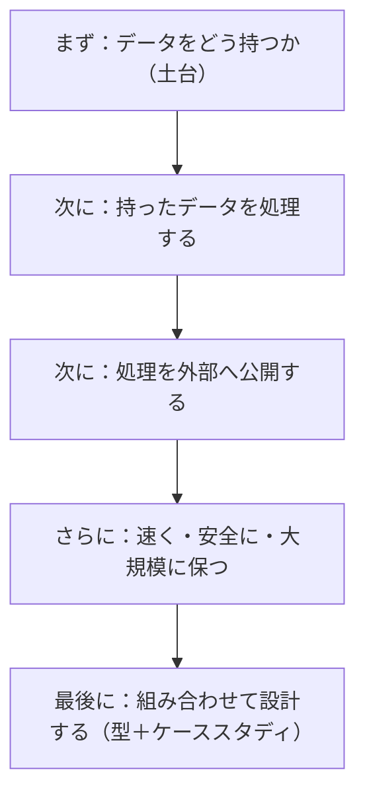
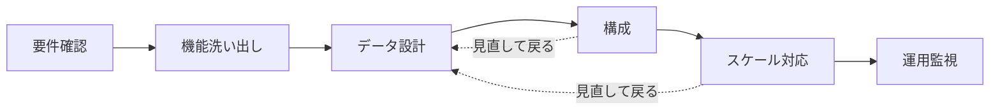
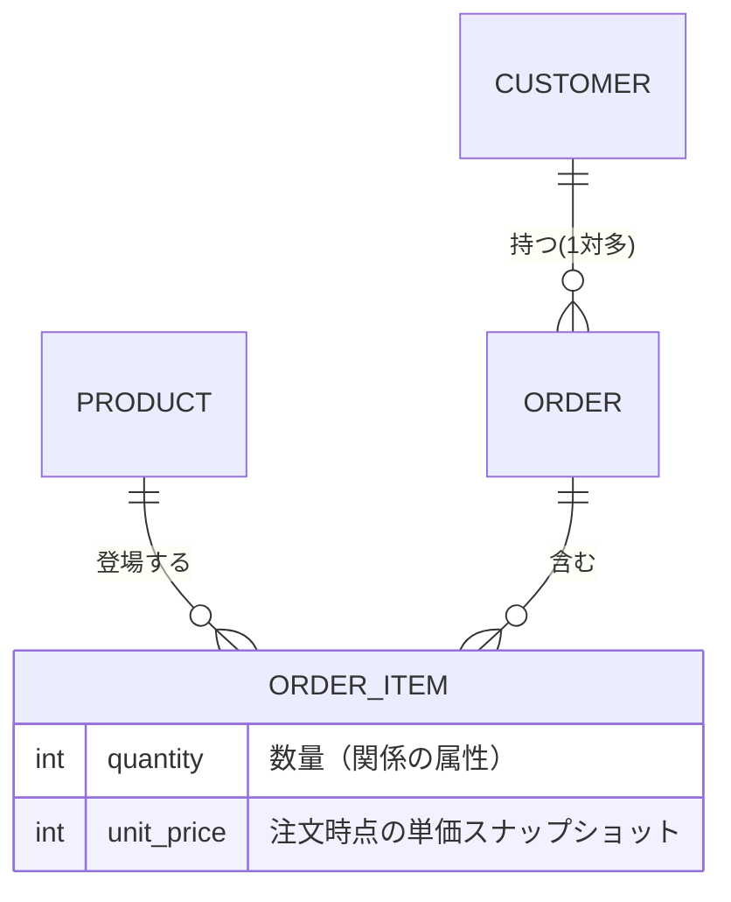
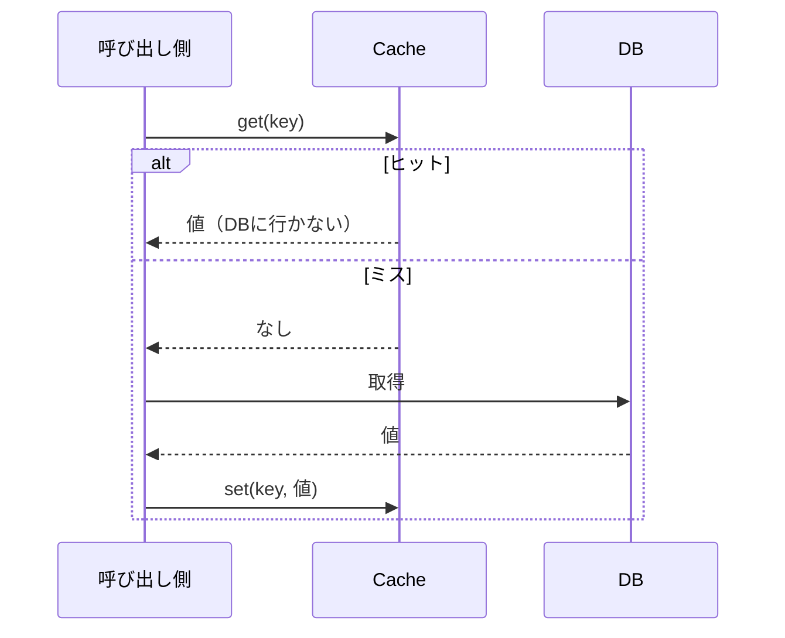
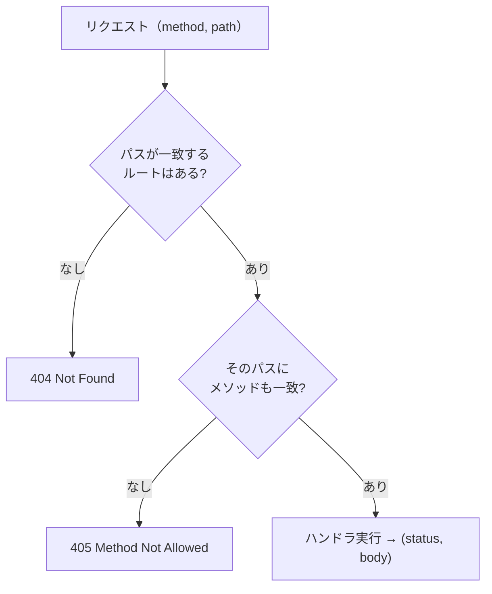
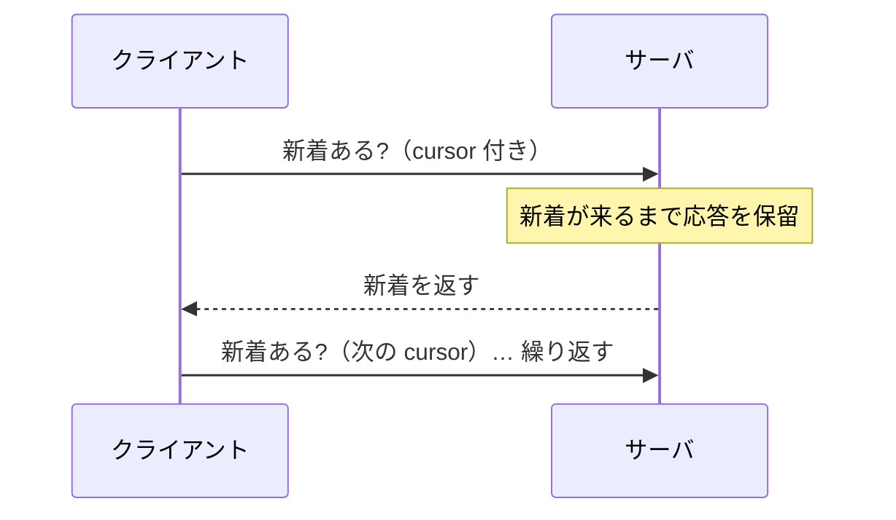
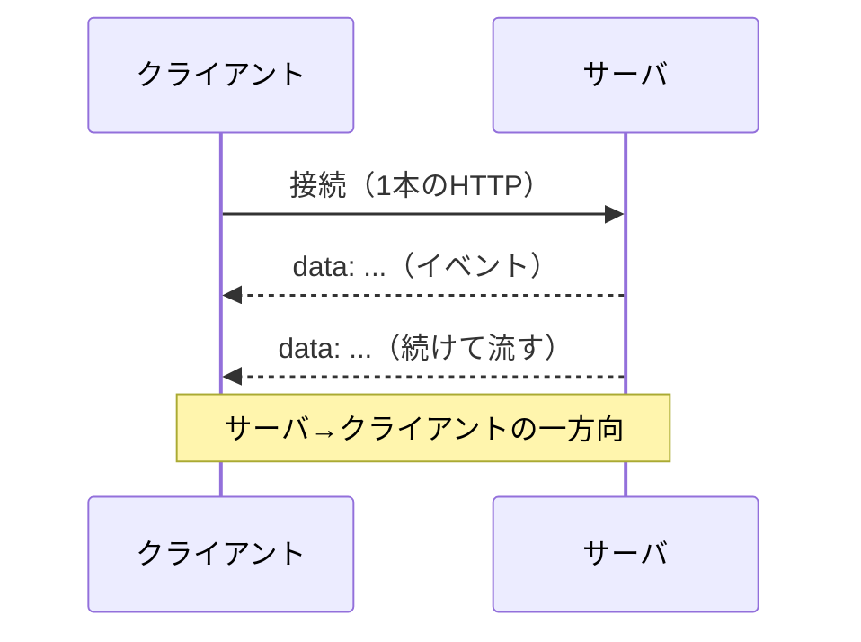
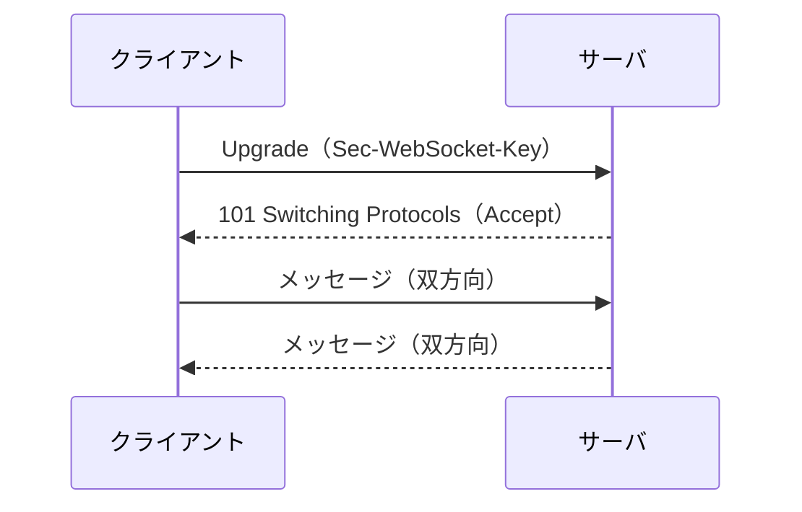
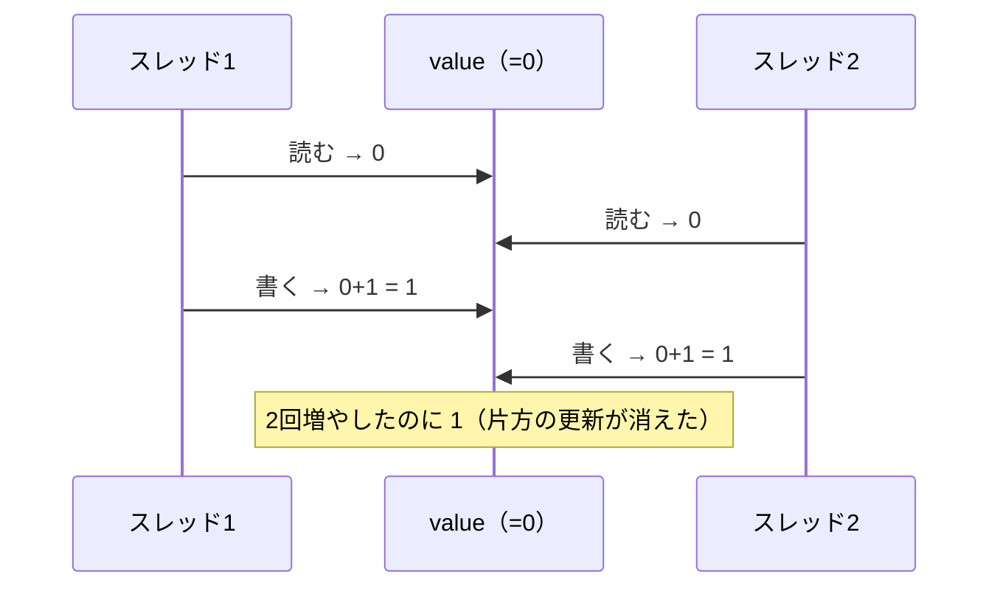

## はじめに

普段は機械学習まわりの実装が中心で、サービスの開発や設計はほとんど経験がありません。
そのため、いざ何かを設計・実装しようとすると、必要な基礎や「考え方の型」が自分の中で体系化されていないと感じていました。

そこで、サービス開発に必要な基礎知識と考え方を、自分で手を動かしながら一度まとめてみることにしました。
この記事は、その学習ノートです。

進め方として、3 つの方針を置きました。

- **段階を追って体系化する** — データの持ち方から設計の実践まで、順を追って整理します
- **Python の標準ライブラリだけで自前実装する** — フレームワークに任せず、仕組みを自分で書いて理解します(`sqlite3` のような言語同梱のモジュールは使います)
- **なぜそう設計するかを言葉にする** — 結論だけでなく、判断とトレードオフを添えます

読み方としては、各段階はそれぞれ独立して読めます。
最後の「設計の実践」で、それまでに用意した部品を組み合わせて、実際のサービスを設計してみます。

なお、この整理は私のうろ覚えの知識と Claude Code と対話した結果を元に進めたので、ベストプラクティスと言い切れない箇所があるかもしれないことを述べておきます。

## サービス開発をどう考え、どう設計するか

サービスは、2 つの軸で捉えると見通しがよくなります。
「何でできているか(段階)」と、「どういう順で考えるか(設計の型)」です。

この章でまず両方を押さえます。
そのあとの各段階で道具をそろえ、最後の「設計の実践」で、型に沿って部品を組み合わせます。

### サービスを「段階」で捉える

サービスは、いくつかの段階が積み重なってできています。
まずデータをどう持ち、次にそれをどう処理し、次に外部へどう公開し、さらに速く・安全に・大規模に保ち、最後にこれらを組み合わせて設計する、という順です。



上の段は、下の段の上に成り立ちます。
処理はデータの持ち方に、公開は処理に依存する、という関係です。

なお、多くの機能は、データ構造が素直であれば自然に実装できます。
そのためこの記事では、データの持ち方(データ設計)を出発点に置いています。

### 設計の「型」— この記事の背骨

思いつきで実装に飛びつくと、後になって全部やり直し、ということが起きがちです。
毎回同じ順序でたどるようにすると、抜け漏れを防ぎつつ、判断の理由を言葉にしながら進められます。

順序は「要件確認 → 機能洗い出し → データ設計 → 構成 → スケール対応 → 運用監視」です。



各ステップで「何を問い、何を決めるか」を挙げていきます。

1. **要件確認 — 何を作るかを固める**
   - 目的とスコープ(何を解決するか。そして今回やらないことを明示する)
   - 利用者と規模感(誰が・どれくらい・読みが多いか書きが多いか)
   - 制約(一貫性はどこまで必要か・遅延の許容・使える資源)
   - 不明点はここで質問して潰します。曖昧なまま設計を進めないのが大事で、後戻りが一番高くつきます。
2. **機能洗い出し — 何ができるかに分解する**
   - 名詞(登場するモノ)と動詞(それへの操作)で挙げると、データ設計と API 設計に直結します。
   - Must と Nice を分け、中心の 1 機能を先に決めてそこから広げます。
3. **データ設計 — どう持つか(心臓部)**
   - エンティティと関係(1 対多 / 多対多 / 属性を持つ中間テーブル)、そして不変条件を決めます。
   - 主キー・外部キー・一意制約。時点の事実はスナップショットで確定保存します。
   - ここが素直だと多くの機能は自然に実装でき、逆にここが歪むと全部が歪みます。
4. **構成 — どう動かすか**
   - リソースとエンドポイント、読み経路 / 書き経路を描きます。どこにキャッシュを挟むかも。
   - まずは単一構成の動く形を作ります(分散は次の段で足します)。
5. **スケール対応 — 増えたらどこが詰まるか**
   - ボトルネックを見極めてから打ちます(最初から作り込まない)。症状と打ち手の対応はこの通りです。

     | 症状 | 打ち手 |
     |---|---|
     | 読み取りが多い | キャッシュ / リードレプリカ |
     | データが 1 台に乗らない | シャーディング(コンシステントハッシュ) |
     | 同時更新の競合 | ロック / トランザクション・制約 |
     | 過剰なアクセス | レート制限 |
     | 重い処理 | メッセージキューで非同期化 |
6. **運用監視 — 作って終わりにしない**
   - 何を記録するか(リクエスト数・エラー率・遅延・利用状況)。
   - 異常にどう気づくか(閾値・アラート)。設定値(キャッシュの TTL・レート上限)は計測を見て見直します。

使い方の原則は 3 つです。
上から順にたどる、ただし行き来してよい(スケールを考えてデータ設計に戻る、はよくあるS)。
各段でなぜそう決めたかを言葉にする。そして全部を一度に完璧にせず、動く核から広げる。

### 段階と型はどう噛み合うか

「段階」と「型」は別の軸ですが、次の対応で結びつきます。
型の各ステップが、どの段階の道具を主に使うかを並べると、こうなります。

| 型のステップ | 主に使う段階の道具 |
|---|---|
| データ設計 | 持ち方の段(モデリング・DB・キャッシュ) |
| 構成 | 公開の段(HTTP・REST)+ 持ち方の段(キャッシュ) |
| スケール対応 | 信頼性・規模の段(並行処理・レート制限・スケール・性能) |
| 機能の中身(処理) | 処理の段(データ構造・集計・ソート・探索・区間・グラフ) |

「考える順(型)」と「サービスの構成要素(段階)」は別物ですが、この対応を意識すると、型を回すときにどの道具を取り出せばよいかが見えてきます。

### ミニ実例: ブックマーク保存を型で一巡する

本格的な適用は最後の「設計の実践」で行いますが、ここで小さな例を一度通しておくと、型の回し方が掴めます。
題材は「URL とタイトルを保存し、一覧・削除する」だけの、個人向けブックマークです。

1. **要件確認**：個人が URL を保存・一覧・削除できればよい。認証・共有・タグは今回やらない。使い方は一覧(読み)が多く、保存(書き)は少なめ。強い一貫性は要らない。
2. **機能洗い出し**：名詞はブックマーク(url, title, created_at, 所有者)。動詞は保存・一覧・削除。Must は保存・一覧・削除、Nice はタグ・検索。中心は「保存 → 一覧」。
3. **データ設計**：`bookmarks(id, user_id, url, title, created_at)`。ユーザー 1 人が複数持つ 1 対多。不変条件は「同じユーザーが同じ URL を重複保存しない」で、これは `(user_id, url)` の UNIQUE 制約で表せます。
4. **構成**：`POST /bookmarks`(201) / `GET /bookmarks`(200) / `DELETE /bookmarks/{id}`(204)。主に呼ばれるのは一覧(読み経路)。件数が増えたらページネーションを足す。今はキャッシュ不要。
5. **スケール対応**：個人利用なら単一構成で十分、と判断できるのも設計のうちです。仮に伸びるなら `user_id` でシャーディング、一覧は keyset ページネーション。「今は打たない」も立派な結論です。
6. **運用監視**：保存数・エラー率・UNIQUE 違反(重複保存の試み)の頻度を見て、UI や仕様を見直す。

小さくても同じ順でたどると、UNIQUE 制約(データ設計)やページネーション(構成 → スケール)が自然に出てきます。
「今はやらない」という線引きも、型が助けてくれます。
この骨のある版は、最後の「設計の実践」で、もっと本格的なサービスに適用して見せます。

## まず、データをどう持つか

ここからは各段階の道具をそろえていきます。
最初はデータの持ち方です。すべての土台で、ここが素直だと後がすべて楽になります。
モデリング → データベースの基礎 → キャッシュ、の順で見ます。

### データモデリング

データモデリングは、仕様を「どんなテーブルを持つか」に翻訳する作業です。
基本の対応はシンプルで、1 対多なら「多」側に外部キーを持たせ、多対多なら中間テーブルを挟みます。

少し面白くなるのが、関係そのものが属性を持つ場合です。
たとえば注文と商品の間には「注文明細」が挟まり、そこに数量や単価が乗ります。これが属性を持つ中間エンティティです。



ここで大事なのがスナップショットの考え方です。
注文明細の単価は、商品テーブルの価格を参照するのではなく、注文した時点の価格をコピーして確定させます。
そうしないと、あとで商品の価格を変えたときに、過去の注文金額まで変わってしまいます。

正規化をどこまでやるか(あえて重複を持つか)は、「その重複は、元が変わったとき一緒に変わるべきか」で判断できます。
一緒に変わるべきなら参照(正規化)、その時点で確定させたいならコピー(スナップショット)です。

コードにすると、こうなります(要点の抜粋です。完全版はリポジトリを参照してください)。

```python
from dataclasses import dataclass

@dataclass
class Product:
    id: int; name: str; price: int          # price は将来変わりうる

@dataclass
class OrderItem:                             # Order と Product をつなぐ中間エンティティ
    order_id: int; product_id: int
    quantity: int                            # 関係の属性
    unit_price: int                          # 注文時点の単価スナップショット（確定値）

class Shop:
    def place_order(self, order_id, customer_id, lines):   # lines: [(product_id, qty)]
        self.orders.append(Order(order_id, customer_id))
        for product_id, qty in lines:
            price_now = self._product(product_id).price     # その時点の価格をコピー
            self.order_items.append(OrderItem(order_id, product_id, qty, unit_price=price_now))

    def order_total(self, order_id):         # 合計は明細から導出（重複して持たない）
        return sum(it.quantity * it.unit_price for it in self.items_of_order(order_id))
```

こうしておくと、注文後に `product.price` を変えても `order_total` は変わりません(過去の金額は確定しているからです)。

### データベースの基礎（sqlite3 で動かす）

データを実際に永続化するとなると、データベースが要ります。
ここでは Python に同梱されている `sqlite3` を使い、フレームワークが隠しがちな仕組みを 3 つ、自分で動かして確かめます。

**インデックス**
索引がないと、目的の行を探すのにテーブル全体を走査します(O(n))。
索引を張ると、その列については絞り込みが効くので O(log n) になります。
`sqlite3` では `EXPLAIN QUERY PLAN` で、`SCAN`(全走査)なのか `SEARCH ... USING INDEX`(索引利用)なのかを目で確認できます。
ただし索引はタダではなく、読みが速くなる一方、書き込みは索引の更新ぶん遅くなります。

**トランザクション(ACID)**
複数の書き込みを「全部成功か、全部なかったことにするか」のどちらかにしたいことがあります。
`sqlite3` では `with conn:` がその境界で、ブロックが正常終了すればコミット、途中で例外が出れば自動でロールバックされます(原子性)。

**制約**
整合性はアプリ側だけでなく、DB 側でも守れます。
外部キー・UNIQUE・CHECK を張っておくと、どの経路から書いても壊れた状態になりません。

コードで見てみます。

```python
import sqlite3
conn = sqlite3.connect(":memory:")
conn.execute("PRAGMA foreign_keys = ON")

def query_plan(conn, sql, params=()):        # SCAN か SEARCH USING INDEX かを文字列で見る
    rows = conn.execute("EXPLAIN QUERY PLAN " + sql, params).fetchall()
    return [row[3] for row in rows]

# 索引なし: ['SCAN articles'] → CREATE INDEX 後: ['SEARCH articles USING INDEX ...']

def add_user_with_articles(conn, user, titles, fail_at=None):
    try:
        with conn:                            # 正常終了で commit・例外で rollback
            conn.execute("INSERT INTO users(id,email,name) VALUES(?,?,?)", user)
            for i, title in enumerate(titles):
                if fail_at is not None and i == fail_at:
                    raise ValueError("mid failure")   # 途中失敗なら user ごと巻き戻る
                conn.execute("INSERT INTO articles(id,user_id,title) VALUES(?,?,?)",
                             (user[0]*100+i, user[0], title))
    except ValueError:
        return False                          # ロールバック済み（部分書き込みは残らない）
    return True
```

`add_user_with_articles` は、記事の途中でわざと失敗させると(`fail_at`)、その前に入れたユーザーごと巻き戻ります。
中途半端に書き込まれた状態が残らない、というのがトランザクションの効きどころです。

### キャッシュ

データベースは頼りになりますが、同じ読み取りが何度も来るなら、毎回 DB に行くのはもったいない場面があります。
そこでキャッシュを挟みます。ただし速さと引き換えに、整合性(古い値をつかむ可能性)という課題を抱えます。

もっとも基本的な使い方が Cache-Aside です。
まずキャッシュを見て、あればそれを返す。無ければ DB から取り、ついでにキャッシュへ保存しておく、という流れです。



古い値を残さないための仕組みが 2 つあります。

- **TTL**：一定時間で自動的に捨てる(期限切れ)。
- **無効化**：元データを更新したとき、対応するキーを明示的に消す。

キャッシュが効くのは、読みが多く更新が少ないデータです。
注意点として、多くのキーが同時に期限切れになると DB へ一斉にアクセスが殺到します(サンダリングハード)。TTL を少しずつずらすと和らぎます。

コードにすると、こうなります。

```python
import time
class SimpleCache:
    def __init__(self, ttl_seconds):
        self.ttl = ttl_seconds; self.store = {}      # key -> (value, saved_at)
    def get(self, key):
        entry = self.store.get(key)
        if entry is None: return None
        value, saved_at = entry
        if time.time() - saved_at > self.ttl:        # 期限切れは捨てる
            del self.store[key]; return None
        return value
    def set(self, key, value): self.store[key] = (value, time.time())
    def invalidate(self, key): self.store.pop(key, None)

class UserRepository:                                # Cache-Aside の実例
    def get_user(self, user_id):
        cached = self.cache.get(user_id)
        if cached is not None: return cached         # ヒット：DBに行かない
        value = self._db_get(user_id)                # ミス：DBから
        if value is not None: self.cache.set(user_id, value)   # 次回に備えて保存
        return value
    def update_user(self, user_id, value):
        self.db[user_id] = value
        self.cache.invalidate(user_id)               # 更新したら無効化（古い値を残さない）
```

## 次に、持ったデータをどう処理するか

データを持てたら、次はそれを処理する道具です。
サービスの機能の多くは、ここで挙げる基本的な処理の組み合わせで書けます。
「多くの機能はデータ構造が素直なら自然に実装できる」を、実際に手を動かして確かめる段です。

### データ構造の使い分け

何を速くしたいかで、使うデータ構造が決まります。

- 辞書：キーで引く O(1)
- 集合：メンバー判定 O(1)(`x in list` は O(n) なので、判定は集合に)
- リスト：順序を保つ・末尾をスタックとして使う(先頭の pop は O(n))
- deque：両端の出し入れ O(1)(キューに向く)

```python
from collections import deque

def has_duplicates(items):                   # 集合で O(n)（リストの in なら O(n^2)）
    seen = set()
    for x in items:
        if x in seen: return True
        seen.add(x)
    return False

def dedupe_preserve_order(items):            # 判定=集合、順序=リスト、と役割分担
    seen, result = set(), []
    for x in items:
        if x not in seen:
            seen.add(x); result.append(x)
    return result

class Queue:                                  # FIFO は deque（list.pop(0) は O(n)）
    def __init__(self): self._items = deque()
    def enqueue(self, x): self._items.append(x)
    def dequeue(self): return self._items.popleft()
```

### 集計

「キーごとにまとめる」(合計・カウント・グルーピング)は頻出です。辞書を軸にすれば O(N) で済みます。
悩みどころは「まだ無いキー」の扱いで、`get(k, 0)` や `defaultdict`、`Counter` を使います。

```python
from collections import defaultdict

def sum_by_key(pairs):                        # [("a",10),("b",5),("a",3)] -> {"a":13,"b":5}
    totals = {}
    for key, value in pairs:
        totals[key] = totals.get(key, 0) + value    # get(key,0) で初回を 0 に
    return totals

def group_by_key(pairs):                      # [("a",1),("b",2),("a",3)] -> {"a":[1,3],"b":[2]}
    groups = defaultdict(list)                # アクセス時に空リストを自動生成
    for key, value in pairs:
        groups[key].append(value)
    return dict(groups)                       # 外に返す前に通常の dict へ（事故防止）
```

### ソート

`sorted(key=...)` が基本です。複合キーはタプルで表し、数値を降順にしたいところだけ符号を反転すれば「一部だけ降順」ができます。
Python のソートは安定なので、同点の並びは元の順序が保たれます。

```python
def sort_by_value_desc(d):                    # {"a":3,"b":1,"c":3} -> [("a",3),("c",3),("b",1)]
    return sorted(d.items(), key=lambda kv: (-kv[1], kv[0]))   # (-値, キー) のタプル

def rank(records):                            # 集計してから並べる（頻出パターン）
    totals = {}
    for name, score in records:
        totals[name] = totals.get(name, 0) + score
    return sorted(totals.items(), key=lambda kv: (-kv[1], kv[0]))
```

### 探索

線形探索は O(n)、二分探索は O(log n)(ソート済みが前提)です。
実務で効くのは、値そのものを探すより「◯◯以上が最初に現れる位置」を探す境界探索(lower_bound)です。
半開区間 `[lo, hi)` で考えると、off-by-one を防ぎやすくなります。仕組みを見るため、`bisect` を使わず自前で書きます。

```python
def binary_search(seq, target):               # 見つかれば index、無ければ -1
    lo, hi = 0, len(seq)                       # 半開区間 [lo, hi)
    while lo < hi:
        mid = (lo + hi) // 2
        if seq[mid] == target: return mid
        if seq[mid] < target: lo = mid + 1     # 右にしか無い
        else: hi = mid                         # 左にしか無い（mid は候補外）
    return -1

def lower_bound(seq, target):                 # target 以上が最初に現れる位置（挿入位置）
    lo, hi = 0, len(seq)
    while lo < hi:
        mid = (lo + hi) // 2
        if seq[mid] < target: lo = mid + 1     # 判定を < に変えるだけで境界探索になる
        else: hi = mid
    return lo
```

### 区間の処理

時間帯や範囲の「重なり」を判定する場面はよくあります。
コツは、重なる条件を並べるのではなく「重ならない条件の否定」で書くことです。場合分けが増えません。
境界を含むか(`<` か `<=`)は仕様で決めます。全ペアを比べると O(N²) ですが、ソートして隣接だけ見れば O(N log N) に落ちます。

```python
def overlaps(s1, e1, s2, e2):                 # [s1,e1) と [s2,e2) が重なるか
    return not (e1 <= s2 or e2 <= s1)          # 「完全に前 or 完全に後」の否定

def has_any_overlap(intervals):               # ソートして隣接だけ見る（O(N log N)）
    ordered = sorted(intervals)
    for i in range(1, len(ordered)):
        if ordered[i][0] < ordered[i-1][1]:    # 今の開始 < 前の終了 なら重なり
            return True
    return False

class BookingManager:                          # 重ならなければ登録、重なれば拒否
    def book(self, start, end):
        for s, e in self.bookings:
            if overlaps(start, end, s, e): return False
        self.bookings.append((start, end)); return True
```

なお、この `overlaps` は、あとの「設計の実践」で予約システムを作るときにそのまま再利用します。

### グラフ・木の探索

つながりを扱うときはグラフです。隣接リスト(ノード → 隣接ノードの並び)で表します。

- BFS：キューを使い、近いノードから訪問。重みなしの最短ホップに向く。
- DFS：再帰で行けるところまで潜って戻る。

どちらも visited が必須で、これがあれば閉路があっても無限ループしません。木はグラフの特殊形で、計算量は O(V+E) です。

```python
from collections import deque

def bfs(graph, start):                         # 近いノードから訪問
    visited, order, q = {start}, [], deque([start])
    while q:
        node = q.popleft(); order.append(node)
        for nxt in graph.get(node, []):
            if nxt not in visited:             # visited で二度訪問を防ぐ
                visited.add(nxt); q.append(nxt)
    return order

def dfs(graph, start):                         # 行けるところまで潜って戻る（再帰）
    visited, order = set(), []
    def visit(node):
        visited.add(node); order.append(node)
        for nxt in graph.get(node, []):
            if nxt not in visited: visit(nxt)
    visit(start); return order

def shortest_hops(graph, start, goal):         # 重みなし最短ホップ（到達不能は None）
    if start == goal: return 0
    visited, q = {start}, deque([(start, 0)])
    while q:
        node, dist = q.popleft()
        for nxt in graph.get(node, []):
            if nxt == goal: return dist + 1
            if nxt not in visited:
                visited.add(nxt); q.append((nxt, dist + 1))
    return None
```

## 次に、処理を外部へどう公開するか

処理ができたら、次はそれを外部から呼べる形にします。
ここでも、フレームワークが隠している部分を自前で書いて確かめます。HTTP の生の姿 → REST の設計 → リアルタイム通信、の順です。

### HTTP の基礎

HTTP は、見た目はただのテキストです。
開始行・ヘッダ・空行・ボディ、という構造で、ヘッダとボディの境界は空行(`\r\n\r\n`)です。
細かい約束として、ヘッダ名は大文字小文字を区別せず、`Content-Length` はボディのバイト数を表します。

生のリクエストをパースし、レスポンスを組み立てる部分を自前で書くと、こうなります。

```python
CRLF = "\r\n"
def parse_request(raw):
    head, _, body = raw.partition(CRLF + CRLF)          # 空行でヘッダ/ボディを分割
    lines = head.split(CRLF)
    method, target, version = lines[0].split(" ")        # "GET /users/1?x=1 HTTP/1.1"
    path, _, query = target.partition("?")
    headers = {}
    for line in lines[1:]:
        if not line: continue
        name, _, value = line.partition(":")
        headers[name.strip().lower()] = value.strip()    # 大小無視のため小文字化
    return {"method": method, "path": path, "query": query, "headers": headers, "body": body}

def build_response(status, headers=None, body="", version="HTTP/1.1"):
    reason = {200:"OK",201:"Created",404:"Not Found",429:"Too Many Requests"}.get(status,"")
    headers = dict(headers or {})
    headers.setdefault("Content-Length", str(len(body.encode("utf-8"))))  # バイト数を自動付与
    lines = [f"{version} {status} {reason}"] + [f"{k}: {v}" for k, v in headers.items()]
    return CRLF.join(lines) + CRLF + CRLF + body
```

### REST API の設計

REST の基本は、URL は名詞(リソース)、操作はメソッド、という分担です。
ステータスコードもよく使うものを押さえます。201(作成)・200(OK)・204(No Content)・404(見つからない)、そして 405(パスは在るが、そのメソッドが無い)です。
べき等性も大事で、`PUT` は繰り返しても状態が変わらない一方、`POST` は毎回増えます。

リクエストの振り分けは、まず「パスが一致するルートはあるか」、次に「そのパスにメソッドも一致するか」の 2 段で考えます。



最小のルータを自前で書くと、こうなります。

```python
class Router:
    def __init__(self): self._routes = []
    def add(self, method, pattern, handler):
        self._routes.append((method, pattern.strip("/").split("/"), handler))
    def _match(self, pattern_parts, path_parts):
        if len(pattern_parts) != len(path_parts): return None
        params = {}
        for pat, actual in zip(pattern_parts, path_parts):
            if pat.startswith("{") and pat.endswith("}"):
                params[pat[1:-1]] = actual              # {id} などの可変部分を捕捉
            elif pat != actual: return None
        return params
    def dispatch(self, method, path, body=None):
        path_parts = path.strip("/").split("/")
        matched = False
        for m, parts, handler in self._routes:
            params = self._match(parts, path_parts)
            if params is None: continue
            matched = True
            if m == method: return handler(params, body)
        return (405, None) if matched else (404, None)  # パスは在る→405 / 無い→404
```

パスは在るがメソッドが無ければ 405、パス自体が無ければ 404 を返す、という区別がポイントです。
なお、この `Router` も、あとの「設計の実践」でそのまま再利用します。

### リアルタイム通信

サーバ側の更新を、クライアントへ能動的に届けたいことがあります。代表的な 3 方式を、誰が始めて何往復するかで見比べます。

**ロングポーリング**：新着が出るまでサーバが応答を保留し、返したらまた訊きに行く。カーソルで取りこぼしを防ぎます。



**SSE**：1 本の HTTP を開いたまま、サーバが一方向にイベントを流し続ける。メッセージは空行で終端します。



**WebSocket**：握手してプロトコルを昇格させ、以後は双方向でやり取りします。



それぞれの核を自前で書くと、こうなります。

```python
class MessageLog:                              # ロングポーリングの核＝カーソルで差分取得
    def __init__(self): self._messages = []
    def append(self, m): self._messages.append(m)
    def poll(self, cursor):                    # cursor 以降の新着 + 次のカーソル
        new = self._messages[cursor:]
        return new, cursor + len(new)          # 取りこぼし防止の鍵はオフセット

def format_sse(data, event=None, event_id=None):   # 空行でメッセージ終端
    lines = []
    if event_id is not None: lines.append(f"id: {event_id}")
    if event is not None: lines.append(f"event: {event}")
    for line in str(data).split("\n"): lines.append(f"data: {line}")
    return "\n".join(lines) + "\n\n"

import base64, hashlib
WS_GUID = "258EAFA5-E914-47DA-95CA-C5AB0DC85B11"    # RFC 6455 の固定 GUID
def websocket_accept(client_key):              # Sec-WebSocket-Accept の計算
    digest = hashlib.sha1((client_key + WS_GUID).encode()).digest()
    return base64.b64encode(digest).decode()   # 例: "dGhl..." -> "s3pPLMBiTxaQ9kYGzzhZRbK+xOo="
```

## さらに、速く・安全に・大規模に保つ

動く形ができたら、次はそれを速く・安全に・大規模に保つ段です。
大事なのは、最初から作り込まないこと。ボトルネックを見極めてから手を打ちます。
並行処理 → レート制限 → スケール → Web パフォーマンス、の順です。

### 並行処理

複数の処理が同じデータを同時にいじると、値が壊れることがあります。根本は、メモリを共有していることです。
`count += 1` すら、内部では「読む → 足す → 書く」の 3 手順で、その間に割り込まれると片方の更新が消えます。



守るにはロックで、この一連を「割り込まれない一手」にまとめます。

```python
import threading

class UnsafeCounter:                           # ロックなし → 競合で値が壊れうる
    def __init__(self): self.value = 0
    def increment(self, times):
        for _ in range(times):
            current = self.value               # 読む
            self.value = current + 1           # 足して書く（この間に割り込まれると消える）

class SafeCounter:                             # ロックあり → 常に正しい
    def __init__(self): self.value = 0; self.lock = threading.Lock()
    def increment(self, times):
        for _ in range(times):
            with self.lock:                    # 同時に1スレッドしか入れない
                current = self.value
                self.value = current + 1
```

### レート制限

過剰なアクセスから守るのがレート制限です。
まず「何を単位に数えるか」を決めます。API キー単位が素直で、IP 単位は NAT の裏にいる大勢を巻き込むことがあります。
アルゴリズムは、固定ウィンドウ(境界で 2 倍問題が起きる)と、トークンバケット(バーストを許しつつ平均を抑える。実務で広く使われる)があります。超過したら 429 を返します。

```python
import time
class TokenBucketLimiter:
    def __init__(self, capacity, refill_per_second):
        self.capacity = capacity; self.refill = refill_per_second; self.buckets = {}
    def allow(self, key):
        now = time.time()
        tokens, last = self.buckets.get(key, (self.capacity, now))
        tokens = min(self.capacity, tokens + (now - last) * self.refill)   # 経過分を補充（上限あり）
        if tokens >= 1:
            self.buckets[key] = (tokens - 1, now); return True             # 1つ消費して許可
        self.buckets[key] = (tokens, now); return False                    # なければ拒否
```

### スケールのパターン

台数を増やして捌くには、まずステートレスにするのが効きます(どのサーバに来ても同じ結果になる)。
その上でロードバランサで振り分け、読みが多ければリードレプリカを足します(反映が少し遅れる=結果整合性)。

データが 1 台に乗らなくなったらシャーディングです。
ここで素朴に `hash % N` で割り当てると、ノードを 1 台足しただけで余りが総入れ替えになり、ほぼ全キーが移動してしまいます。
これを抑えるのがコンシステントハッシュで、キーとノードを同じ円環上に置き、キーから右回りで最初に出会うノードに割り当てます。
ノードが増減しても動くのはその周辺のキーだけで、仮想ノードを使えば偏りも減らせます。

```python
import bisect, hashlib

def modulo_shard(key, nodes):                  # ノード数が変わると余りが総入れ替え
    h = int(hashlib.md5(key.encode()).hexdigest(), 16)
    return nodes[h % len(nodes)]

class ConsistentHashRing:                      # ノード増減の再配置を最小化（約1/ノード数）
    def __init__(self, nodes=(), replicas=100):
        self.replicas = replicas; self._ring = {}; self._keys = []
        for n in nodes: self.add(n)
    def _hash(self, v): return int(hashlib.md5(v.encode()).hexdigest(), 16)
    def add(self, node):
        for i in range(self.replicas):         # 仮想ノードで偏りを減らす
            self._ring[self._hash(f"{node}#{i}")] = node
        self._keys = sorted(self._ring)
    def get_node(self, key):                   # 円環上で自分以降の最初のノード（二分探索）
        if not self._ring: return None
        idx = bisect.bisect(self._keys, self._hash(key)) % len(self._keys)
        return self._ring[self._keys[idx]]
```

実際に 3 台から 4 台へ増やして 1000 キーで測ると、素朴な `hash % N` は約 750 キーが移動したのに対し、コンシステントハッシュは約 250 に収まりました。

### Web パフォーマンス

性能はまず計測からです(LCP などの指標)。ここではサーバ側の効きどころを 2 つ挙げます。
条件付きリクエスト：内容の指紋(ETag)を返しておき、クライアントが同じ ETag を持っていれば 304 を返して本文の再送を省きます。
gzip：転送量を圧縮で減らします。繰り返しの多いテキストほどよく縮みます。

```python
import gzip, hashlib
def etag_for(body):                            # 内容の指紋（同じ内容なら同じ ETag）
    return f'"{hashlib.md5(body.encode()).hexdigest()}"'

def handle_conditional_get(body, if_none_match=None):   # (status, headers, body)
    etag = etag_for(body)
    if if_none_match == etag:
        return (304, {"ETag": etag}, "")       # 内容不変 → 本文を再送しない
    return (200, {"ETag": etag}, body)

def compression_ratio(text):                   # 圧縮後/前。繰り返しの多いテキストは大幅に縮む
    return len(gzip.compress(text.encode())) / len(text.encode())
```

## 最後に、組み合わせて設計する

ここが山場です。
これまでにそろえた段階の道具と、最初に示した設計の型を、実際のサービスに当てはめてみます。
以下の 3 つのケースで、考え方と実装を追います。

### 設計の型を適用する

型(要件確認 → 機能洗い出し → データ設計 → 構成 → スケール対応 → 運用監視)は、この記事の前半で詳しく述べました。
ここではそれを、実際のサービスに適用して見せます。

見せ方は、ケースによって 2 通り使い分けます。

- **設計書形式**：型の 6 ステップの見出しで、最初から一気に設計する(URL 短縮で使います)。
- **ロードマップ形式**：一番単純な形から段階的に育て、各段が型のどのステップに当たるかを添える(予約・EC で使います)。

どちらも「型の 6 ステップを一通り通る」のは共通です。

### ケーススタディ: URL 短縮（設計書形式で型を一巡）

<!-- メモ: 長い URL を短いコードにし、コードへのアクセスを元 URL へ転送。型の6見出しで一気に設計。①要件(短縮/解決/計測、認証・独自ドメイン・管理UIはやらない、解決〔読み〕>>発行〔書き〕なので解決経路が主戦場、発行コードは常に同じ URL へ=強い一貫性、クリック数はずれてよい)②機能(発行/解決〔中心〕/計測、名詞=コードと元URLの対応、中心=発行→解決)③データ設計(url_mapping(code PK,long_url,created_at,click_count)、肝はコードの作り方=連番ID を base62〔6文字で約568億通り〕、連番は衝突しない・短い・確定的、トレードオフ=隣を推測されやすい→秘匿要るなら乱数+衝突チェック、別解=URL ハッシュ、公開URLなので連番で十分)④構成(POST /api/urls 発行 201/GET /{code} 解決 302、パス衝突注意=catch-all /{code} と管理APIを /api/ 配下に分ける定石、前段の部品〔キャッシュ・ルータ・レート制限〕を import して配線)⑤スケール(解決経路にキャッシュ、コードでシャーディング〔コンシステントハッシュ〕、発行にレート制限、採番の分散=ノードごとに ID レンジ)⑥運用(クリック数/発行数/解決404率、クリックは非同期集計の判断も)。【図: URL短縮アーキ flowchart Client→Router→レート制限/キャッシュ→Service→DB】。実装: encode_base62/ShortenerService/UrlShortenerApp(部品の配線)。 -->

### ケーススタディ: 予約システム（ロードマップ形式）

<!-- メモ: 会議室のようなリソースを時間帯で予約。希少資源=時間帯(区間)、核=処理・並行制御。まず型で設計(①要件=予約/キャンセル/一覧、課金通知やらない、同じリソースで時間帯が重なってはいけない=強い ②機能=予約〔中心〕/キャンセル/一覧 ③データ設計=Booking(id PK,resource_id,start,end)、1対多、不変条件=同じ resource_id で区間が重ならない、判定は処理の段の overlaps を再利用 ④構成=POST /bookings 201/重なれば 409 Conflict、DELETE 204、GET 一覧 ⑤スケール=全件走査 O(N) をやめ開始時刻ソートで隣接、並行制御はリソース単位にロック範囲を閉じる、本番は DB のトランザクション・制約へ ⑥運用=成功率/409率/キャンセル率)。作った道のり=まず単純(単一リソースの重なり判定=overlaps 再利用)→広げる(複数リソース+Booking+キャンセル)→本番へ(二重予約 check-then-act をプロセス内ロックで防止+API化 409)。実装: RoomCalendar→BookingService→SafeBookingService(book/cancel をロックで包むだけ=差分はロックのみ)→make_booking_api。20スレッドが同枠を狙っても成功1件のみ。限界=プロセス内ロックは複数台で破綻→次の EC へ。 -->

### ケーススタディ: EC 在庫（ロードマップ形式）

<!-- メモ: 商品を在庫つきで扱い、複数商品をまとめて注文。希少資源=個数(在庫カウント)、核=データ設計。予約と対になるケース。型で設計(①要件=在庫管理/注文/合計、決済配送やらない、売り越さない=在庫が負にならない・注文金額確定=強い ②機能=在庫つき商品/注文〔在庫足りれば確保、1つでも足りなければ何も売らない=中心〕/合計/参照 ③データ設計★主役=Customer/Product(価格・在庫)/Order/OrderItem(数量・単価)、顧客1対多注文・注文1対多明細・商品1対多明細、OrderItem は属性を持つ中間エンティティ、不変条件=在庫≥0/合計=Σ(数量×単価) は明細から導出/単価は注文時点スナップショット ④構成=POST /orders 201/在庫不足 409、GET /products/{id} ⑤スケール=在庫を別テーブル・行ロックで競合範囲を狭める、商品IDでシャーディング、カート=予約在庫〔TTL 付き hold〕 ⑥運用=成功率/在庫不足409率/在庫切れ商品)。作った道のり=まず単純(単一商品 在庫≥0)→中心(注文/明細を厳密にデータ設計、全明細を確認してから減らす=原子性の芽)→本番へ(sqlite で実DB化、CHECK+条件付き減算 UPDATE...WHERE stock>=? +トランザクションで売り越し防止+API化)。【図: place_order 分岐 flowchart トランザクション→条件付き減算→更新0行?→全ロールバック409/スナップショット→残り?→commit201】。実装: Inventory.buy→Shop.place_order(メモリ版、確認してから減らす)→OrderDB.place_order(条件付き減算+rowcount==0 で InsufficientStock+スナップショット)。 -->

### 予約と EC の対比

<!-- メモ: 記事に必ず入れる対比表。予約=希少資源:時間帯(区間)/核:区間の重なり・並行制御/並行制御:プロセス内ロック/主に関わる段:処理の段・信頼性の段。EC=希少資源:個数(カウント)/核:データ設計(関係・不変条件)/並行制御:DB のトランザクション+制約/主に関わる段:持ち方の段。メッセージ=「守りたい不変条件は何か」を見極めるとモデリングも処理も自然に決まる。時間の希少性と個数の希少性という2典型。 -->

## まとめ・学んだこと

<!-- メモ: 段階で捉えるとどこに手を入れるか・何が足りないかが見える。標準ライブラリで自前実装するとフレームワークが隠していた仕組み(索引・トランザクション・ルーティング・ハンドシェイク)が腑に落ちる。データ設計が起点、ただし処理が核のドメイン(予約)もある=「不変条件は何か」で見極める。並行制御は避けて通れない(ロック/DBのトランザクション・制約/そもそも共有しない)。設計は型で進めると思いつきに飛びつかず判断の理由を残せる。 -->

## おわりに

<!-- メモ: ことわり・免責。この整理は Claude Code と対話しながら進めた(設計判断や実装方針に Claude の提案が多く入っている)。そのためベストプラクティスと断定はできない箇所があるかも、誤り・より良いやり方の指摘は歓迎。あくまで「ML畑の自分がサービス開発の基礎を体系化するための学習ノート」でプロダクションの正解集ではない。今後の展望(アルゴリズム系の穴埋め=N+1問題・two-pointer/sliding window、ケース追加=SNSタイムライン〔fan-out・グラフ〕・チャット〔リアルタイム通信〕)。リポジトリ(全実装・全テスト): github.com/atsushi11o7/cs-fundamentals-practice。 -->

